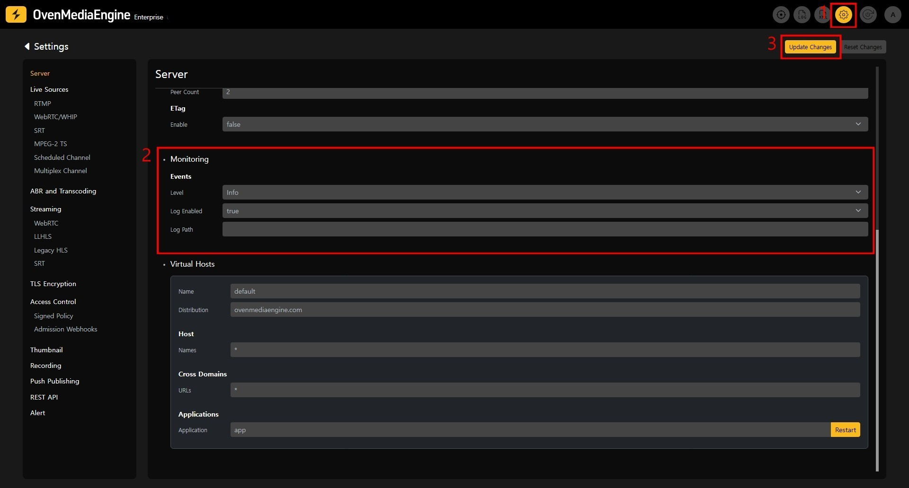

## Configuration

Event monitoring can be configured by modifying `Server.xml` or through the Web Console.

### Configuration using Server.xml

To enable event monitoring, add the relevant settings to `Server.xml`.

```xml
<?xml version="1.0" encoding="UTF-8" standalone="no"?>
<Server version="8">

 <Monitoring>
    <Events>
      <Level>info</Level>
      <Log>
        <Enabled>true</Enabled>
        <Path>/var/log/ovenmediaengine</Path>
      </Log>
    </Events>
  </Monitoring>

</Server>
```

<table><thead><tr><th width="204">Parameter</th><th width="99">Required</th><th>Description</th></tr></thead><tbody><tr><td><code>&#x3C;Events>&#x3C;Level></code></td><td>N</td><td>Event logs have different levels according to operations. Configurable values are `trace`, `debug`, `info`, `warn`, `error`, and the default is `debug`.</td></tr><tr><td><code>&#x3C;Events>&#x3C;Log>&#x3C;Enabled></code></td><td>Y</td><td>The event logging function can be enabled or disabled with `true` or `false`.</td></tr><tr><td><code>&#x3C;Events>&#x3C;Log>&#x3C;Path></code></td><td>N</td><td>Specifies the directory where event log files are saved. The default directory is `/var/log/ovenmediaengine`.</td></tr></tbody></table>


:::warning

If you modify `Server.xml`, you need to restart OvenMediaEngine and the Web Console.

:::


### Configuration using the Web Console

You can enable the event monitoring function through the UI on the Web Console's Server Settings page.



1. Navigate to the Settings → Server page using the navigation at the top-right of the screen.
2. Set the values in the monitoring section.
   \
   2-1. `level`: Set the level of event logs.
   \
   2-2. `Log Enabled`: Set to `true` to enable event logging.
   \
   2-3. `Log Path`: Set the directory where event logs will be saved. If set to an empty value, event logs will be saved as `event.log` in OvenMediaEngine's default log storage directory, `/var/log/ovenmediaengine`.
3. After setting the values, click the `Update Changes` button at the top to apply the changes.


:::warning

OvenMediaEngine will automatically restart when changes are applied.

:::


## Post Configuration

### Web Console Event Log Directory Setting


:::tip

No additional settings are needed if you use the default directory, /var/log/ovenmediaengine.

:::


To synchronize recorded event logs with the Web Console, you need to match the Web Console's environment variables with the configured `LogPath`.

You can set the changed event logging directory by adding environment variables to [system.env](../../getting-started-with-web-console.md).

```
OS_ENGINE_MONITORING_EVENT_PATH=/your/eventlog/directory
```

### Event Specification

Please refer to the [Event Specification](event-specification.md) document for details on the event formats and event lists recorded through event logging.
