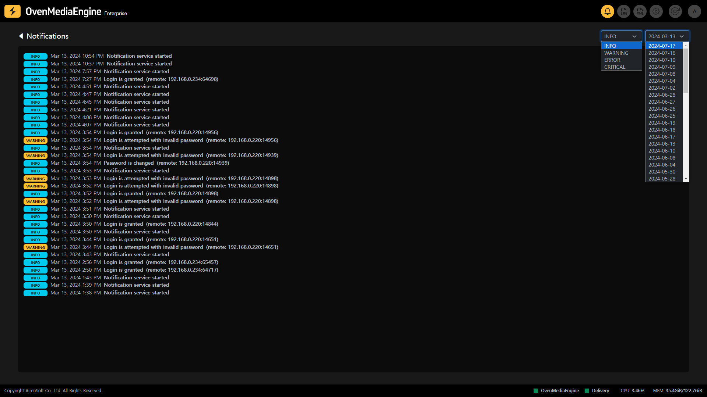

You can access this page by clicking the Log icon on the right side of the Web Console navigation bar. This page allows you to view OvenMediaEngine logs to monitor system activity and performance in real time. This feature enables you to detect and resolve issues immediately, allowing for optimal functionality and quick troubleshooting.
