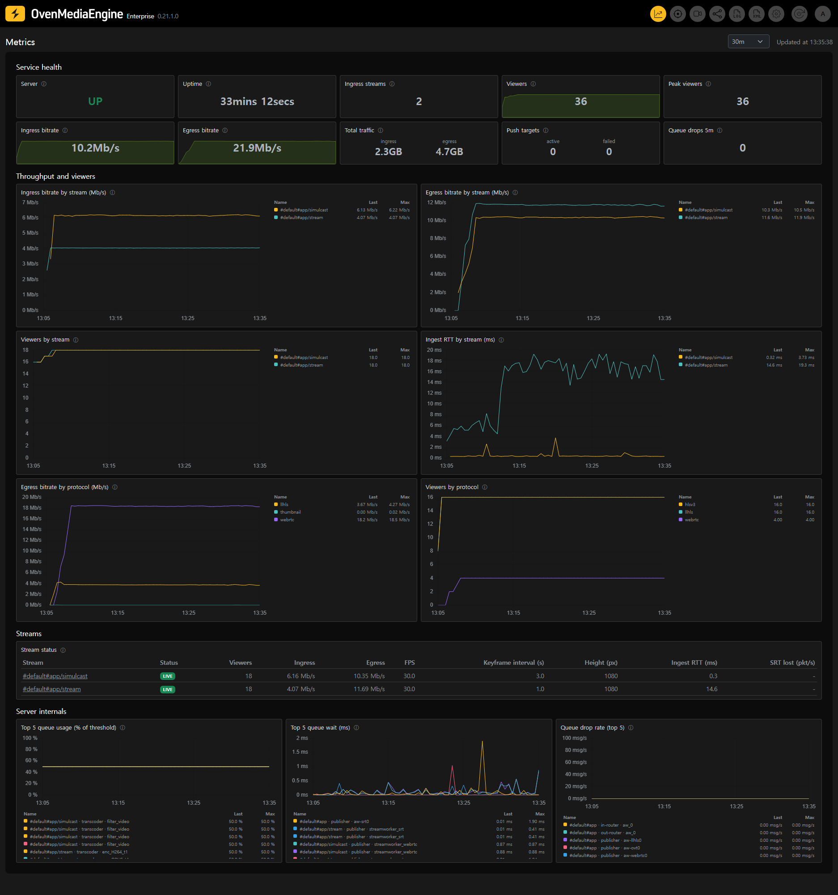
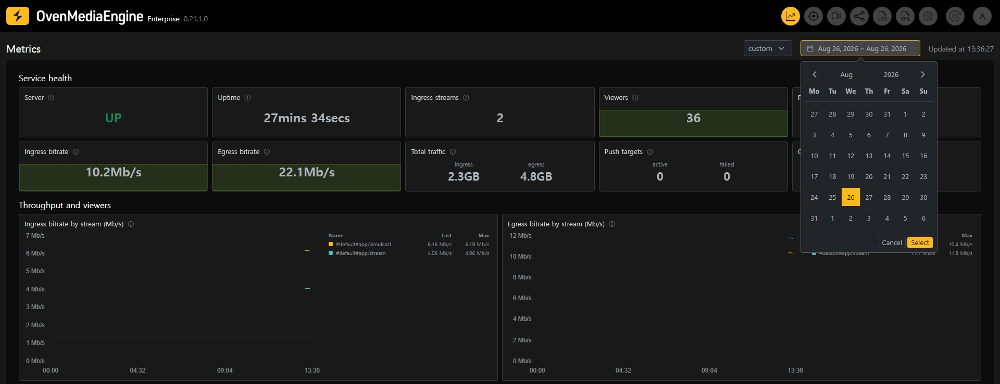

The Metrics pages chart how your server and each of its streams behaved **over time** — not only what they are doing right now. Use them to answer questions like "when did viewers drop", "did the contributor's connection degrade before the complaints started", or "which stream is filling the uplink".

You can access the [Metrics Dashboard](metrics-dashboard.md) by clicking the chart icon on the right side of the Web Console navigation bar. From there, clicking any stream opens its [Stream Quality](stream-quality.md) page.

{/* SCREENSHOT: full Metrics Dashboard page, top range selector visible (shared with metrics-dashboard.md) */}

## Where the data comes from

The metrics history is collected by the [Bundled Prometheus](../../../../features/operations-and-monitoring/bundled-prometheus.md) that ships with OvenMediaEngine Enterprise. It samples the server's [OpenMetrics](../../../../features/operations-and-monitoring/openmetrics.md) endpoint every 15 seconds and keeps **30 days** of history by default — nothing needs to be configured.

Retention is also the longest span these pages can chart: selecting a wider range shows only the data that still exists. To keep a longer window, see [Retention](../../../../features/operations-and-monitoring/bundled-prometheus.md#retention).

If the bundled Prometheus is stopped or unreachable, the Metrics pages show a notice explaining why instead of charts. The rest of the Web Console — including the live figures on the stream pages — is unaffected.

## Selecting a time range

Every Metrics page has a range selector in the upper right corner.

{/* SCREENSHOT: range selector expanded — presets and the Custom date picker open */}

* **Presets** — `30m` (default), `1h`, `3h`, `1d`, `7d`, and `30d`, always ending now. While a preset is selected the page refreshes automatically every 30 seconds.
* **Custom** — pick a start and end day on the calendar to inspect a fixed window in the past, up to 31 days wide. A custom window does not auto-refresh, and the tiles and tables show the values **as of the end of that window** — opening last Tuesday shows the server as it was last Tuesday.

The selected range follows you: clicking a stream on the dashboard opens its Stream Quality page over the same window.

## Looking back at ended streams

The dashboard's stream table — and the Stream Quality page itself — cover every stream **seen within the selected range**, not only the ones live right now.

* Streams currently ingesting show a **LIVE** badge.
* Streams that have ended show when they ended instead, and their rows are dimmed. The numbers shown are the last values observed while the stream was alive.

This is how you inspect a stream that is already gone: widen the range (or set a custom window around the time it ran), find it in the table, and click through.

## Reading the charts

* Every panel title has an **ⓘ icon** — click it for a short guide to what the panel shows and what a bad reading looks like.
* The legend lists each series with its **Last** and **Max** values over the window, in the same unit as the chart.
* **Click** a legend row to isolate that series and hide the others — useful when one line spikes and you want to inspect it alone. Click it again to bring everything back. **Ctrl/Cmd+Click** toggles a single series without affecting the rest.
* Charts always span the full selected range. If a line stops short of the right edge, the data stopped there — for example, the stream ended.
