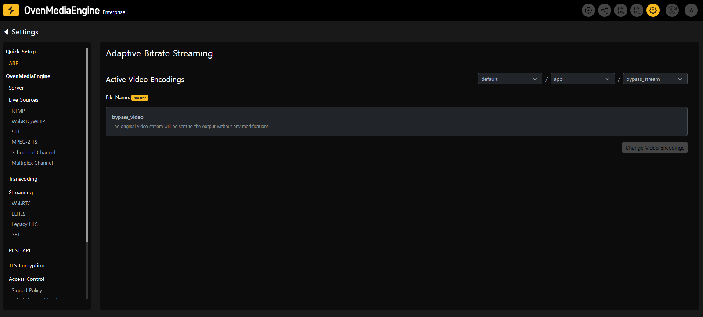
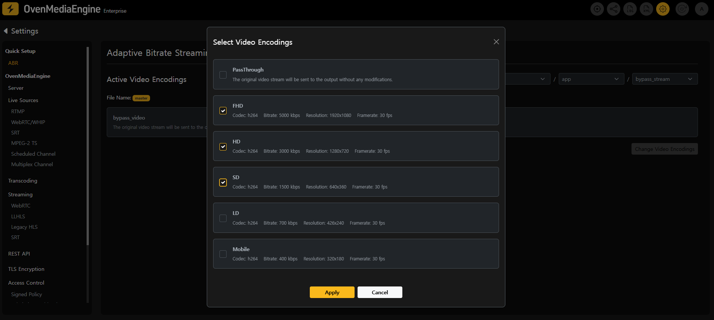
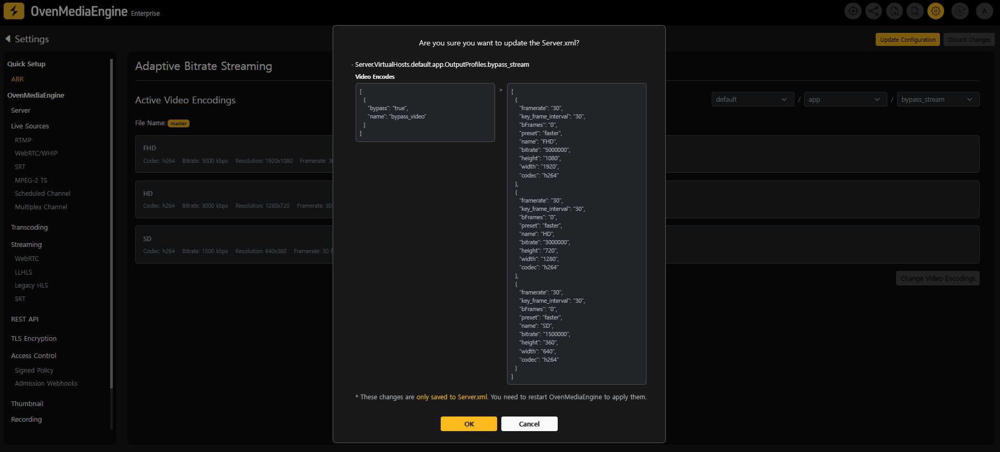
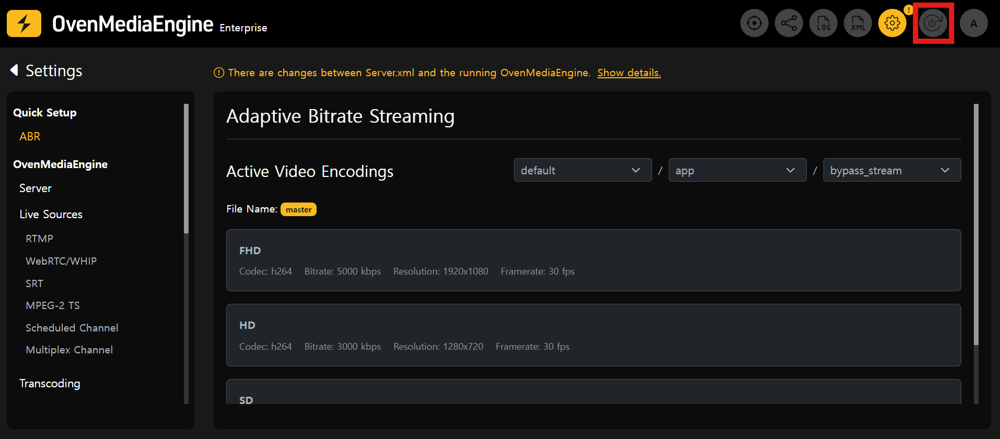
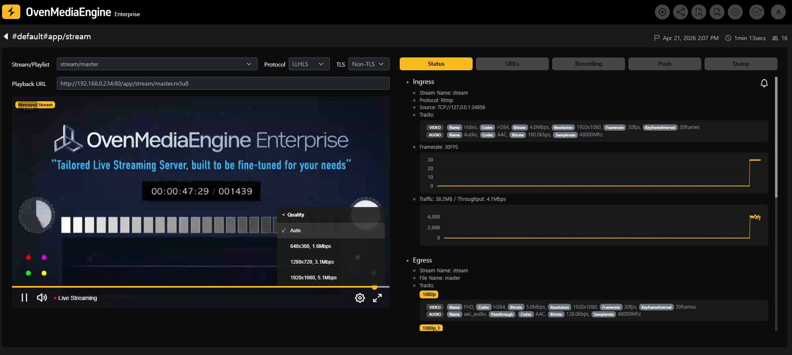

You can configure ABR by selecting predefined video encoding presets in the Quick ABR Setup page.

On the configuration page, you can select the Virtual Host, Application, and Output Profile for ABR, and check the name of the Playlist file (`master`) to be modified.

:::info

By default, OvenMediaEngine Enterprise operates in PassThrough mode, delivering the input stream without transcoding.

:::

To change the video encoding settings, click the `Change Video Encoding` button. In the popup, select the desired video encodings and click `Apply` to apply the changes. Once modified, the `Update Configuration` button in the top-right corner will be enabled.

Click the `Update Configuration` button to review the changes. Clicking `OK` will update the OvenMediaEngine configuration file, `Server.xml`.

:::info

At this stage, only the configuration file (`Server.xml`) is updated, and the changes are not yet applied to the running OvenMediaEngine.

:::

To apply the updated ABR settings, click the `Restart OvenMediaEngine`button in the top-right corner.

:::danger

During the restart, any active streaming will be temporarily interrupted.

:::

After the restart is complete, you can verify that ABR has been applied by playing the configured `master` playlist in the stream playback page.
