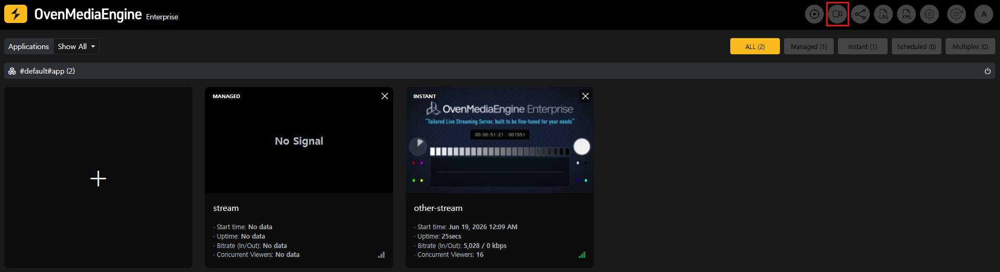
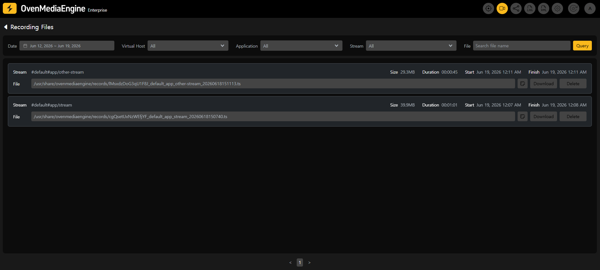
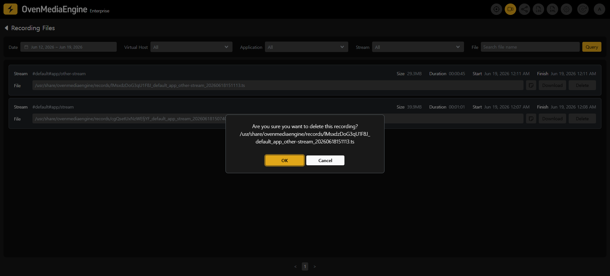

The Recording Files page lets you browse the recordings created by OvenMediaEngine's recording feature in a single list, and download or delete them.

For how to create recordings, refer to the related manuals:

* [Recording](../../../features/streaming-and-distribution/recording.md): How to configure recording in `Server.xml`.
* [Start Recording](stream-list/managed-and-instant-streams.md#start-recording--01712): How to start and stop recording from the Web Console.
* [Record (REST API)](../../../features/rest-api/v1/virtual-host/application/record.md): How to control recording through the REST API.

## Prerequisites

This page works on the recording files that OvenMediaEngine has written to disk, together with their XML metadata file (Info File). For recordings to appear in this page, OvenMediaEngine must be configured correctly.

* A `<RootPath>` must be set under the File publisher in `Server.xml`. In OvenMediaEngine Enterprise, it is set to `/usr/share/ovenmediaengine/records` by default. If the `<RootPath>` is not set, recordings for that application are not listed and cannot be downloaded.
* An XML metadata file must be generated for each recording, since this page lists and manages recordings based on it. OvenMediaEngine generates this file by default, so no extra configuration is required unless you have changed the recording settings.

## Accessing the Page

Click the `Recording Files` icon in the Web Console navigation bar.

## Page Layout

### Search Filters

Select your filter values and click the `Query` button to apply them.

* **Date**: The date range to search, based on the recording start time. The last 7 days are selected by default.
* **Virtual Host** / **Application** / **Stream**: Linked drop-downs. Choosing a Virtual Host narrows the Application list, and choosing an Application narrows the Stream list.
* **File**: Search by file name.

### Recording List

Each recording is shown as a card with the following information.

* **Stream**: The source of the recording, in `#VirtualHost#Application/Stream` format.
* **Size**: The size of the recording file.
* **Duration**: The length of the recording.
* **Start** / **Finish**: When the recording started and finished.
* **File**: The full path of the recording file on the server.
* **Download** / **Delete** buttons.

The list is paginated with 50 items per page. Use the page navigation at the bottom to move through the results.

## Downloading a Recording

Click the `Download` button on a recording card to save the file using your browser's normal download. The file streams straight to disk, so even multi-gigabyte recordings download without issue.

## Deleting a Recording

Click the `Delete` button on a recording card and confirm in the dialog. Deleting a recording removes the media file and its entry from the XML metadata file, and cleans up any empty directories.

## Behavior and Limitations

* The list data is cached for about 5 seconds, so a newly completed recording may take a few seconds to appear. Deletions are reflected immediately.
* In large environments with many recordings, loading the list performs a disk scan, which can take additional time.
