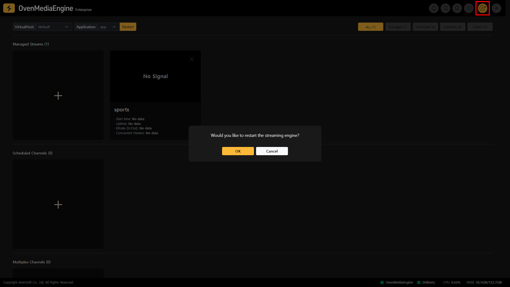
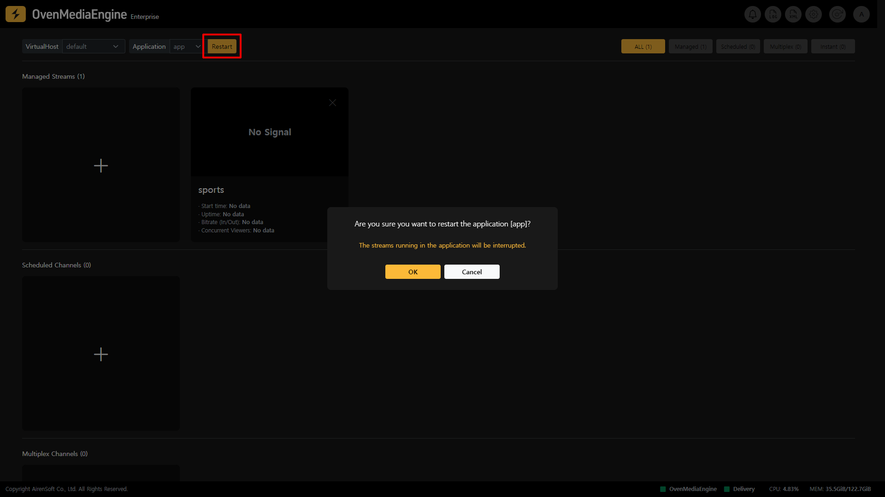
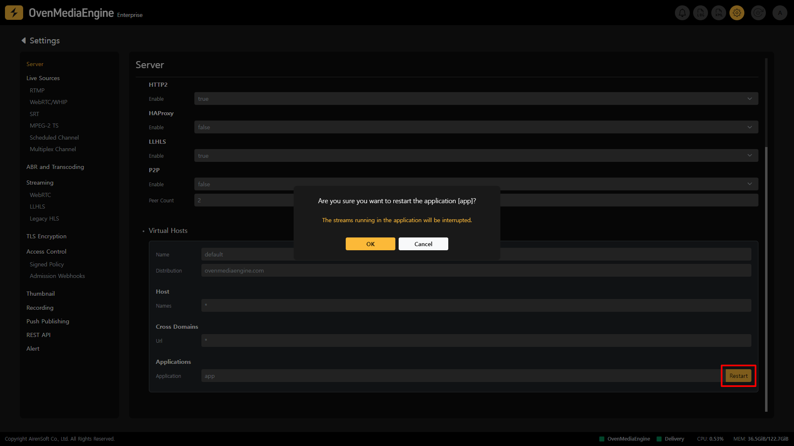

## Restart OvenMediaEngine

You can restart OvenMediaEngine immediately by clicking the `Restart` button at the top right corner of OvenMediaEngine Enterprise. Upon restart, all the latest changes and configurations will be applied to OvenMediaEngine.

## Restart Application | 0.17.0.0+

If you need to quickly restart only a specific `Application`, you can restart that `Application` using the method below.

:::tip

All client connections from other Applications remain intact, except for the specified `Application`.

:::

### Restart the Application from the Stream List

* You can restart the `Application` by selecting it in the upper left of the Stream List and clicking the `Restart` button.

### Restart the Application from the Server Settings

1. Click the `Settings` button on the right side of the Web Console navigation bar to enter the Server Settings page.
2. You can then restart the `Application` by scrolling down and clicking the `Restart` button on the right side of the `Application Name` in the Virtual Hosts Settings under Applications.
   * _If there are multiple applications on the `VirtualHost`, the `Applications` will be listed on the Settings screen._

:::info

Click [HERE](/broken/pages/ZmDPbfdDcFBTEmiIz2Zy#api-interface) to learn how to restart the Application using the API.

:::

