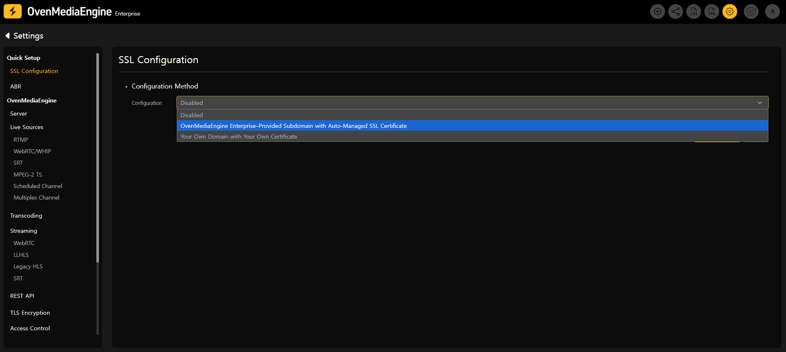
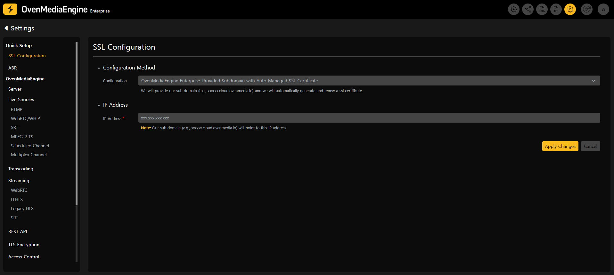
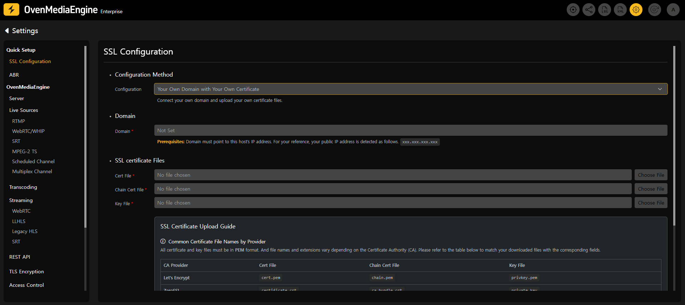
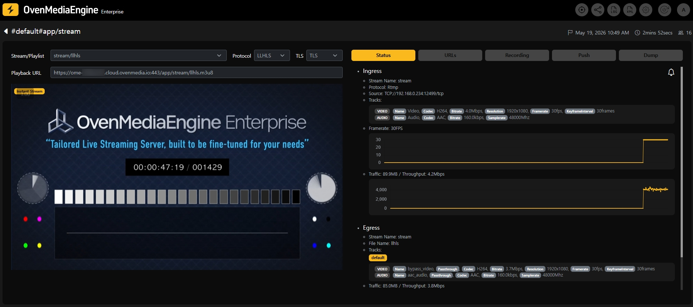
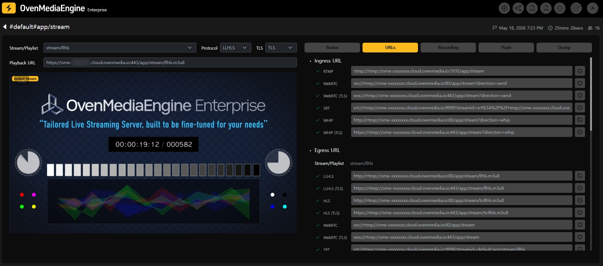

import Tabs from '@theme/Tabs';
import TabItem from '@theme/TabItem';

Modern web browsers such as Chrome, Safari, Firefox, and Edge enforce security restrictions that **prevent the use of camera/microphone permissions** and **block playback of unsecured streams** in environments **without SSL (HTTPS)**. In particular, to use WebRTC publishing/playback and HLS playback smoothly, communication between the **server and the client must be encrypted via HTTPS/WSS**. SSL/HTTPS also ensures that all communication between the server and clients is transmitted securely.

OvenMediaEngine Enterprise provides features that make this configuration easy. Completing the security setup described in this guide is a required step to build and operate a stable and secure streaming service.

## Configure and Verify SSL

### Configure SSL in the Web Console

1. Click the \[Settings] icon in the upper-right corner of the Web Console to open the Settings page, then select **\[SSL Configuration]** from the left menu.

2. In the Configuration Method section, click \[Change Configuration] to switch to edit mode.

3. Choose an SSL configuration method that fits your service environment.

<Tabs>
<TabItem value="option-a" label="Option A">

#### OvenMediaEngine Enterprise–Provided Subdomain with Auto-Managed SSL Certificate \[Recommended]

* Without any complex setup, OvenMediaEngine Enterprise automatically provisions a dedicated subdomain and SSL certificate required for SSL configuration, and manages certificate renewals starting 20 days before expiration.

</TabItem>
<TabItem value="option-b" label="Option B">

#### Your Own Domain with Your Own Certificate

* Register your domain and SSL certificate directly in OvenMediaEngine Enterprise. Make sure your domain's DNS records point to this host's IP address in your DNS management console. You can find the Public IPv4 address of this instance on the \[SSL Configuration] page for reference.
* Please ensure that your SSL certificate is renewed manually before it expires.

</TabItem>
</Tabs>

* If you choose the _Your Own Domain with Your Own Certificate_ option (Option B), please refer to the "[Custom SSL Certificate File Guide](custom-ssl-certificate-file-guide.md)" for the required certificate files to upload.

### Access via HTTPS

4. Once SSL is applied successfully, you can access the Web Console using the URL shown on the \[SSL Configuration] page.
   * For example, `https://ome-xxxxxxx.cloud.ovenmedia.io:8443`.

### Verify SSL playback and check URLs

5. Publish a media source to `rtmp://{Domain}:1935/{app}/{stream}`, then confirm in the Stream List on the Web Console that the stream is being delivered properly.

6. If playback works normally even after selecting `TLS` in the stream detail view, the SSL setup is complete.

7. In the \[URLs] tab, you can view the TLS-enabled Ingress URL and Egress URL at a glance. Your service is now ready to deliver stable and secure streaming over encrypted connections.

