## Managed Streams

Managed Stream refers to the Stream List in OvenMediaEngine Enterprise where users pre-specify stream names and use them.

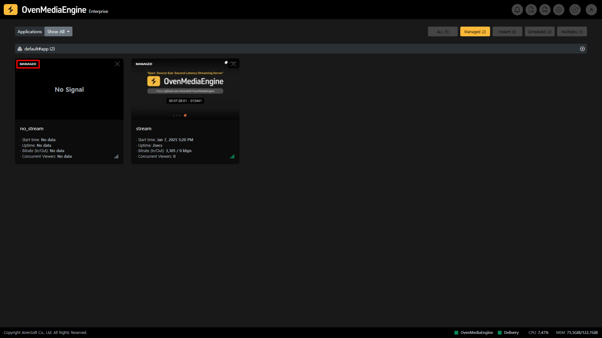

As you can see in the image above, the Stream List lets you see at a glance whether a user has created a Managed Stream and whether it has received a stream.

### Create a Managed Stream

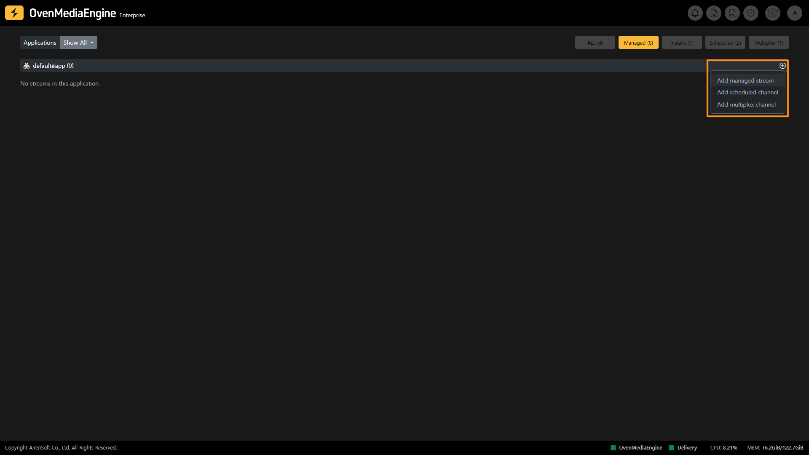

As shown in the image above, when you first access OvenMediaEngine Enterprise, there is no Managed Stream created. You can make a Managed Stream by clicking the Plus button, located in the upper right corner. Managed Streams will be displayed in the Stream List until you delete them.

### Delete a Managed Stream

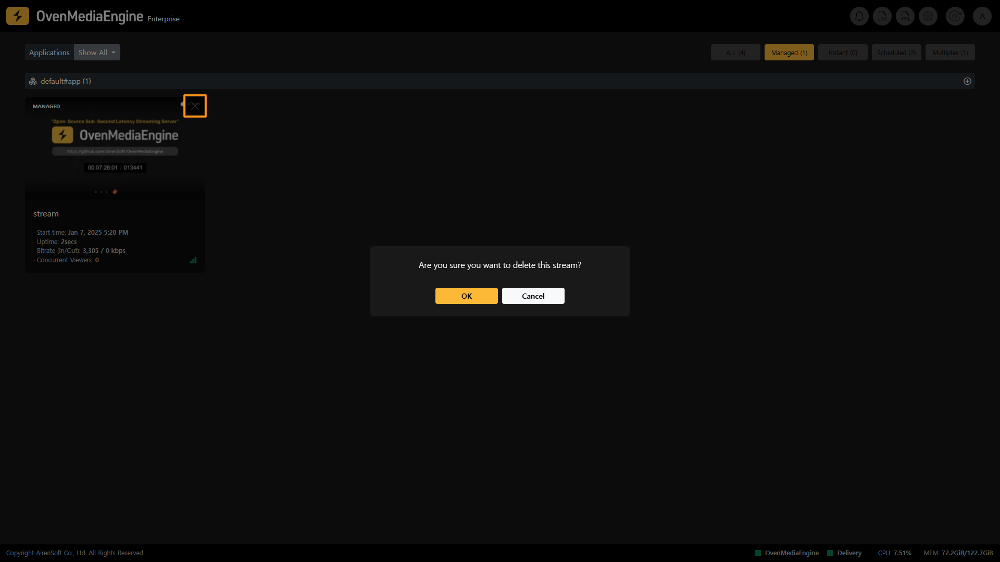

You can delete a Managed Stream by clicking the X button in the upper right corner of Stream Box.

At this time, if the Managed Stream is not receiving a stream, this Stream Box will disappear from the Stream List. However, if you delete the Managed Stream while the stream is being transmitted, the Managed Stream will be converted to an Instant Stream and the stream will remain.

To completely stop streaming, you need to stop transmitting media sources from cameras, live encoders, etc.

## Instant Streams

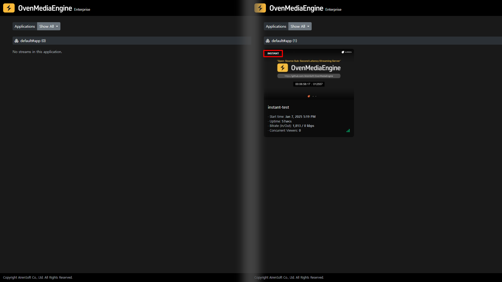

Instant Stream is a feature that detects streams sent to OvenMediaEngine Enterprise that are not designated as Managed Streams, automatically classifies them as Instant, and provides a list for monitoring.

You cannot directly delete the Instant Stream from OvenMediaEngine Enterprise, and it will automatically disappear from the Instant Streams list when transmission from cameras, live encoders, etc. is stopped.

## Scheduled Channels

Scheduled Channel is a feature in OvenMediaEngine Enterprise that allows you to stream on a set schedule using pre-recorded media files or live.

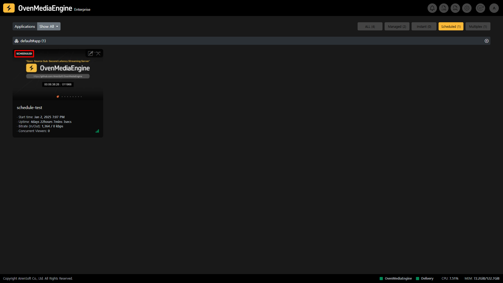

:::info

Detailed Guide: [https://ovenmedialabs.com/docs/ome/live-source/scheduled-channel](https://ovenmedialabs.com/docs/ome/live-source/scheduled-channel)

:::

### Create a Scheduled Channel

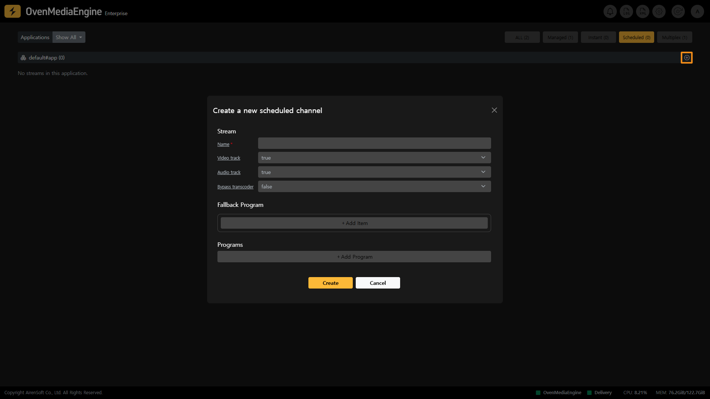

As you can see in the image above, you can create a Scheduled Channel from the Web Console Home.

* **Name**: This is the stream information that the Scheduled Channel needs to create.
* **Video track**: Determines whether to use the video track. If VideoTrack is set to `true` and there's no video track in the Item, an error will occur.
* **Audio trac**k: Determines whether to use the audio track. If AudioTrack is set to `true` and there's no audio track in the Item, an error will occur.
* **Bypass transcoder**: Set to `true` if transcoding is not desired.

Setting a Fallback Program will automatically switch the screen if there is no program scheduled for the current time or if an error occurs in the item. When the program is updated or the streaming returns to normal, it will return to the original program.

* **URL**: The URL points to the location of the media source.
* **Start**: The start attribute can be set in milliseconds to indicate where in the file playback should start.
* **Duration**: The duration indicates the playback time of that item in milliseconds.

In the Program, you can schedule the streaming to play by setting the time and end time in ISO8601 format.

* **Name**: The name is an optional reference value.
* **Scheduled**: Set the start time of the program.
* **Repeat**: Decide whether to repeat the Items when its playback ends.
* **URL**: The URL points to the location of the media source.
  * If it starts with `file://`, it refers to a file within the `MediaRootDir` directory.
  * If it starts with `stream://`, it refers to another stream within the same OvenMediaEngine.

:::info

stream://vhost\_name/app\_name/stream\_name

:::

* **Start**: The start attribute can be set in milliseconds to indicate where in the file playback should start. If not set, start defaults to 0.
* **Duration**: The duration indicates the playback time of that item in milliseconds. After the duration ends, it moves to the next item. If not set duration defaults to the file's duration.

### Modify a Scheduled Channel

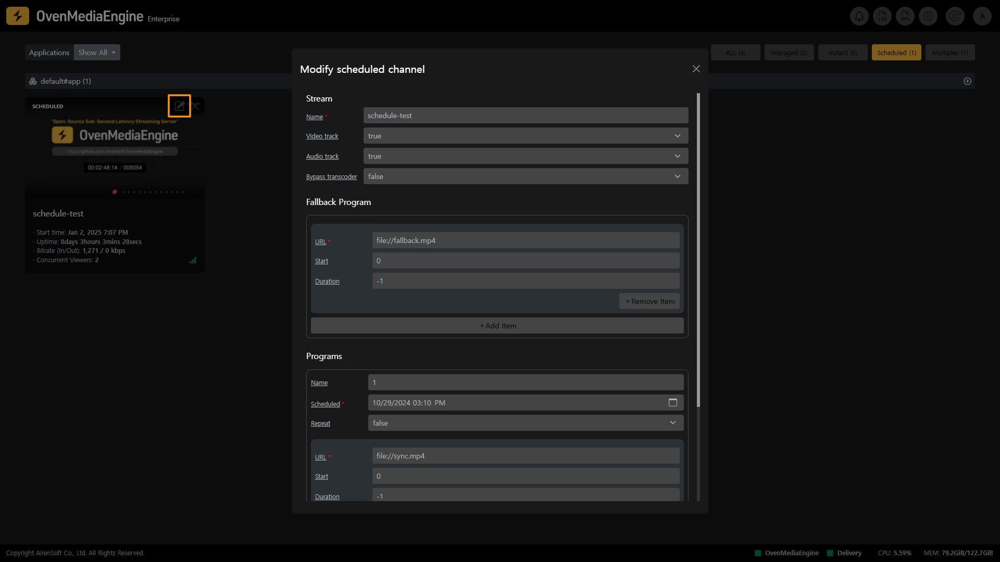

You can edit a Scheduled Channel Box created by a user by clicking the Edit icon in the Web Console Home.

### Delete a Scheduled Channel

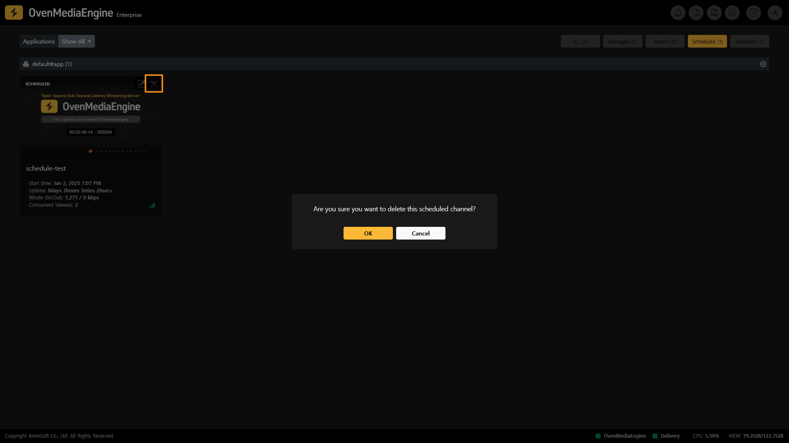

You can delete a Scheduled Channel Box created by a user by clicking the X mark in the Web Console Home.

## Multiplex Channels

You can use the Multiplex Channel feature within OvenMeidaEngine Enterprise to combine multiple ingressing streams into one stream to form an [Adaptive Bitrate Streaming _(_&#x41;BR)](../../web-console-settings/abr-and-transcoding-settings.md#check-adaptive-bitrate-streaming-abr-settings--01430) or to duplicate an external stream and send it to another Application. Multiplex Channel can also take already encoded tracks from other Local Streams and compose them into its tracks, which can be useful when changing codecs or re-tuning quality.

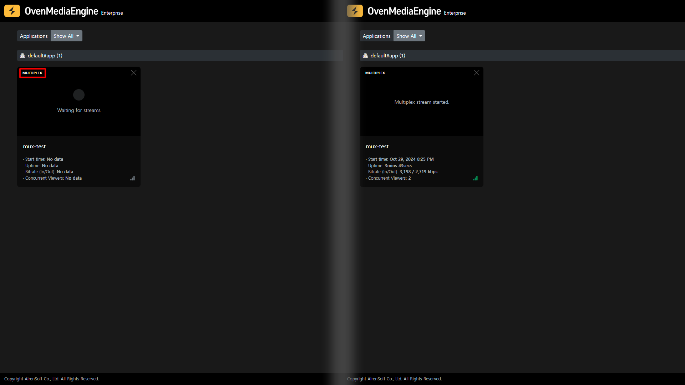

:::info

Detailed Guide: [https://ovenmedialabs.com/docs/ome/live-source/multiplex-channel](https://ovenmedialabs.com/docs/ome/live-source/multiplex-channel)

:::

### Create a Multiplex Channel

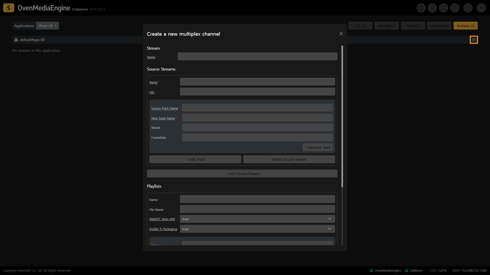

As you can see in the image above, you can create a Multiplex Channel from the Web Console Home.

* **Name**: This is the name of the stream to be newly created.

Multiplex Channel multiplexes multiple Source Streams, which can also be loaded as streams from other Vhosts or Apps.

* **Name**: Name of the Source Stream to be multiplexed.
* **URL**: URL of the Source Stream

:::info

stream://\<vhost name>/\<app name>/\<stream name>

:::

* **Source Track Name**: The Source Track Name is either `<OutputProfile><Encodes><VideoName>` or `<OutputProfile><Encodes><AudioName>`.
* **New Track Name**: Renamed source track name to be used in the multiplex stream.

Playlists configured on a Multipelx Channel exist only on that Multipelx Channel. Playlists must be configured using the newly mapped Track names in the `<TrackMap>` of `<SourceStreams>` and must use the same format as `<OutputProfile>`.

* **WebRTC Auto ABR**: It is set to `true` by default and will automatically switch Renditions when using WebRTC.
* **Enable Ts Packaging**: When `<EnableTsPackaging>` is turned on in a Playlist, the HLS Publisher will use this Playlist to package TS files and prepare them for streaming.
* **audio**: The New Track Name is set in the Source Stream. This is the audio track name to be used in the Playlist.
* **video**: The New Track Name is set in the Source Stream. This is the video track name to be used in the Playlist.

### Delete a Multiplex Channel

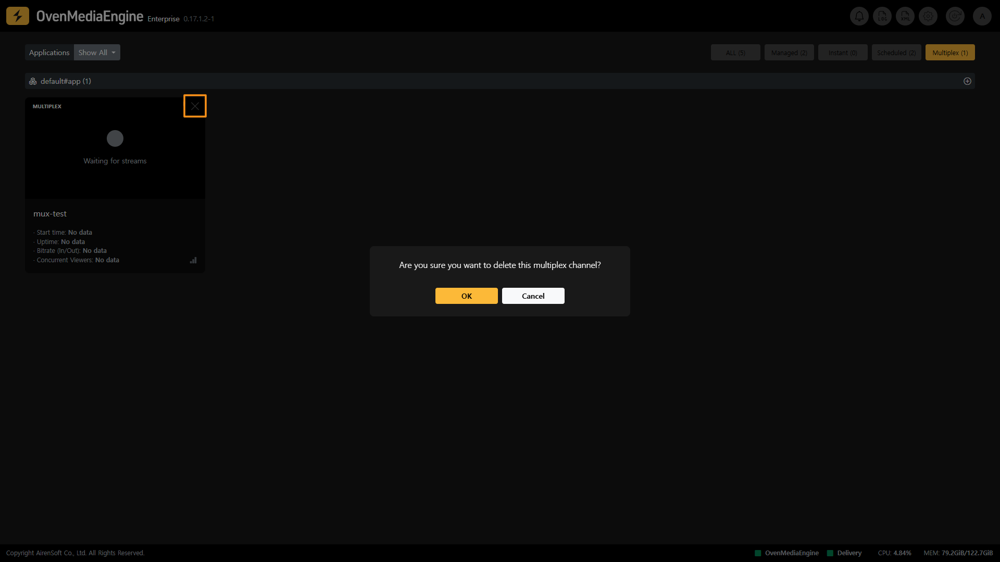

You can delete a Multiplex Channel Box created by a user by clicking the X mark in the Web Console Home.

## Thumbnails

OvenMediaEngine Enterprise can generate Thumbnails from your live streams to organize your broadcast list or monitor multiple streams simultaneously.

### If the Thumbnail is not displayed

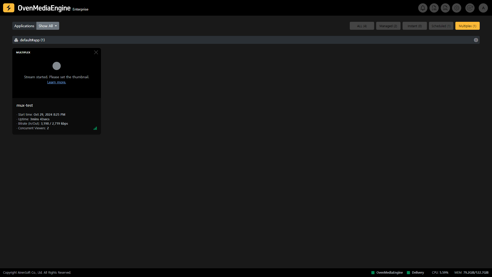

If the thumbnail feature is not enabled in OvenMediaEngine when broadcasting a stream, a guide will be displayed in the thumbnail area. You can set the thumbnails by referring to the guide.

:::info

Detailed Guide: [https://ovenmedialabs.com/docs/ome/thumbnail](https://ovenmedialabs.com/docs/ome/thumbnail)

:::

## Waiting for Streaming

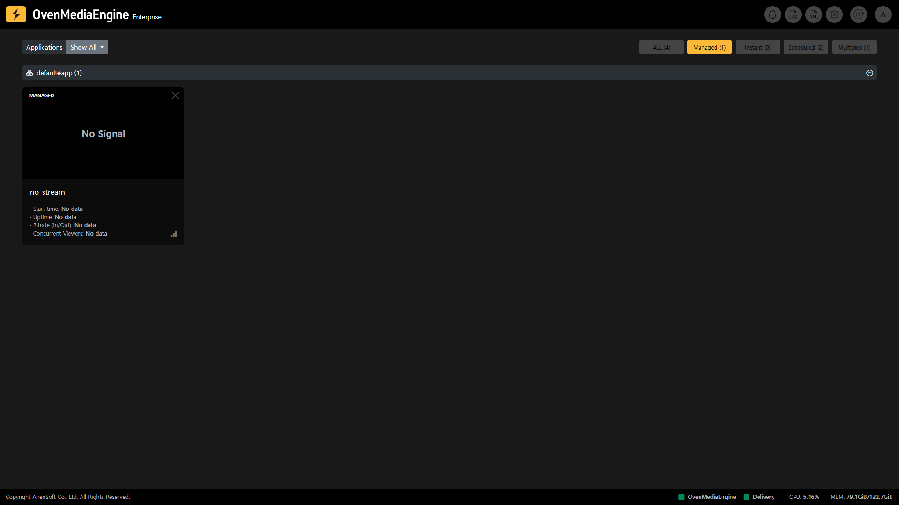

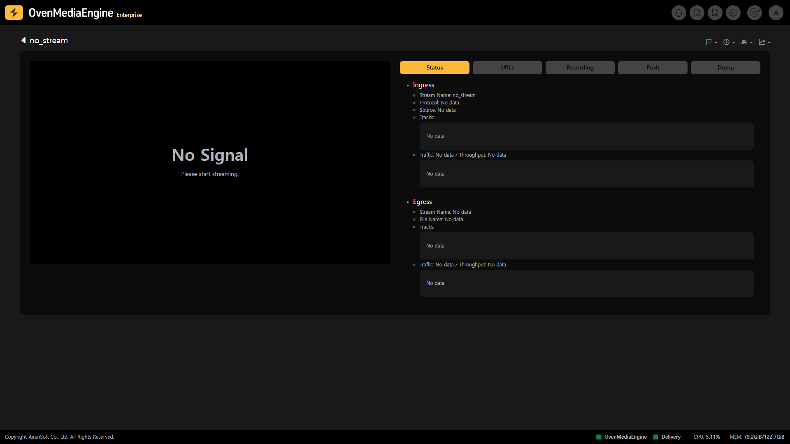

Managed Streams, Scheduled Channels, and Multiplex Channels, when there is no ingress stream and it is waiting, it is displayed as `No Signal` and `No data`.
