## Managed Streams and Instant Streams

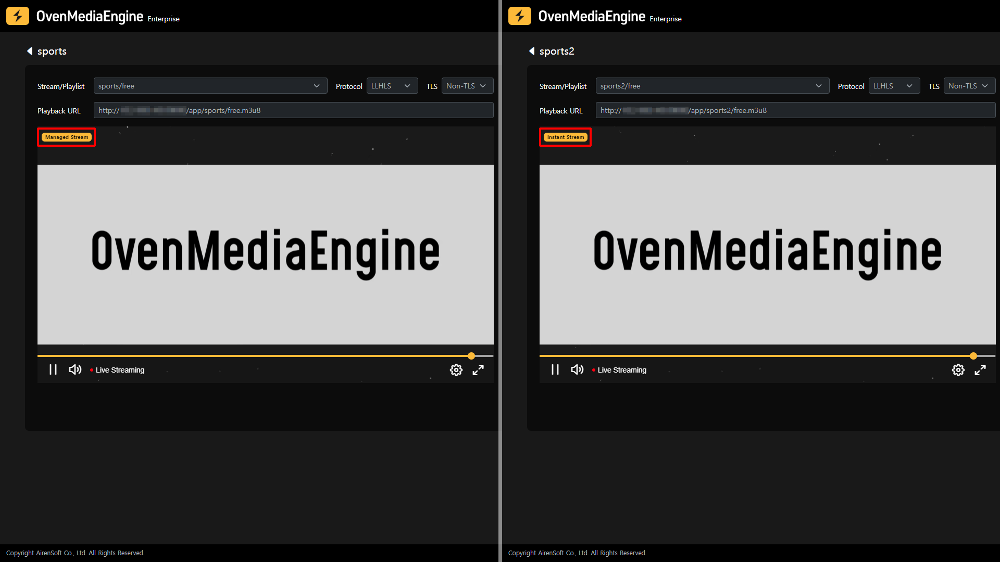

Managed and Instant Streams are categorized in the Stream List, so you can easily distinguish them. Also, if you select Managed or Instant Stream and go to the Stream Monitoring screen, you can easily check it by the icon marked on the upper left of the OvenPlayer where the corresponding Stream is playing.

## Stream Monitoring Tab

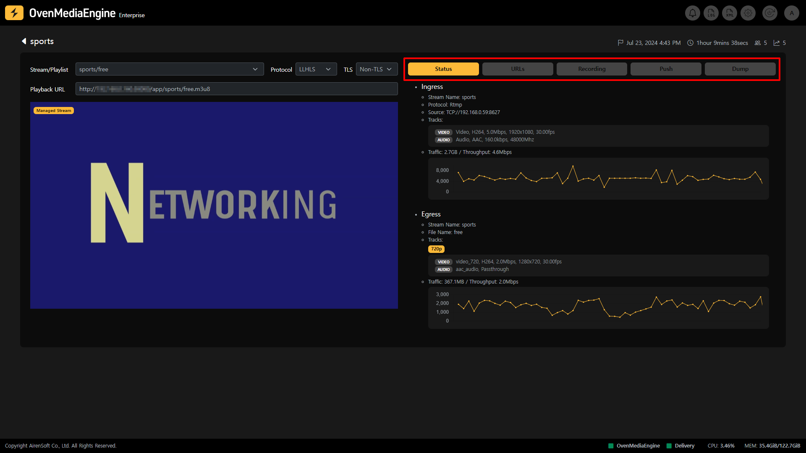

* **Stream Playback**: You can play the stream through the embedded OvenPlayer after selecting the options, such as Output Stream, Playlist, Protocol, etc. on the left side of the Stream Monitoring screen.
* **Status**: You can check the Ingress/Egress metadata and statistics of the stream.
* **URLs**: You can see the Ingress/Egress URLs of the stream, and the available Ingress/Egress Protocols are displayed according to the OvenMediaEngine settings.

:::info

- Supported Ingress Protocols: RTMP, WebRTC, WebRTC/TLS, WHIP, WHIP/TLS, SRT
- Supported Egress Protocols: WebRTC, WebRTC/TLS, LLHLS, LLHLS/TLS, HLS

:::

* **Recording**: You can check the recording status of the stream.
* **Push Publishing**: You can check the Push Publishing status that transmits the stream to other platforms.
* **Dump**: You can check the LLHLS Dump status of the stream.

## Stream Status Monitoring

### Metadata and Statistics

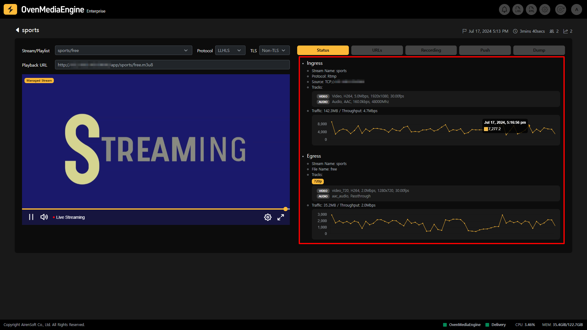

* **Ingress**: You can check the Ingress metadata and statistics such as Protocol, Source location, Track, Input Traffic, etc.
* **Egress**: You can check the Egress metadata and statistics such as Output Profile, Track, Output Traffic, etc.
  * _If multiple Output Profiles are configured in OvenMediaEngine, it can work as ABR._

## Play Stream

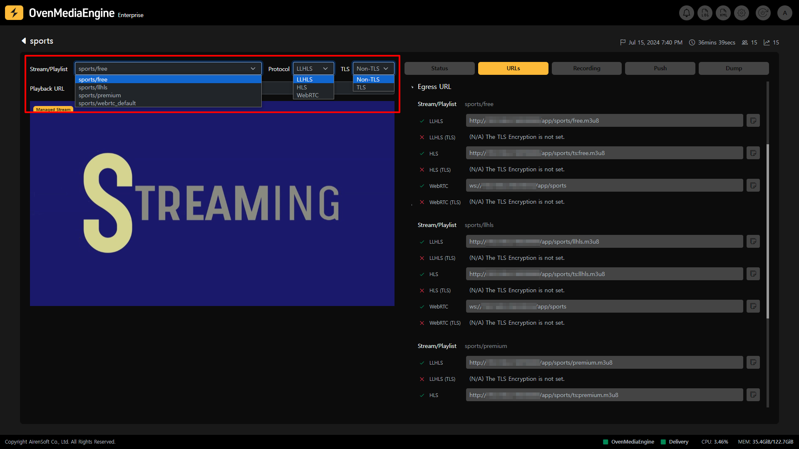

Depending on the playback options you have chosen, such as Output Stream or Playlist (depending on OvenMediaEngine settings), Protocol selection (LLHLS or WebRTC), Certificate availability (TLS or Non-TLS), etc., a Playback URL of the Stream is displayed. You can play it through OvenPlayer or an external player using the Playback URL.

### Playback URL

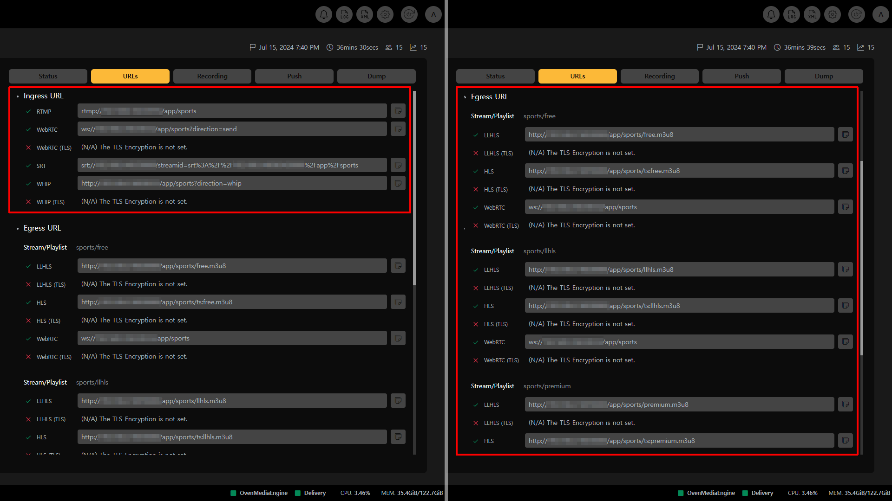

* **Ingress URL**: You can check the input stream URL address that is activated and available for use in OvenMediaEngine
* **Egress URL**: You can see the stream playback URL address for each Output Stream, Playlist, and Protocol set in OvenMediaEngine.

:::info

You can easily copy the URL by clicking the Copy icon at the end of each URL.

:::

### Failed to Play Stream

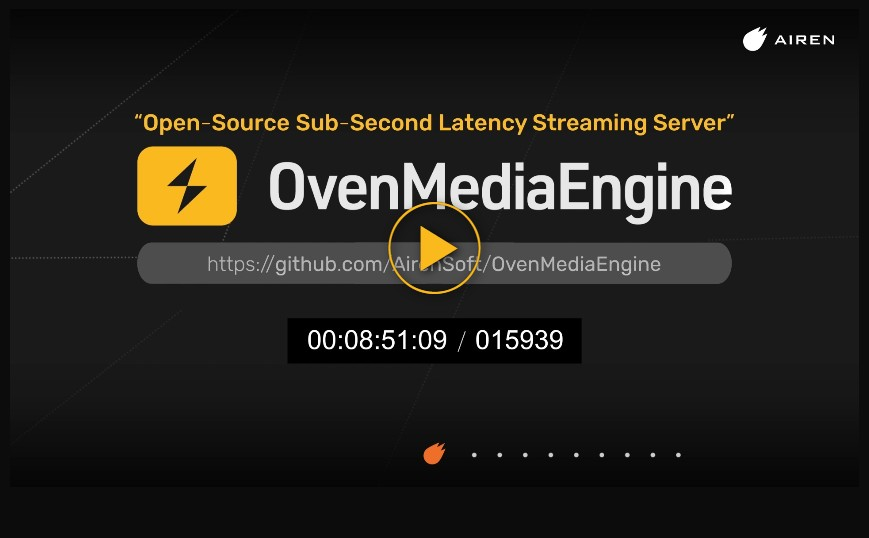 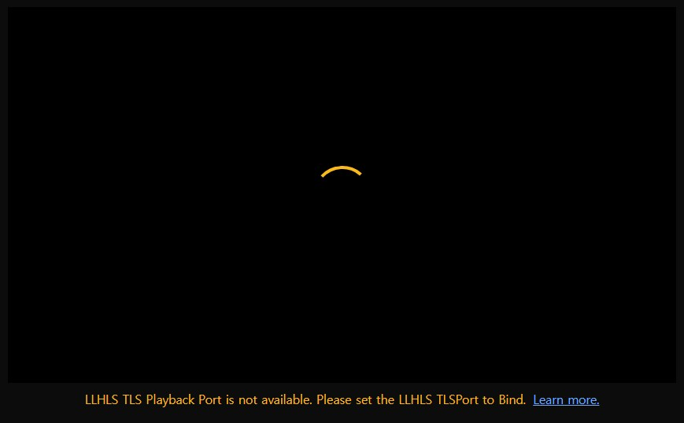

The selected Playback URL can be played using OvenPlayer included in OvenMediaEngine Enterprise, but if playback fails, the system automatically provides the cause and solution at the bottom of OvenPlayer. If you encounter any problems, please refer to the information.

## Recording Status

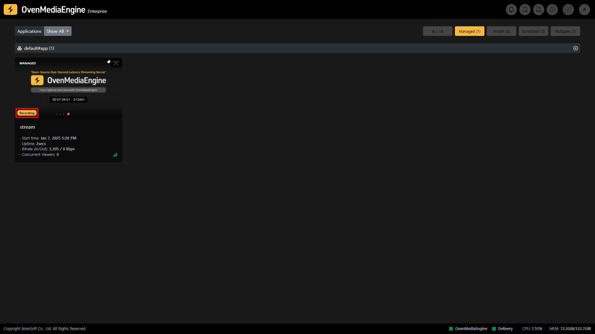

Recording is a function that records when the stream is Live. When the stream is recording, you can see at a glance that it is recording through the Recording marking in the Stream List.

In addition, you can use and control Recording using the API.

:::info

* Recording Settings Guide: [https://ovenmedialabs.com/docs/ome/recording](https://ovenmedialabs.com/docs/ome/recording)
* Recording API Guide: [https://ovenmedialabs.com/docs/ome/rest-api/v1/virtualhost/application/recording](https://ovenmedialabs.com/docs/ome/rest-api/v1/virtualhost/application/recording)

:::

### Start Recording | 0.17.1.2+

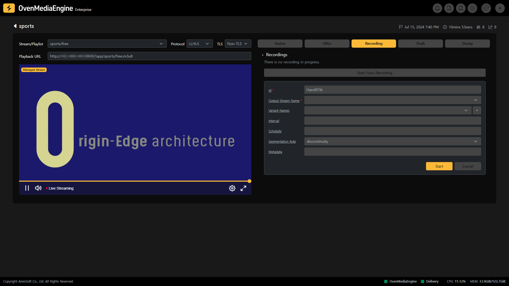

You can check the detailed recording status through the Recording tab in Stream Monitoring and control Recording using the Start/Stop Recording function.

* **Id**: Unique ID to identify the recording task.
* **Output Stream Name**: Output stream name to record.
* **Variant Names**: Array of track names to record.
* **Interval**: Recording time per file (milliseconds). Not allowed to use with the schedule.
* **Schedule**: Same as Crontab syntax '10 \*/1 \*' means to output the recorded file every 10 minutes of the hour. Not allowed to use with Interval.
* **Segmentation Rule**: Define the policy for continuous or discontinuous timestamps in divided recorded files.
  * **continuity**: The timestamp of recorded files is continuous.
  * **discontinuity** (default): The timestamp starts anew for each recorded file.
* **Metadata**: Metadata is used by the Record Delivery feature. An example of Record Delivery settings is shown below.

:::info

aws\_access\_key\_id='xxx', aws\_secret\_access\_key='xxx', endpoint='https://object.storage.com', region='us-east-1', bucket\_name='bucket\_name', object\_dir='my/vod/path/',delete='true'

:::

## Push Publishing Status

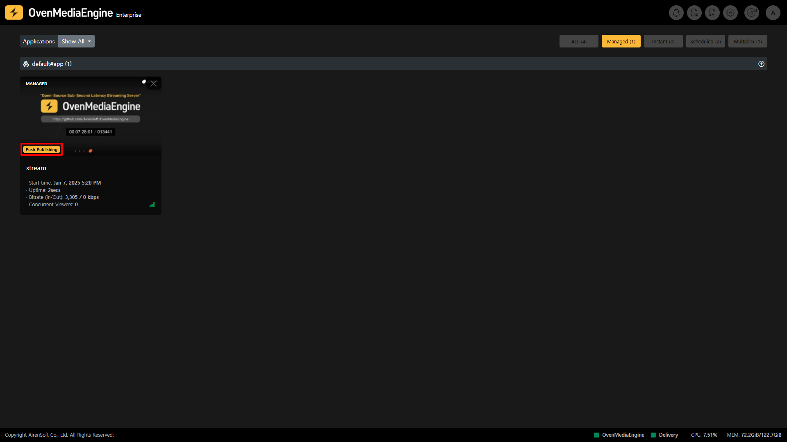

Push Publishing is a function that retransmits a stream ingested into OvenMediaEngine Enterprise to other platforms. While the stream is being Push Published, you can see the Push Publishing mark in the Stream List to know at a glance that it is being restreamed.

Also, you can use and control Push Publishing using the API.

:::info

* Push Publishing Settings Guide: [https://ovenmedialabs.com/docs/ome/recording](https://ovenmedialabs.com/docs/ome/recording)
* Push Publishing API Guide: [https://ovenmedialabs.com/docs/ome/rest-api/v1/virtualhost/application/push](https://ovenmedialabs.com/docs/ome/rest-api/v1/virtualhost/application/push)

:::

### Start Push Publishing | 0.17.1.2+

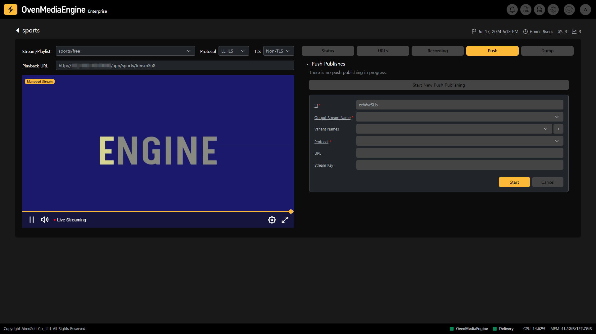

You can check the detailed re-streaming status through the Push tab in Stream Monitoring and control pushes using the Start/Stop Push Publishing function.

* **Id**: Unique ID to identify the task.
* **Output Stream Name**: Output stream name to Push Publishing.
* **Variant Names**:  Array of track names to push publish. This value is `<Encodes>` _\[Video|Audio|Data]_ `<Name>` in the `<OutputProfile>` setting. If empty, all tracks will be sent.
* **Protocol**: Protocol to Push Publishing.
* **URL**: Address of destination (Stream URL).
* **Stream Key**: RTMP stream key. Not used in SRT and MPEG2-TS.

## (LL)-HLS Dump Status

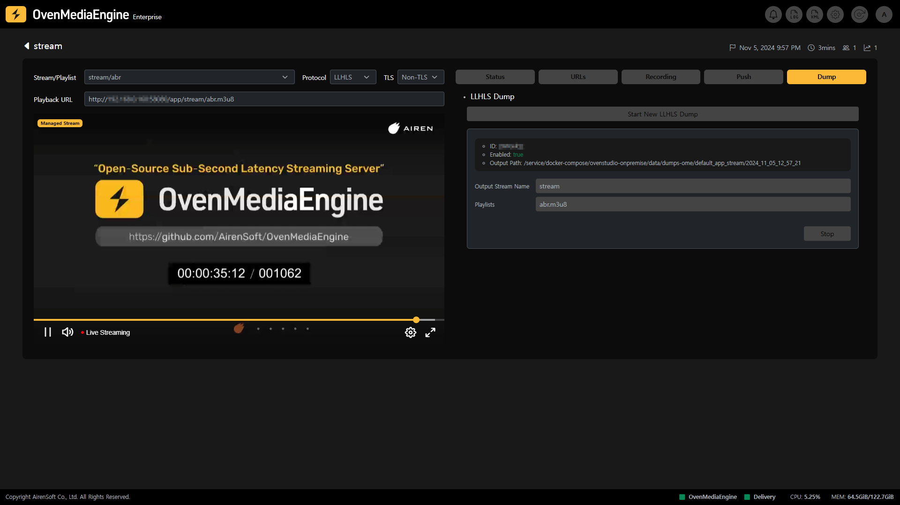

(LL)-HLS Dump is a feature that dumps the `.m3u8` and all track segments when the stream is played back as (LL)-HLS, allowing you to provide the file to VoD immediately up to the dumped point, while Live. You can check the detailed (LL)-HLS Dump status through the Dump tab on the Stream Monitor page while the stream is being dumped.

In addition, you can use and control (LL)-HLS Dump using the API.

:::info

* LLHLS Dump Settings Guide: [https://ovenmedialabs.com/docs/ome/streaming/low-latency-hls#dump](https://ovenmedialabs.com/docs/ome/streaming/low-latency-hls#dump)
* LLHLS Dump API Guide: [https://ovenmedialabs.com/docs/ome/rest-api/v1/virtualhost/application/stream/hls-dump](https://ovenmedialabs.com/docs/ome/rest-api/v1/virtualhost/application/stream/hls-dump)

:::

### Start (LL)-HLS Dump | 0.17.1.2+

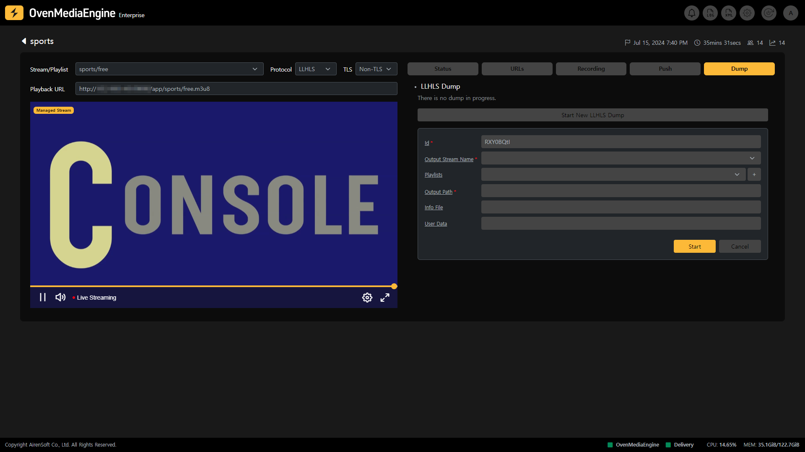

You can check the detailed (LL)-HLS Dump status through the Dump tab in Stream Monitoring and control the Dump using the Start/Stop (LL)-HLS Dump function.

* **Id**: ID for this API request.
* **Output Stream Name**: The name of the Output Stream created with `<OutputProfile>`.
* **Playlists**: Dump the Master Playlist set in `<outputPath>`. It must be entered in Json array format, and multiple Playlists can be specified.
* **Output Path**: Directory path to output. The directory must be writable by the OvenMediaEngine process. OvenMediaEngine will create the directory if it doesn't exist.
* **Info File**: This is the name of the DB file in which the information of the dumped files is updated. If this value is not provided, no file is created. An error occurs if a file with the same name exists.
* **User Data**: If `<infoFile>` is specified, this data is written to `<infoFile>`. Does not work if `<infoFile>` is not specified.
