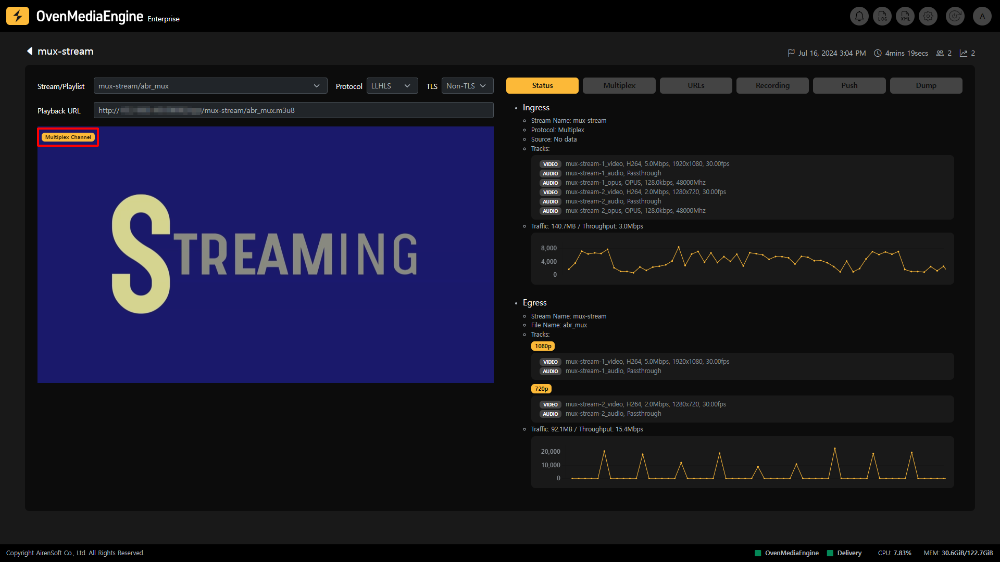
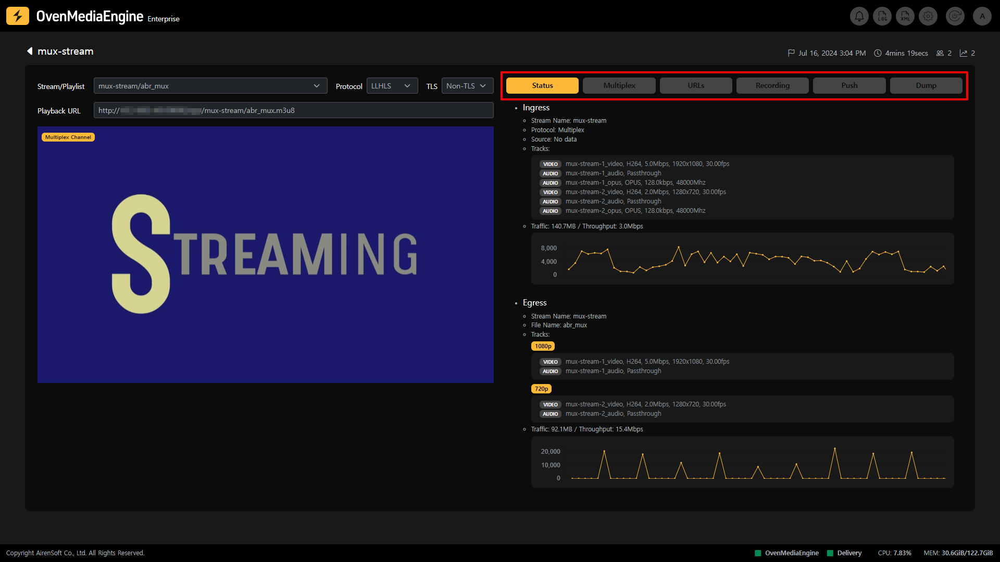
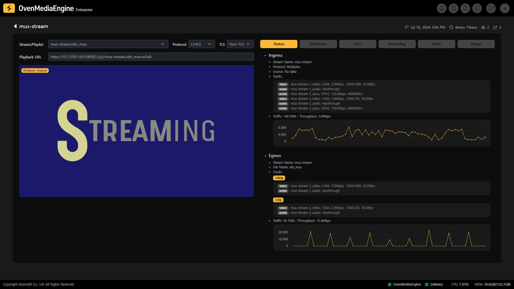
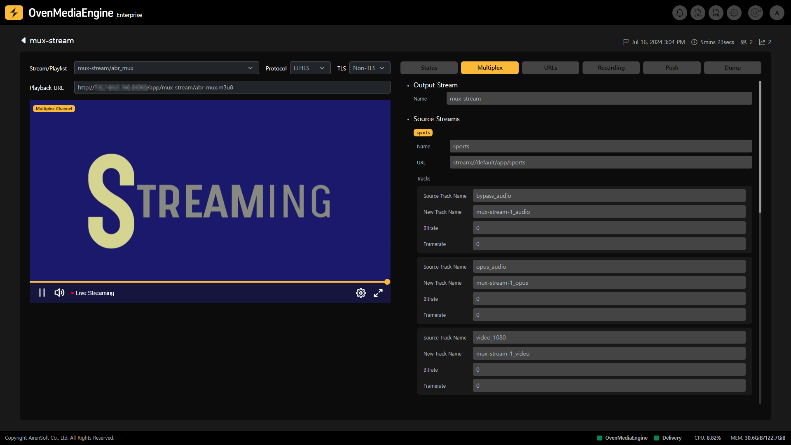
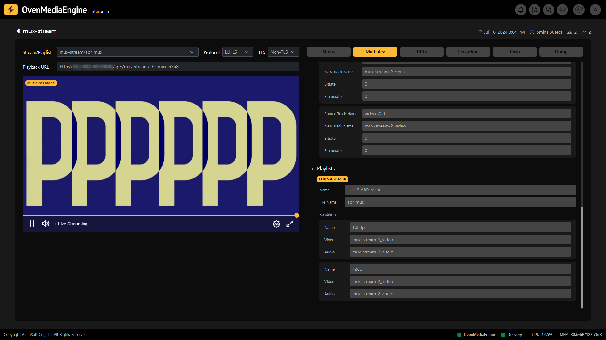
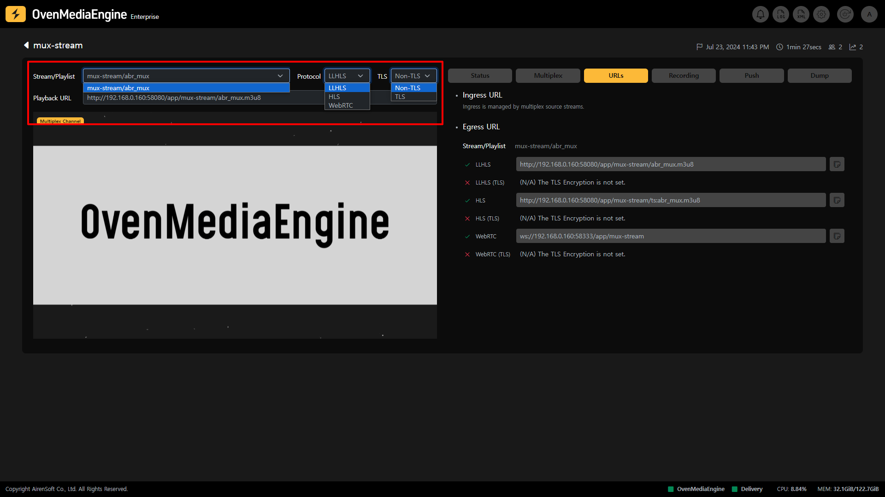
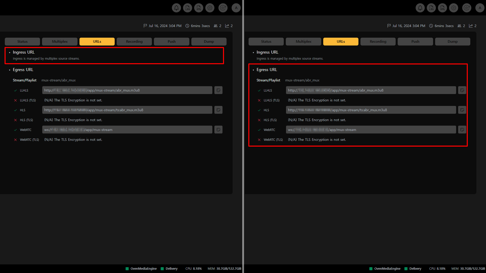
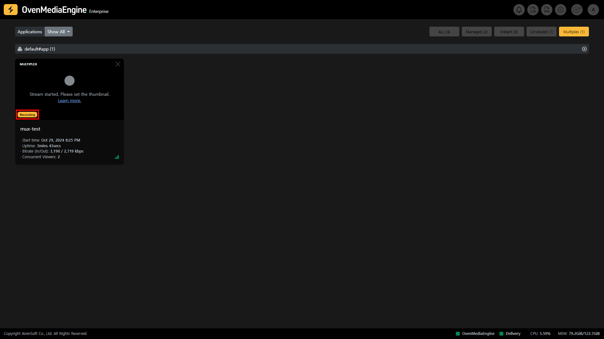
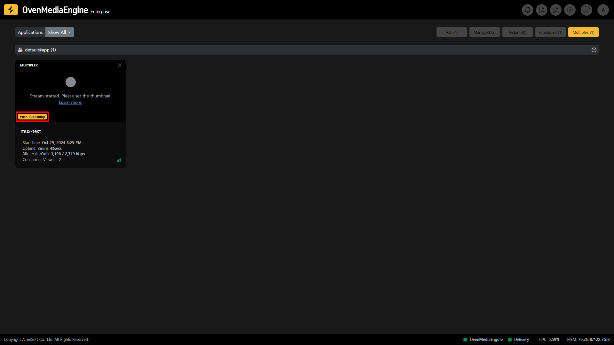

## Multiplex Channels

Multiplex Channel feature within OvenMediaEngine Enterprise to combine multiple ingressing streams into one to form an [Adaptive Bitrate Streaming _(_&#x41;BR)](../../web-console-settings/abr-and-transcoding-settings.md#check-adaptive-bitrate-streaming-abr-settings--01430) or to duplicate an external stream and send it to another Application.

Multiplex Channels are recognizable as they are categorized in the Stream List. Additionally, when you select a stream and go to Stream Monitoring, you can easily see which channel that stream is playing on via the Multiplex Channel icon displayed at the top left of OvenPlayer.

## Multiplex Channel Tab

* **Stream Playback**: You can play the Multiplex Channel stream through the embedded OvenPlayer after selecting the options, such as Output Stream, Playlist, Protocol, etc. on the left side of the Stream Monitoring screen.
* **Status**: You can check the Ingress/Egress metadata and statistics of the Multiplex Channel.
* **URLs**: Ingress of Multiplex Channel follows Multiplex Provider configuration in OvenMediaEngine. Therefore, in the URLs tab, you can see only the Egress URL.

:::info

- Supported Egress Protocols: WebRTC, WebRTC/TLS, LLHLS, LLHLS/TLS, HLS

:::

* **Recording**: You can check the recording status of the Multiplex Channel.
* **Push Publishing**: You can check the Push Publishing status that transmits the Multiplex Channel stream to other platforms.
* **Dump**: You can check the LLHLS Dump status of the Multiplex Channel.

## Multiplex Channel Stream Status Monitoring

### Metadata and Statistics

* **Ingress**: You can check the Ingress metadata and statistics such as Protocol, Source location, Track, Input Traffic, etc.
  * _In the case of the Multiplex Channel, various ingress streams come in, so all tracks of each stream are displayed._
* **Egress**: You can check the Egress metadata and statistics such as Output Profile, Track, Output Traffic, etc.
  * _Multiplex Channel can combine various ingress streams into one stream to configure an ABR, so the track is displayed like an ABR._

## Multiplex

### Mux File

To use Multiplex Channel, you need to enable Multiplex Provider in `Server.xml`. You can create and delete Multiplex Channels via a Mux File (`<Stream_Name>.mux`) or API.

Multiplex Provider monitors `MuxFilesDir` path, and when the Mux File is created, it parses the syntax and creates a Multiplex Channel. When the Mux File is modified, the existing channel is deleted and a new channel is created. Of course, when the Mux File is removed, the channel is deleted.

### Output Stream

The stream name of the Multiplex Channel must be the same as the Mux File name to work.

:::tip

If the Output Stream is `mux-stream`, the Mux File name must also be `mux-stream.mux`.

:::

### Source Streams

Source Streams is a list of streams to be loaded into the corresponding Multiplex Channel, and is specified by referencing a Mux File. Streams can be loaded not only from the current `VirtualHost`  or `Application`, but also from other `VirtualHost` or  `Application`, and if the stream name of the specified source stream matches the source location, it will be automatically combined and start streaming in the Multiplex Channel.

:::warning

Due to the concept of Multiplex Channels that combine multiple streams into a single stream, track names may be duplicated, so if the track names of loaded streams are conflicted, you should change them.

:::

### Playlists

The Playlist is a feature that allows you to bundle multiple streams and use them like ABR, and you must compose a playlist based on the track names of the streams loaded into the multiplex channel.

:::warning

The File Name of the Playlist must be unique throughout the entire `Application`.

:::

:::info

Detailed Guide:  [https://ovenmedialabs.com/docs/ome/live-source/multiplex-channel#configuration](https://ovenmedialabs.com/docs/ome/live-source/multiplex-channel#configuration)

:::

## Play Stream

Depending on the playback options you have chosen, such as Output Stream or Playlist (depending on OvenMediaEngine settings), Protocol selection (LLHLS or WebRTC), Certificate availability (TLS or Non-TLS), etc., a Playback URL of the Stream is displayed. You can use the playback URL to play it via OvenPlayer or an external player.

### Playback URL

* **Ingress URL**: OvenMediaEngine ingresses streams based on the Mux File you configured, so there is no separate Ingress URL displayed.
* **Egress URL**: You can check the playback address for each Playlist set in the Multiplex Channel of OvenMediaEngine.

:::info

You can easily copy the URL by clicking the Copy icon at the end of each URL.

:::

## Recording Status

Recording is a function that records when the Multiplex Channel is Live. When the Multiplex Channel is recording, a Recording mark is added to the Stream List, so you can see at a glance that it is recording. If you want to check the detailed recording status, use the Recording tab in Stream Monitoring.

You can also use and control Recording using the API.

:::info

* Recording Settings Guide: [https://ovenmedialabs.com/docs/ome/recording](https://ovenmedialabs.com/docs/ome/recording)
* Recording API Guide: [https://ovenmedialabs.com/docs/ome/rest-api/v1/virtualhost/application/recording](https://ovenmedialabs.com/docs/ome/rest-api/v1/virtualhost/application/recording)

:::

### Start Recording | 0.17.1.2+

Please refer to the [#start-recording-or-0.17.1.2](managed-and-instant-streams.md#start-recording--01712 "mention") as the Recording function works the same regardless of whether it is a Managed Stream, Instant Stream, Scheduled Channel, or Multiplex Channel.

## Push Publishing Status

Push Publishing is a feature that rebroadcasts streams contained in the Multiplex Channel to another platform. While the Multiplex Channel is push publishing, you can see at a glance that it is being re-streamed by seeing a Push Publishing mark in the Stream List. You can also check the detailed Push Publishing status through the Push Publishing tab in the Stream Monitoring screen.

Also, you can use and control Push Publishing using the API.

:::info

* Push Publishing Settings Guide: [https://ovenmedialabs.com/docs/ome/recording](https://ovenmedialabs.com/docs/ome/recording)
* Push Publishing API Guide: [https://ovenmedialabs.com/docs/ome/rest-api/v1/virtualhost/application/push](https://ovenmedialabs.com/docs/ome/rest-api/v1/virtualhost/application/push)

:::

### Start Push Publishing | 0.17.1.2+

Please refer to the [#start-push-publishing-or-0.17.1.2](managed-and-instant-streams.md#start-push-publishing--01712 "mention") as the Push Publishing function works the same regardless of whether it is a Managed Stream, Instant Stream, Scheduled Channel, or Multiplex Channel.

## (LL)-HLS Dump Status

(LL)-HLS Dump is a feature that dumps the `.m3u8` and all track segments when the Multiplex Channel is played back as (LL)-HLS, allowing you to provide the file to VoD immediately up to the dumped point, while Live. You can check the detailed (LL)-HLS Dump status through the Dump tab on the Stream Monitor page while the stream is being dumped.

In addition, you can use and control (LL)-HLS Dump using the API.

:::info

* LLHLS Dump Settings Guide: [https://ovenmedialabs.com/docs/ome/streaming/low-latency-hls#dump](https://ovenmedialabs.com/docs/ome/streaming/low-latency-hls#dump)
* LLHLS Dump API Guide: [https://ovenmedialabs.com/docs/ome/rest-api/v1/virtualhost/application/stream/hls-dump](https://ovenmedialabs.com/docs/ome/rest-api/v1/virtualhost/application/stream/hls-dump)

:::

### Start (LL)-HLS Dump | 0.17.1.2+

Please refer to the [#start-ll-hls-dump-or-0.17.1.2](managed-and-instant-streams.md#start-ll-hls-dump--01712 "mention") as the (LL)-HLS Dump function works the same regardless of whether it is a Managed Stream, Instant Stream, Scheduled Channel, or Multiplex Channel.
