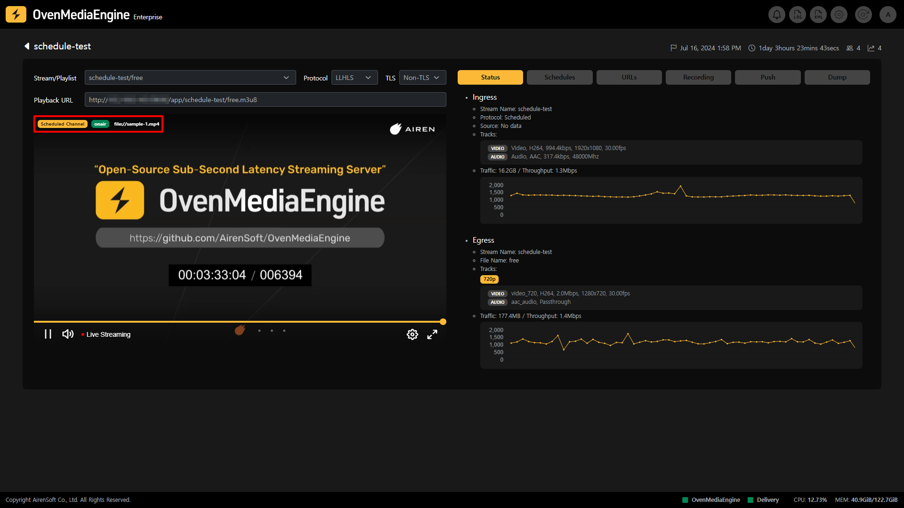
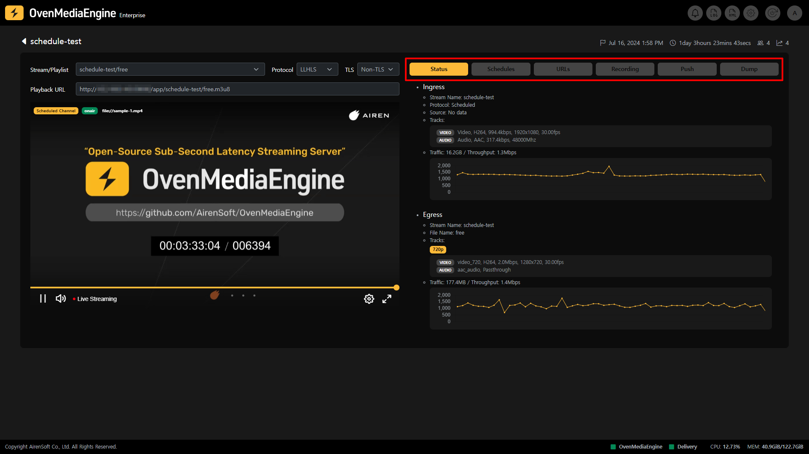
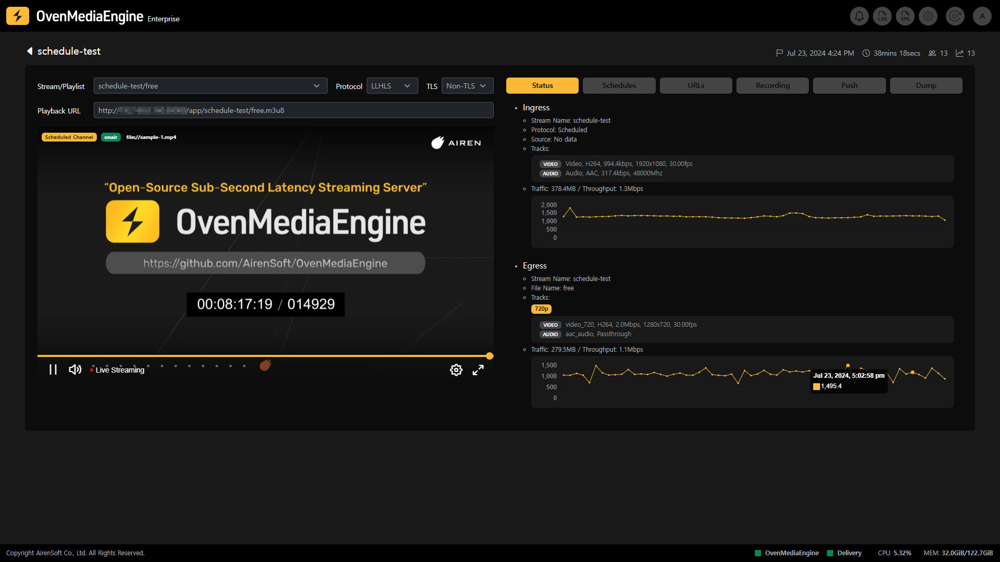
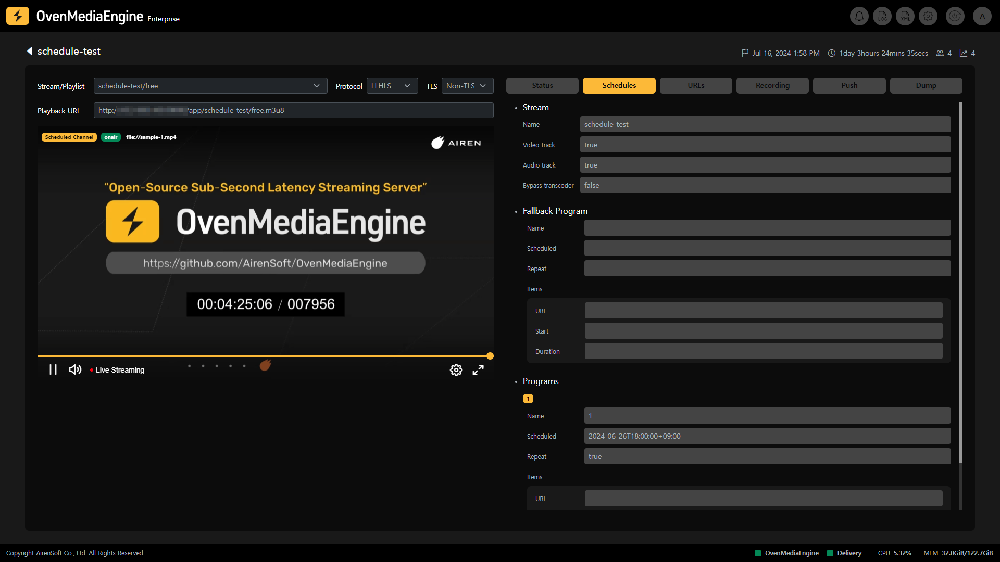
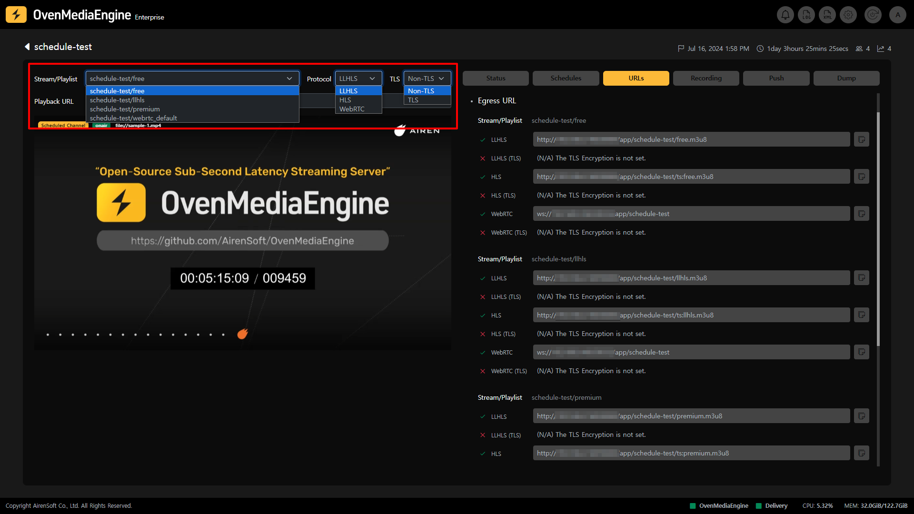
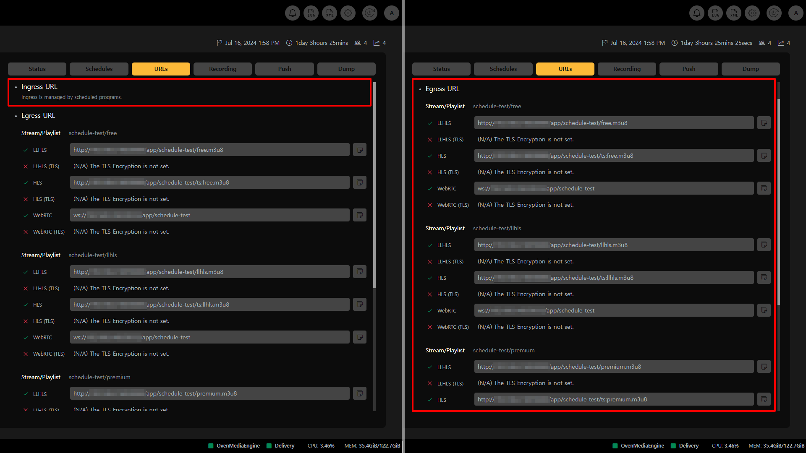
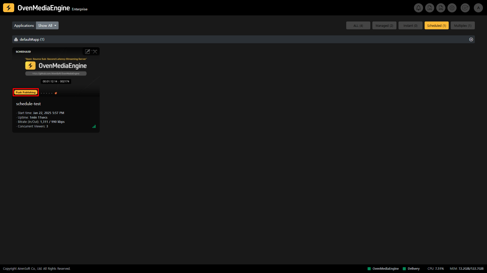

## Scheduled Channels

Scheduled Channel is a feature that allows you to set a Live Channel by referencing pre-recorded Media Files or Live Streams, and the Live Channel is configured and played back according to the Schedule File.

Scheduled Channels are distinguishable as they are categorized in the Stream List, but if you select the stream and go to the Stream Monitoring screen, you can easily check whether the Scheduled Channel is currently referencing a Media File or Live by marking it with the path at the top left of the OvenPlayer where the Stream is playing.

## Scheduled Channel Tab

* **Stream Playback**: You can play the Scheduled Channel stream through the embedded OvenPlayer after selecting the options, such as Output Stream, Playlist, Protocol, etc. on the left side of the Stream Monitoring screen.
* **Status**: You can check the Ingress/Egress metadata and statistics of the Scheduled Channel.
* **URLs**: Since Scheduled Channels consist of Media File or Live, Ingress follows the Scheduled Program set in OvenMediaEngine. Therefore, in the URLs tab, you can only see Egress URLs.

:::info

- Supported Egress Protocols: WebRTC, WebRTC/TLS, LLHLS, LLHLS/TLS, HLS

:::

* **Recording**: You can check the recording status of the Scheduled Channel.
* **Push Publishing**: You can check the Push Publishing status that transmits the Scheduled Channel stream to other platforms.
* **Dump**: You can check the LLHLS Dump status of the Scheduled Channel.

## Scheduled Channel Stream Status Monitoring

### Metadata and Statistics

* **Ingress**: You can check the Ingress metadata and statistics such as Protocol, Source location, Track, Input Traffic, etc.
* **Egress**: You can check the Egress metadata and statistics such as Output Profile, Track, Output Traffic, etc.
  * _If multiple Output Profiles are configured in OvenMediaEngine, it can work as ABR._

## Schedules

### Schedule File

The Schedule Channel operates according to the Schedule File (`<Stream_Name>.sch`) in the `ScheduleFileDir` path. OvenMediaEngine analyzes the Schedule File, updates the Schedule Channel when the content changes, and plays the corresponding Stream according to the schedule. Conversely, if the Schedule File is deleted, the stream is deleted.

### Fallback Program

This is a function that automatically switches the currently playing screen when there is no scheduled program at the current time or an error occurs in the schedule. When the schedule is updated or the schedule returns to normal, it switches back to the original program. Both Media File and Live can be used as sources for the Fallback Program, but it is common to use Media File that can be played continuously.

### Program

Shows the program configured in the Schedule File. The program can be configured as Media File or Live, and the set program is played sequentially.

:::info

Detailed Guide: [https://ovenmedialabs.com/docs/ome/live-source/scheduled-channel#schedule-files](https://ovenmedialabs.com/docs/ome/live-source/scheduled-channel#schedule-files)

:::

## Play Stream

Depending on the playback options you have chosen, such as Output Stream or Playlist (depending on OvenMediaEngine settings), Protocol selection (LLHLS or WebRTC), Certificate availability (TLS or Non-TLS), etc., a Playback URL of the Stream is displayed. You can play it through OvenPlayer or an external player using the Playback URL.

### Playback URL

* **Ingress URL**: OvenMediaEngine ingresses streams according to the Schedule File you set, there is no Ingress URL displayed separately.
* **Egress URL**: You can see the stream playback URL address for each Output Stream, Playlist, and Protocol set in OvenMediaEngine.

:::info

You can easily copy the URL by clicking the Copy icon at the end of each URL.

:::

## Recording Status

Recording is a function that records when a Scheduled Channel is Live according to its schedule. When the Scheduled Channel is recording, a Recording mark is added to the Stream Box in the Stream List so that you can see at a glance that it is recording. You can also check the detailed recording status through the Recording tab in Stream Monitoring.

Also, you can use and control Recording using the API.

:::info

* Recording Settings Guide: [https://ovenmedialabs.com/docs/ome/recording](https://ovenmedialabs.com/docs/ome/recording)
* Recording API Guide: [https://ovenmedialabs.com/docs/ome/rest-api/v1/virtualhost/application/recording](https://ovenmedialabs.com/docs/ome/rest-api/v1/virtualhost/application/recording)

:::

### Start Recording | 0.17.1.2+

Please refer to the [#start-recording-or-0.17.1.2](managed-and-instant-streams.md#start-recording--01712 "mention") as the Recording function works the same regardless of whether it is a Managed Stream, Instant Stream, Scheduled Channel, or Multiplex Channel.

## Push Publishing Status

Push Publishing is a feature that retransmits a Scheduled Channel stream to another platform. While the Scheduled Channel is being re-streamed, you can see at a glance that it is being re-broadcasted by seeing a Push Publishing mark in the Stream List. You can also check the detailed Push Publishing status through the Push Publishing tab in the Stream Monitoring screen.

In addition, you can use and control Push Publishing using the API.

:::info

* Push Publishing Settings Guide: [https://ovenmedialabs.com/docs/ome/recording](https://ovenmedialabs.com/docs/ome/recording)
* Push Publishing API Guide: [https://ovenmedialabs.com/docs/ome/rest-api/v1/virtualhost/application/push](https://ovenmedialabs.com/docs/ome/rest-api/v1/virtualhost/application/push)

:::

### Start Push Publishing | 0.17.1.2+

Please refer to the [#start-push-publishing-or-0.17.1.2](managed-and-instant-streams.md#start-push-publishing--01712 "mention") as the Push Publishing function works the same regardless of whether it is a Managed Stream, Instant Stream, Scheduled Channel, or Multiplex Channel.

## (LL)-HLS Dump Status

(LL)-HLS Dump is a feature that dumps the `.m3u8` and all track segments when the Scheduled Channel is played back as (LL)-HLS, allowing you to provide the file to VoD immediately up to the dumped point, while Live. You can check the detailed (LL)-HLS Dump status through the Dump tab on the Stream Monitor page while the stream is being dumped.

In addition, you can use and control (LL)-HLS Dump using the API.

:::info

* LLHLS Dump Settings Guide: [https://ovenmedialabs.com/docs/ome/streaming/low-latency-hls#dump](https://ovenmedialabs.com/docs/ome/streaming/low-latency-hls#dump)
* LLHLS Dump API Guide: [https://ovenmedialabs.com/docs/ome/rest-api/v1/virtualhost/application/stream/hls-dump](https://ovenmedialabs.com/docs/ome/rest-api/v1/virtualhost/application/stream/hls-dump)

:::

### Start (LL)-HLS Dump | 0.17.1.2+

Please refer to the [#start-ll-hls-dump-or-0.17.1.2](managed-and-instant-streams.md#start-ll-hls-dump--01712 "mention") as the (LL)-HLS Dump function works the same regardless of whether it is a Managed Stream, Instant Stream, Scheduled Channel, or Multiplex Channel.
