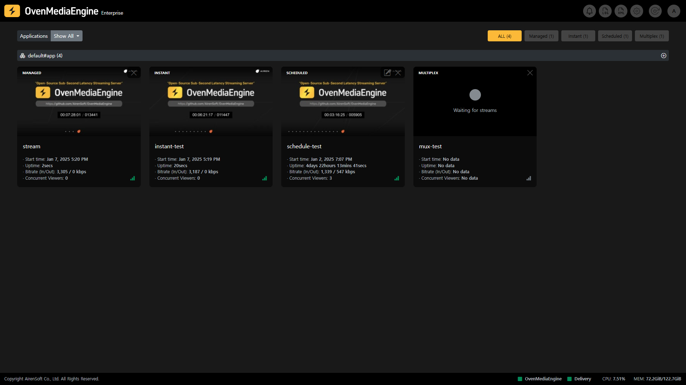
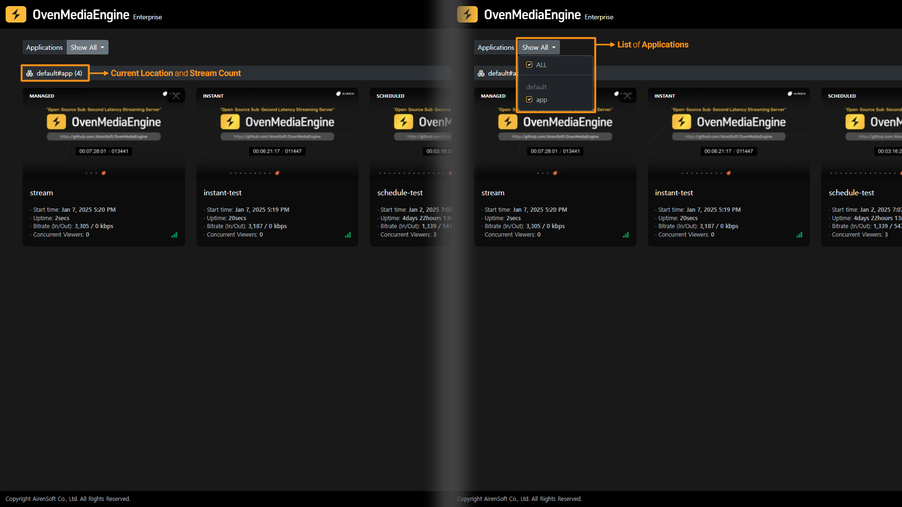
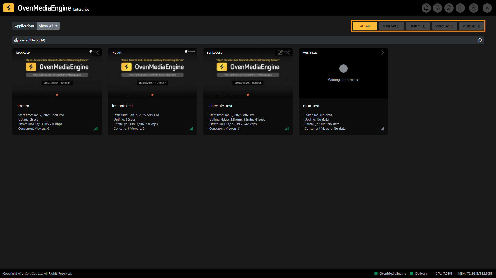
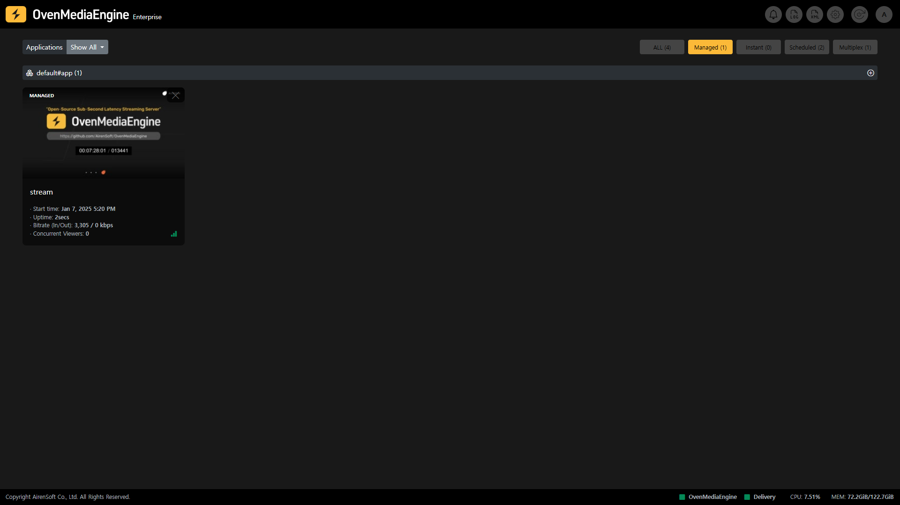
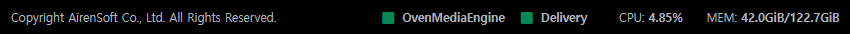

Upon signing in, you will be directed to the Web Console Home, where each section is explained below in detail.

## Navigation

<table><thead><tr><th width="93">Icon</th><th width="141">Move to</th><th>Description</th></tr></thead><tbody><tr><td>BI</td><td>Home</td><td>Go to the Web Console Home.</td></tr><tr><td></td><td>Notifications</td><td>You can view real-time system notifications.</td></tr><tr><td></td><td>Logs</td><td>You can access real-time OvenMediaEngine's logs.</td></tr><tr><td></td><td>Configuration Files</td><td>You can view the Configuration Files (`.xml`) of OvenMediaEngine.</td></tr><tr><td></td><td>Settings</td><td>You can check the settings of OvenMediaEngine. <em>※ The settings will be updated in the future to allow direct editing of XML in OvenMediaEngine Enterprise.</em></td></tr><tr><td></td><td>Restart engine</td><td>You can restart OvenMediaEngine.</td></tr><tr><td></td><td>Account</td><td>You can change your password or sign out.</td></tr></tbody></table>

## List of Streams

### Select `VirtualHost` and `Application`

You can select the `VirtualHost` and `Application` currently running in OvenMediaEngine through the `VirtualHost` in the `Application` menus located at the top left of the Web Console Home. In addition, the Web Console Home displays a list of Streams included in the selected `VirtualHost` in the `Application`.

:::info

You can use OvenMediaEngine's `<VirtualHost>` to run multiple streaming servers on a single machine. See the User Guide for more information: [https://ovenmedialabs.com/docs/ome/configuration#virtual-host](https://ovenmedialabs.com/docs/ome/configuration#virtual-host)

:::

:::info

You can also use OvenMediaEngine's `<Application>` to define stream behavior _(Stream input, Encoding, and Stream output)_ and build different streaming environments. See the User Guide for more information: [https://ovenmedialabs.com/docs/ome/configuration#application](https://ovenmedialabs.com/docs/ome/configuration#application)

:::

### Stream Categorization

In OvenMediaEngine Enterprise, the items categorized as Streams are Managed Streams, Scheduled Channels, Multiplex Channels, and Instant Streams. You can view each Stream list by clicking on the Category button at the top right of OvenMediaEngine Enterprise.

As shown in the image above, you can display the Stream List by selecting only one stream item, or you can configure the Stream List by selecting multiple stream items. You can select each Stream classified by item to go to Stream Monitoring.

:::tip

Regardless of Stream Categorization, you can check the Stream List including Steaming Status, Start time, Uptime, Input/Output throughput, Concurrent Viewers, Push Publishing, Recording, and Dumping.

:::

For descriptions of each item in the Stream List, including Managed Streams, Instant Streams, Scheduled Channels, and Multiplex Channels, please refer to the [Stream List](stream-list/README.md), a sub-manual of Web Console Home.

## System Status

The System Status Bar is always displayed at the bottom of any OvenMediaEngine Enterprise screen. From this bar, you can check the real-time status of OvenMediaEngine and Delivery included in the enterprise package, as well as the real-time usage of CPU and Memory.
