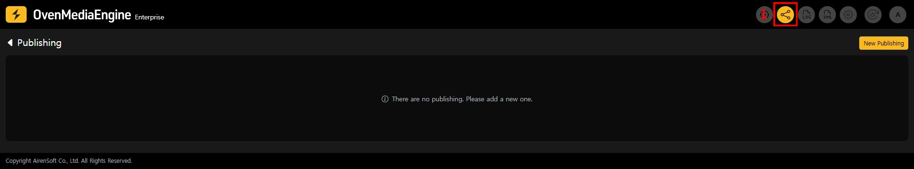
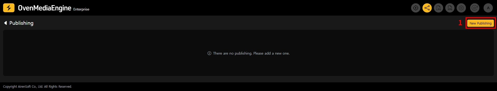
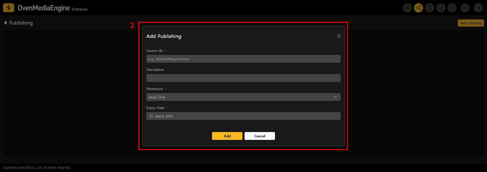
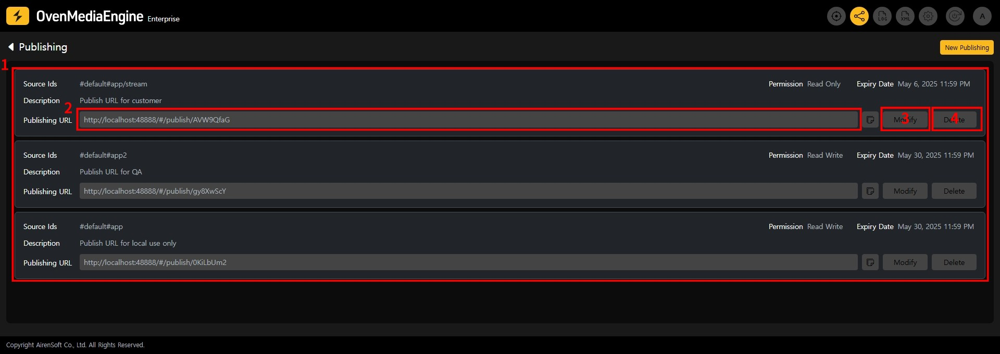
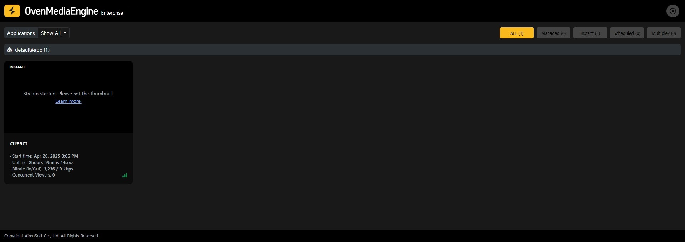
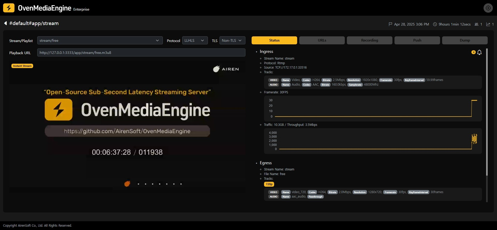
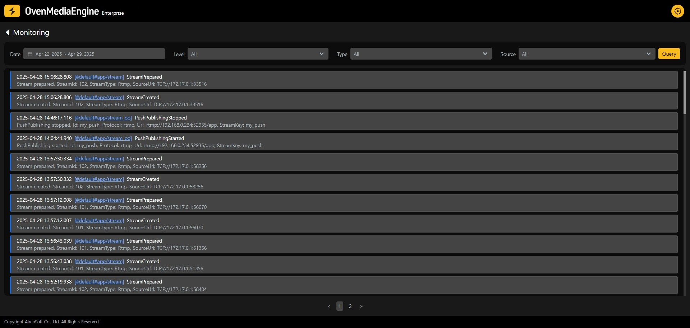
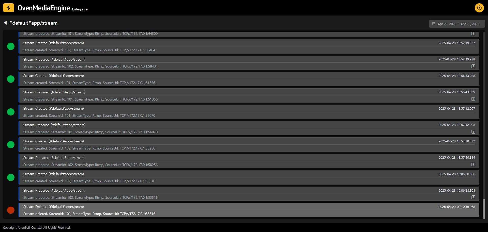
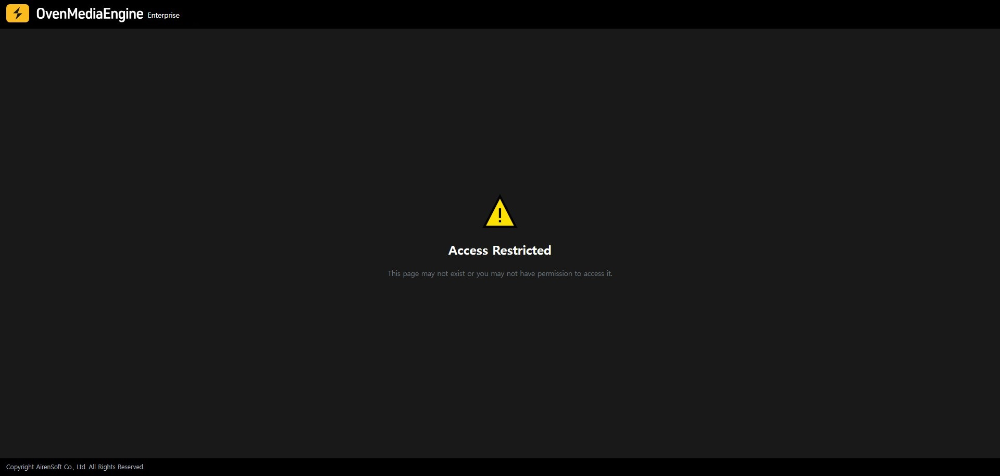

Web Console Publishing is a feature that allows you to share the OvenMediaEngine Enterprise Web Console's stream list page, stream details page, and event monitoring page with external users without requiring sign-in. You can share specifying virtual hosts, applications, and streams, as well as you can manage shared links by setting permissions and specifying expiration dates.

## Creating and Managing Web Console Publishing URLs

You can create and manage Web Console Publishing URLs from the Publishing page in the Web Console.

1. Access the Publishing page using the navigation at the top right of the screen.

### Creating a Publishing URL

You can create a Publishing URL to share the Web Console externally. Created URLs can be modified or deleted as needed.

1. Click the New Publishing button at the top of the publishing page to display the Publishing URL creation dialog.

2. Configure the following values in the dialog to create a Publishing URL:

<table><thead><tr><th width="111">field</th><th width="90">required</th><th>description</th></tr></thead><tbody><tr><td>Source Ids</td><td>Y</td><td>
Specify virtual hosts, applications, and streams that are accessible from the shared Web Console. Multiple settings can be configured and should be separated using commas.

<ul><li><strong>Virtual host</strong>: Specified in the format `#{virtual_host_name}`. All applications and streams within the specified virtual host are accessible. </li><li><strong>Application</strong>: Specified in the format `#{virtual_host_name}#{app_name}`. All streams within the specified application are accessible.</li><li><strong>Stream</strong>: Specified in the format `#{virtual_host_name}#{app_name}/{stream_name}`. Access to the specified stream is possible.</li></ul>

If you specify `#default/app1/stream, #default/app2`, you can share the stream (`#default/app1/stream`) and all streams within the application (`#default/app2`)
</td></tr><tr><td>Description</td><td>N</td><td>You can add a description for record-keeping when creating a Publishing URL.</td></tr><tr><td>Permission</td><td>Y</td><td><ul><li><strong>Read Only</strong>: External users can only view the shared pages. </li></ul>

<ul><li><strong>ReadWrite</strong>: External users can additionally perform the following actions:</li></ul><ol><li>Stream list page: Managed Streams creation/modification/deletion, Scheduled Channels creation/modification/deletion, Multiplex Channels creation/deletion.</li><li>Stream details page: Recording start/stop, Push Publishing start/stop, (LL)-HLS Dump start/stop.</li></ol></td></tr><tr><td>Expiry Date</td><td>Y</td><td>You can set the validity period for the Publishing URL.</td></tr></tbody></table>

### Managing Publishing URLs

1. You can check the list of created Publishing URLs and their configuration.
2. You can verify the Publishing URL to be shared.
3. You can modify the settings of the created Web Console Publishing URL. You can reconfigure the `Source Ids`, `Description`, `Permission`, and `Expiry Date` that were set during creation, and changes will be applied immediately to the shared Publishing URL.
4. Deletes the Publishing URL. The shared Publishing URL becomes immediately unavailable.

## External Sharing Mode Web Console

When accessing a Publishing URL, the external sharing mode Web Console's stream list page is displayed.

### Stream List Page

* The list of streams corresponding to the configured Source Ids is displayed.
* If the configured Permission is `Read Write`, the functions to create/delete Managed Streams, create/modify/delete Scheduled Channels, and create/delete Multiplex Channels are enabled.

### Stream Details Page

* If the configured Permission is `Read Write`, the functions to start/stop Recording, start/stop Push Publishing, and start/stop (LL)-HLS Dump are enabled.

### Event Monitoring and Event Timeline Page

 

* Event Monitoring (List) for streams corresponding to the configured Source Ids are displayed.

### Access Restriction Error Page

An access restriction error page is displayed when the Publishing URL authentication fails. Publishing URL authentication failure occurs in the following cases:

1. Accessing a non-existent Publishing URL.
2. The Publishing URL has been deleted.
3. The Publishing URL has expired due to the `Expiry Date`.
4. Accessing `Source Ids` that are not allowed.
