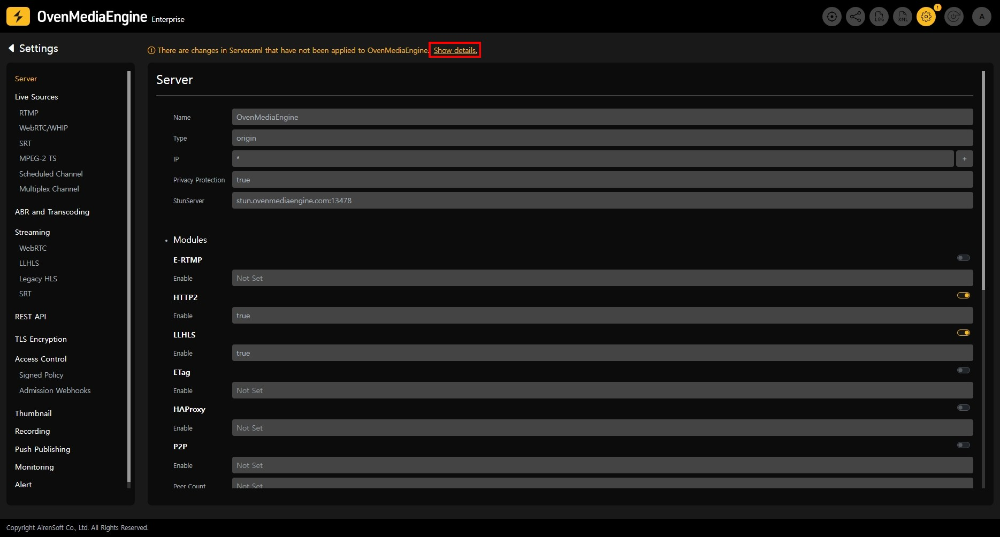
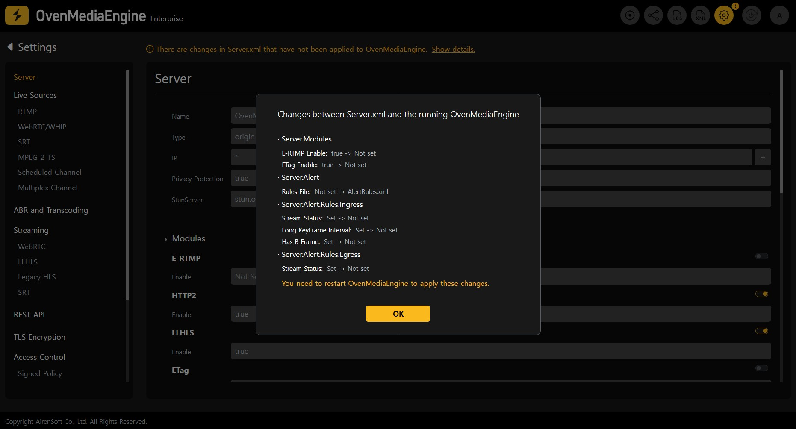

You can check the settings for various features provided by OvenMediaEngine. Detailed information about the list of features and settings can be found in the [OvenMediaEngine User Guide](https://docs.ovenmediaengine.com/).

### Unapplied Configuration Detection

The Web Console provides a feature to check for configuration changes that have not yet been applied to the running OvenMediaEngine.
&#x20;When such changes are detected, an exclamation mark (!) icon appears next to the Settings menu in the top navigation bar.

When navigating to the Settings screen, if there are unapplied changes, a notification message is displayed at the top.
&#x20;By clicking the `Show details` button, you can view a popup listing the configuration items that have not yet been applied to OvenMediaEngine.

The popup displays a comparison of the old and new values for each item.

These changes require restarting OvenMediaEngine to take effect.
&#x20;You can restart OvenMediaEngine either by using the "Restart" button in the top navigation bar of the Web Console or manually.

:::tip

The feature to modify OvenMediaEngine settings in the Web Console will be available soon, allowing you to use your streaming setup more efficiently. Stay tuned for updates!

:::

