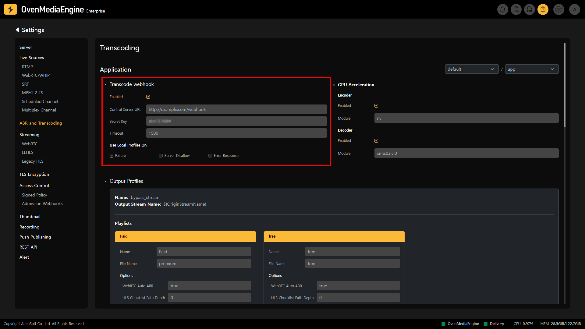
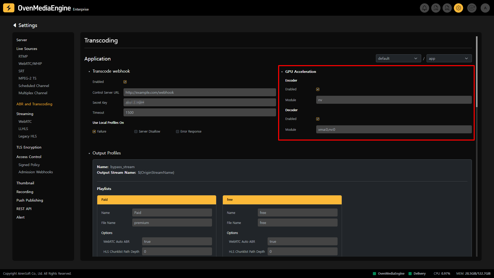
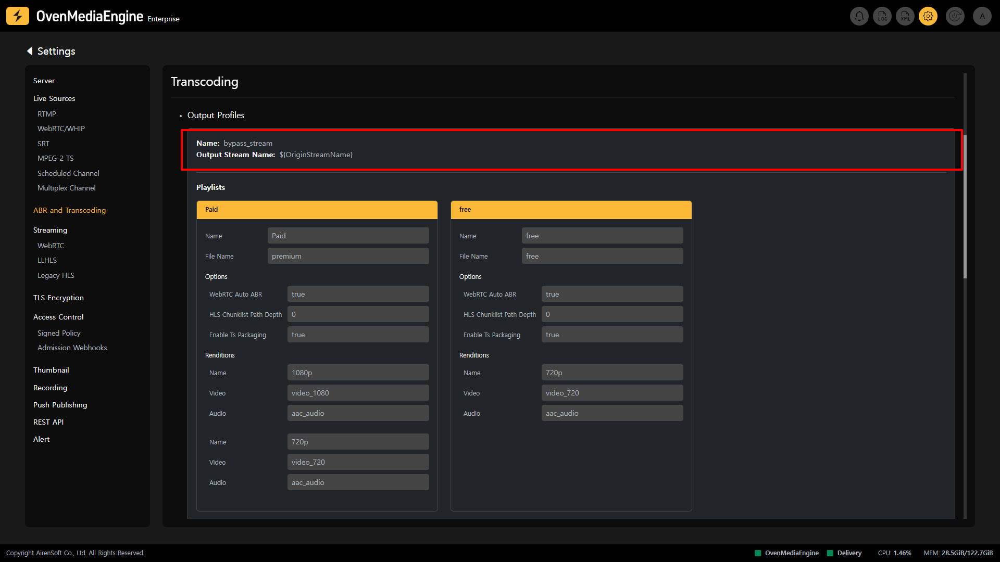
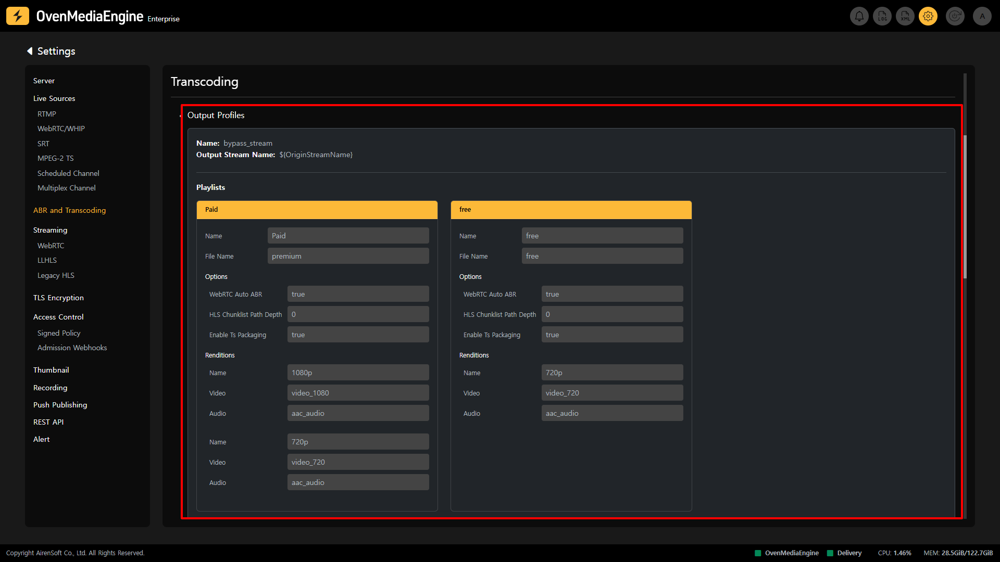
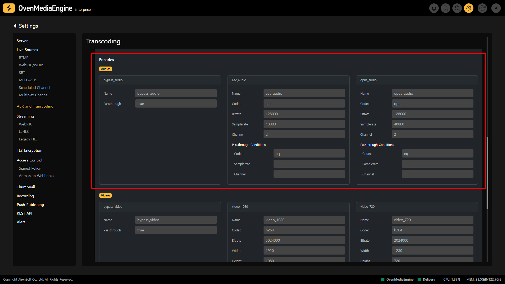
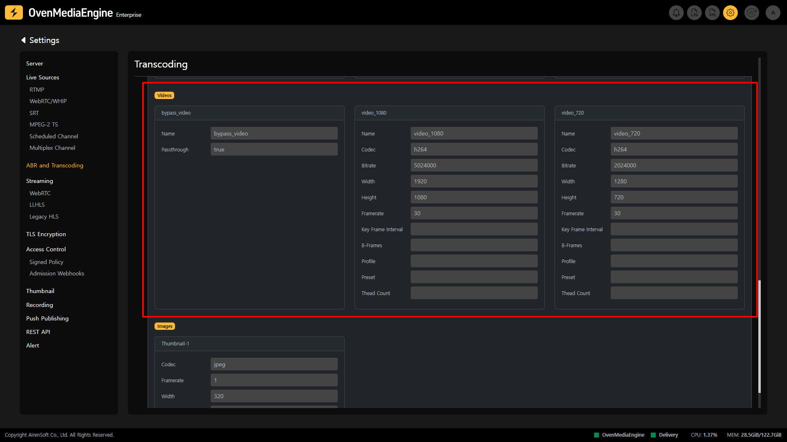
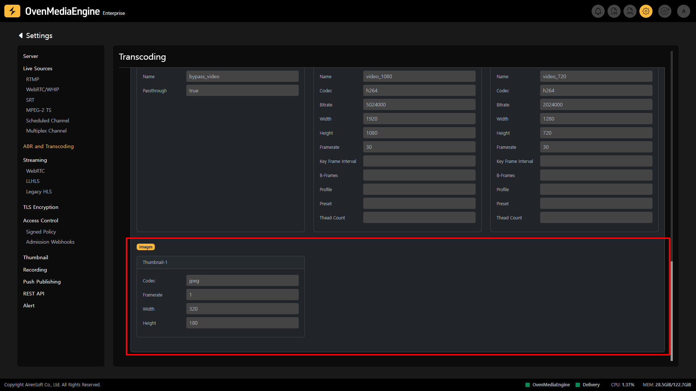

OvenMediaEngine has an embedded Live Transcoder that can decode Media Sources ingested from the live transcoder, re-encode them with a configured codec, or encode them Live with adjusted quality by utilizing transcoder options (Video Bitrate, Video Framerate, Audio Samplerate, etc.).

## Transcoding Settings

On the ABR and Transcoding Settings page, you can check the settings of the Live Transcoder embedded into OvenMediaEngine for each `Application`.

### Check Transcode Webhook Activation

ABR and Transcoding Settings 페이지에서 Transcode Webhook의 활성화 여부 및 설정 내용을 확인할 수 있습니다.

* `Enabled`: Sets can enable or disable `TranscodeWebhook`.
* `Control Server URL`: The URL of the Control Server, and supports both HTTP and HTTPS.
* `Secret Key`: This is the Secret Key used to pass authentication for the Control Server. To pass security authentication, an HMAC-SHA1 encrypted value of the HTTP Payload is added to the HTTP Header's `X-OME-Signature`. This Key is used for generating this value.
* `Timeout`: Timeout value used when connecting to the Control Server

#### See the Use Local Profiles On Options:

* `Failure`: This determines whether to use the `OutputProfiles` from Local settings in case of communication failure with the Control Server. By default, it is set to `true`, but if you sets this option to `false`, a communication failure with the Control Server will result in a failure to create the Output stream.
* `Server Disallow`: When the Control Server responds with a 200 OK, but `allowed` is set to `false`, OvenMediaEngine follows `UseLocalProfilesOnServerDisallow` policy.
* `Error Response`: When the Control Server responds with error status codes such as `400 Bad Request`, `404 Not Found`, or `500 Internal Error`, OvenMediaEngine follows `UseLocalProfilesOnErrorResponse` policy.

:::info

Detailed Guide: [https://ovenmedialabs.com/docs/ome/transcoding/transcodewebhook](https://ovenmedialabs.com/docs/ome/transcoding/transcodewebhook)

:::

### Check GPU Acceleration Activation

If you enable `HardwareAcceleration` option in `Server.xml`, Hardware Codec will be used automatically when creating a stream, and fall back to Software Codec if Hardware Codec cannot be used due to insufficient hardware resources.

On the ABR and Transcoding Settings page, you can verify that GPU-based hardware decoding and encoding ([Hardware-Accelerated Video Encoding](../../../features/transcoding-and-processing/hardware-encoder-support.md)), one of the features supported by OvenMediaEngine Enterprise at the Enterprise-grade, is enabled and its settings are checked.

#### See the Encoder Options:

* `Enabled`: Sets can enable or disable `HardwareAcceleration Encoder`.
* `Module`: Sets the module to be used as `HardwareAcceleration Encoder`, such as NVIDIA GPU, Xilinx Alveo U30MA, or Intel QuickSync.

#### See the Decoder Options:

* `Enabled`: Sets can enable or disable `HardwareAcceleration Decoder`.
* Module: Sets the module to be used as `HardwareAcceleration Decoder`, such as NVIDIA GPU, Xilinx Alveo U30MA, or Intel QuickSync.

:::info

Detailed Guide: [https://ovenmedialabs.com/docs/ome/transcoding/gpu-usage](https://ovenmedialabs.com/docs/ome/transcoding/gpu-usage)

:::

## List of Output Profiles

On the ABR and Transcoding Settings page, you can see a list of `Output Profiles` set for your `Application`.

* `Name`: Since you can make multiple output profiles, so you can specify a unique profile name to distinguish each output profile.
* `Output Stream Name`: When an Output Profile is set, the Ingress Stream is encoded according to the `Encodes` setting of the `OutputProfile`, and the generated egress stream name follows the `Output Stream Name` rules. For example, if the ingress stream name is `sports`, it will be `sports_bypass` according to the rules specified in the image above.

:::info

Detailed Guide: [https://ovenmedialabs.com/docs/ome/transcoding#outputprofiles](https://ovenmedialabs.com/docs/ome/transcoding#outputprofiles)

:::

### **Check Adaptive Bitrate Streaming (ABR) Settings | 0.14.3.0+**

You can check the ABR Settings for each Output Profile of the `Application` on the ABR and Transcoding Settings page.

You can set up ABR by adding `Playlists` or a Playlist with multiple `Renditions` to `OutputProfiles`. An `OutputProfile` can have multiple playlists, and each playlist can be accessed by F`ileName`.

### Check Playlist Settings

#### Playlists

* `Name`: You can configure multiple playlists, each playlist can be given a unique name to distinguish them.
* `File Name`: You can specify a `File Name` to access each playlist. However, the `File Name` must not contain the `Playlist` and `Chunklist`.

#### Options

* `WebRTC Auto ABR`: When ABR is applied to a WebRTC Stream, this option allows the system to automatically switch `Rendition` as needed.
* `HLS Chunklist Path Depth`: `Chunklist` may use absolute URLs, which include the full path to the file, or relative URLs, which are shorter and rely on the base URL provided by the playlist.
  * _If you set `HLS Chunklist Path Depth` to 0, all Chunk files (`.ts`) will be located at the same directory level as Playlist (`.m3u8`)._
* `Enable TS Packaging`: `.ts` files used in Legacy HLS require A/V Mux processing in advance, so the `EnableTsPackaging` option must be set.

#### Renditions

* `Name`: You can configure multiple renditions, and you can specify a unique name to distinguish each `Rendition`.
* `Video`: You set up the `Video Encode Name` in `OutputProfile` and enter the corresponding `Video Profile Name` set for the `Rendition Video`, OvenMediaEngine can automatically connect and use it.
* `Audio`: You set up the `Audio Encode Name` in `OutputProfile` and enter the corresponding `Audio Profile Name` set for the `Rendition Audio`, OvenMediaEngine can automatically connect and use it.

:::info

Detailed Guide: [https://ovenmedialabs.com/docs/ome/transcoding#adaptive-bitrate-streaming-abr](https://ovenmedialabs.com/docs/ome/transcoding#check-adaptive-bitrate-streaming-abr-settings--01430)

:::

#### Supported Codecs by Streaming Protocol

Each streaming protocol has a supported codec. If you set multiple codecs in the `Playlist`, OvenMediaEngine will automatically select the codec that matches the protocol and transmit the stream. However, if the codec is set to something that does not match the streaming protocol, the stream cannot be transmitted.

:::tip

List of supported codecs by streaming protocol: [https://ovenmedialabs.com/docs/ome/transcoding#supported-codecs-by-streaming-protocol](https://ovenmedialabs.com/docs/ome/transcoding#supported-codecs-by-streaming-protocol)

:::

## Encodes Settings

:::tip

List of codecs supported by Live Transcoder: [https://ovenmedialabs.com/docs/ome/transcoding#supported-video-audio-and-image-codecs](https://ovenmedialabs.com/docs/ome/transcoding#supported-video-audio-and-image-codecs)

:::

### Check Audio Encoding Profile Settings

`Audio Profile` is used when encoding ingress audio and is required to egress under policies or standards of web browsers.

* `Name`: Enter the encode name for Audio Renditions.
* `Codec`: Specifies the `opus` or `aac` codec to use.
* `Bitrate`: Sets the audio bits transmitted per second.
* `Samplerate`: Sets the audio samples transmitted per second.
* `Channel`: Sets the number of audio channels.

:::tip

If you only set the Audio Encoding Profile, you can transmit it as Audio-only.

:::

:::info

Detailed Guide: [https://ovenmedialabs.com/docs/ome/transcoding#audio](https://ovenmedialabs.com/docs/ome/transcoding#audio)

:::

### Check Video Encoding Profile Settings

`Video Profile` is used when encoding ingress video and is required to egress under policies or standards of web browsers.

* `Name`: Enter the encode name for Video Renditions.
* `Codec`: Specifies the `vp8`, `h264`, or `h265` codec to use.
* `Bitrate`: Sets the video bits transmitted per second.
* `Width`: Sets the width of the resolution.
* `Height`: Sets the height of the resolution.

:::tip

If you want to reduce or increase the overall resolution while maintaining the aspect ratio of the original video, simply enter the `Width`. OvenMediaEngine will automatically calculate the `Height` according to the aspect ratio of the original video and adjust the resolution.

:::

* `Framerate`: Sets the video frame per second.
* `Key Frame Interval`: Sets the number of frames between two keyframes (0\&#126;600). The default is framerate (i.e., 1 second).
* `B-Frames`: Sets the number of B-frames (0\&#126;16). The default is 0.
* `Profile`: This option is available when the video codec is set to `h264`. You can specify one of the `baseline`, `main`, and `high`.
* `Preset`: Uses preset for encoding quality and performance.
  * _If you use `h264`, you can use `Preset` such as `ultrafast`, `superfast`, `veryfast`, `faster`, `fast`, `medium`, `slow`, `slower`, `veryslow`, `placebo`._
* `Thread Count`: Sets the number of threads in encoding.

:::info

Detailed Guide: [https://ovenmedialabs.com/docs/ome/transcoding#video](https://ovenmedialabs.com/docs/ome/transcoding#video)

:::

### Check Image Encoding Profile Settings

`Image Profile` is an option to generate a thumbnail of the stream and the `Bypass` option, which extracts the original as is, cannot be used.

* `Codec`: Specifies the `jpeg` or `png` codec to use.
* `Framerate`: This option sets the number of thumbnail images to be extracted per second. The closer the `Image Framerate` is to the `Video Framerate`, the smoother the thumbnail movement will be but may overload the server.
* `Width`: Sets the width of the thumbnail.
* `Height`: Sets the height of the thumbnail.

:::tip

If you want to generate a thumbnail image while maintaining the aspect ratio of the original video, just enter the `Width`. OvenMediaEngine will automatically calculate the `Height` and extract a thumbnail image according to the aspect ratio of the original video.

:::

:::info

Detailed Guide: [https://ovenmedialabs.com/docs/ome/transcoding#image](https://ovenmedialabs.com/docs/ome/transcoding#image)

:::

## **Conditional** Transcoding Settings

If the codec or track quality of the ingress stream matches all of the conditions of `BypassIfMatch`, the egress stream can be transmitted as a `Pass-through` without encoding.

### Matching Elements in Audio

* `Codec`: When the `Audio Codec` is **equal to** the conditions of `BypassIfMatch`.
* `Samplerate`: When the `Audio Samplerate` value is **equal to**, **less than or equal to**, or **greater than or equal to** the set `BypassIfMatch` conditions.
* `Channel`: When the number of `Audio Channels` is **equal to**, **less than or equal to**, or **greater than or equal to** the set `BypassIfMatch` conditions.

### Matching Elements in Video

* `Codec`: When the `Video Codec` is **equal to** the conditions of `BypassIfMatch`.
* `Width`:  When the `Width` of the resolution is **equal to**, **less than or equal to**, or **greater than or equal to** the set `BypassIfMatch` conditions.
* `Height`:  When the `Height` of the resolution is **equal to**, **less than or equal to**, or **greater than or equal to** the set `BypassIfMatch` conditions.
* `SAR`: When the conditions specified in `BypassIfMatch` match the `Resolution` and `Aspect Ratio`.

:::info

Detailed Guide: [https://ovenmedialabs.com/docs/ome/transcoding#conditional-transcoding](https://ovenmedialabs.com/docs/ome/transcoding#conditional-transcoding)

:::

