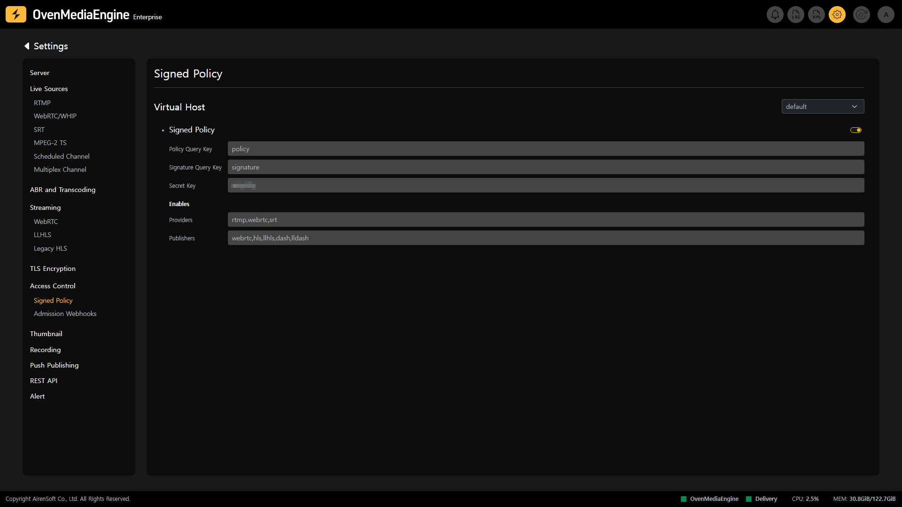
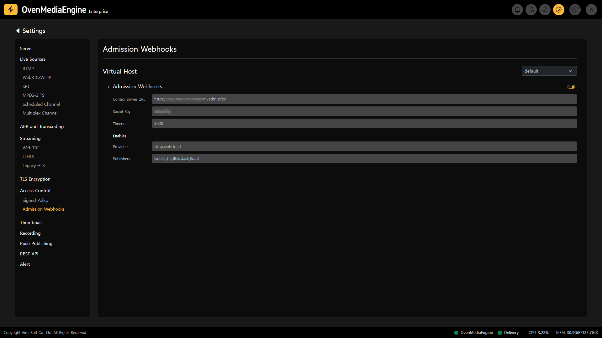

On the Access Control Settings, you can check if access restrictions for Ingress and Egress streams provided by OvenMediaEngine are enabled and what the settings are.

Also, [OvneMediaEngine Enterprise 16.6.2](../../../about/release-notes/0.16.6.md#01662-1-july-17-2024) (updated on July 17, 2024) adds support for [Proxy Protocol](../../../features/workflow-integration-and-external-system-connectivity/proxy-protocol.md) in `SignedPolicy` and `AdmissionWebhooks`, further enhancing security by comparing and verifying the Client Address passed through The PROXY protocol version 1 by HAProxy with `real_ip`.

## Signed Policy Settings | 0.12.0.0+

`SignedPolicy` is a module that limits the user's privileges and time. For example, if you make a specific RTMP URL accessible for only 60 seconds, the provided URL will be automatically destroyed after 60 seconds. Also, if you make an RTMP URL that can be transmitted for only 1 hour, the RTMP transmission will automatically stop after 1 hour.

As shown below, a `SignedPolicy URL` includes the `Policy` and `Signature` as a query string in the stream URL, so viewers who receive a `SignedPolicy URL` cannot access any resources other than the provided URL.

```url
scheme://domain.com:port/app/stream?policy=<>&signature=<>
```



You can check whether the Signed Policy is enabled and its settings for each `VirtualHost` in the Signed Policy section of Access Control Settings.

* `Policy Query Key`: The query string key name in the URL pointing to the `Policy` value.
* `Signature Query Key`: The query string key name in the URL pointing to the `Signature` value.
* `Secret Key`: The secret key used when encoding with HMAC-SHA1.
* `Enables`: List of Providers and Publishers to enable `SignedPolicy`.


:::warning

Currently, `SignedPolicy` supports `RTMP` between Providers, and `WebRTC`, `LLHLS`, and `Thumbnail` between Publishers.

:::


:::info

Detailed Guide: [https://ovenmedialabs.com/docs/ome/access-control/signedpolicy](https://ovenmedialabs.com/docs/ome/access-control/signedpolicy)

:::


## Admission Webhooks Settings | 0.12.2.0+

`AdmissionWebhooks` are HTTP Callbacks that query the Control Server to control Publishing and Playback acceptance requests. You can leverage `AdmissionWebhooks` for a variety of purposes, including Customer Authentication, Tracking Published Streams, Hiding App/Stream Names, Logging, and more.



You can view whether Admission Webhooks are enabled and the settings for each `VirtualHost` in the Admission Webhooks section in Access Control Settings.

* `Control Server Url`: The HTTP Server that receives queries. HTTP and HTTPS are available.
* `Secret Key`: The secret key used when encoding with HMAC-SHA1.
* `Timeout`: The time (in milliseconds) to wait for a response after a request.
* `Enables`: List of Providers and Publishers to enable `AdmissionWebhooks`.


:::warning

Currently, `AdmissionWebhooks` supports `RTMP`, `WebRTC`, and `SRT` between Providers, and `WebRTC`, `LLHLS`, and `Thumbnail` between Publishers.

:::


:::info

Detailed Guide: [https://ovenmedialabs.com/docs/ome/access-control/admission-webhooks](https://ovenmedialabs.com/docs/ome/access-control/admission-webhooks)

:::

