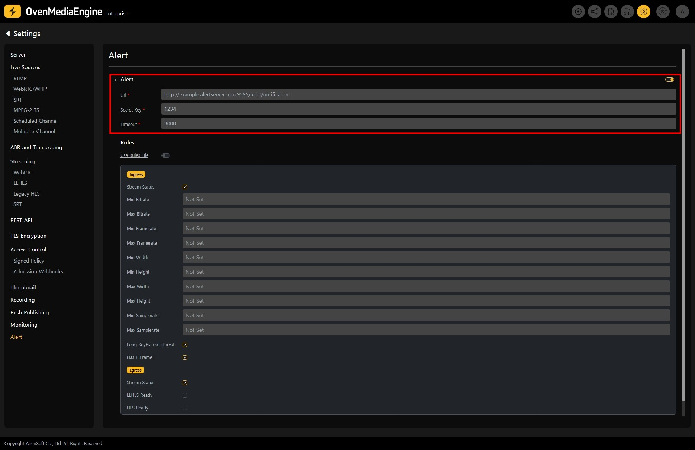
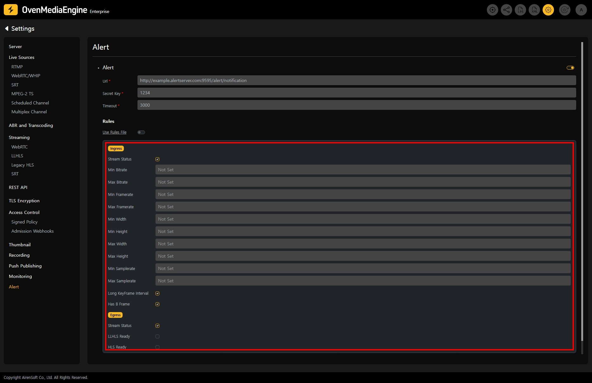
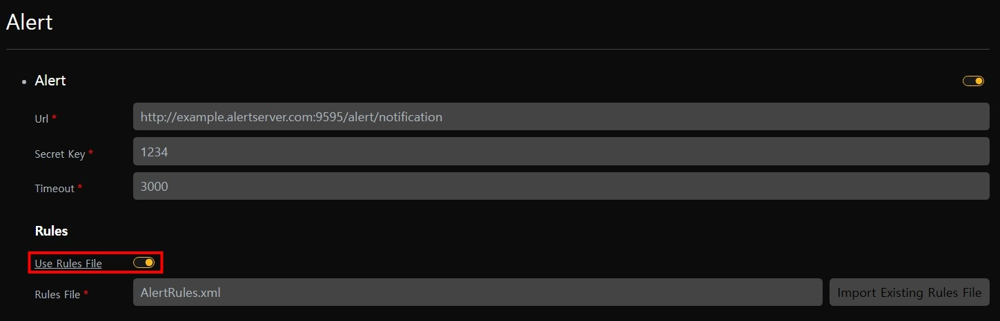
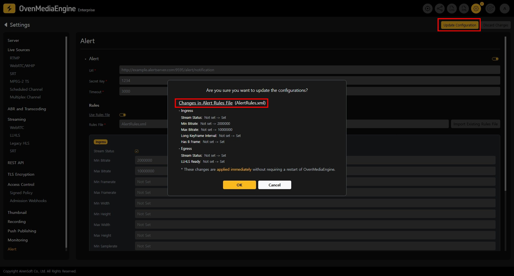

Alert is a module that can detect anomalies and patterns of interest in a stream or system and send notifications to you. Anomalies and patterns of interest can be set through predefined, and when detected, the module sends an HTTP(S) request to the user's notification server.

## Alert Settings

On the Alert Settings, you can view and edit the details of the set Alert.

* `Url`: The HTTP Server will receive the notification. HTTP and HTTPS are available.
* `Secret Key`: The secret key used when encrypting with HMAC-SHA1. For more information, please see [Security](/docs/ome/alert#security).
* `Timeout`: The time (in milliseconds) to wait for a response after a request.

## Rules Settings

On the Rules in the Alert Settings, you can predefine anomalies and patterns of interest that may occur in a stream or system through Rules.

### Ingress Rule

<table><thead><tr><th width="195">Rule</th><th>Description</th></tr></thead><tbody><tr><td>`StreamStatus`</td><td>It detects the creation, failure, readiness, and deletion states of a ingress stream.</td></tr><tr><td>`Min Bitrate`</td><td>Detects when the ingress stream's bitrate is lower than the set value.</td></tr><tr><td>`Max Bitrate`</td><td>Detects when the input stream's bitrate is greater than the set value.</td></tr><tr><td>`Min Framerate`</td><td>Detects when the ingress stream's framerate is lower than the set value.</td></tr><tr><td>`Max Framerate`</td><td>Detects when the ingress stream's framerate is greater than the set value.</td></tr><tr><td>`Min Width`</td><td>Detects when the ingress stream's width is lower than the set value.</td></tr><tr><td>`Max Width`</td><td>Detects when the ingress stream's width is greater than the set value.</td></tr><tr><td>`Min Height`</td><td>Detects when the ingress stream's height is lower than the set value.</td></tr><tr><td>`Max Height`</td><td>Detects when the ingress stream's height is greater than the set value.</td></tr><tr><td>`Min Samplerate`</td><td>Detects when the ingress stream's sample rate is lower than the set value.</td></tr><tr><td>`Max Samplerate`</td><td>Detects when the ingress stream's sample rate is greater than the set value.</td></tr><tr><td>`Long KeyFrame Interval`</td><td>Detects when the ingress stream's keyframe interval is too long (exceeds 4 seconds).</td></tr><tr><td>`Has B Frame`</td><td>Detects when there are B-frames in the ingress stream.</td></tr></tbody></table>

### Egress Rule

<table><thead><tr><th width="195">Rule</th><th>Description</th></tr></thead><tbody><tr><td>`StreamStatus`</td><td>It detects the creation, readiness, and deletion states of a egress stream.</td></tr><tr><td>`LLHLSReady`</td><td>Detects the point in time when Low-Latency HLS playback becomes available.</td></tr><tr><td><kbd>HLSReady</kbd></td><td>Detects the point in time when HLS playback becomes available.</td></tr></tbody></table>

## Using Dynamic Rules Loading | 0.18.3.1+

With the Dynamic Rules Loading feature, you can modify and apply alert patterns in real time without restarting OvenMediaEngine.

On the Alert Settings page, enable the `Use Rule File` option. When enabled, a UI for specifying the file to manage the Rules separately will appear.

* `Rules File`: Enter the path for the Rules management file to be created.
  \
  If a relative path is specified, it will be set relative to the OvenMediaEngine configuration directory.
* `Import Existing Rules File`: Load an existing Rules management file.

Click the `Update Configuration button` in the upper right corner to apply the Rules settings to OvenMediaEngine.

Before applying the settings, a popup will display the changes in the file for review.
&#x20;By clicking the "OK" button, the new settings will be applied immediately without restarting OvenMediaEngine.

:::info

Detailed Guide: [/docs/ome/alert](/docs/ome/alert)

:::

