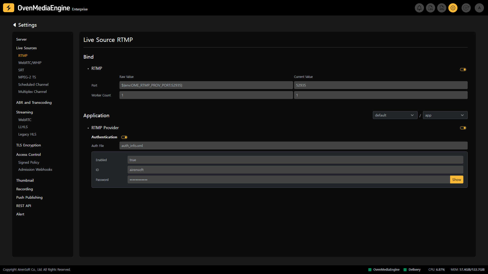
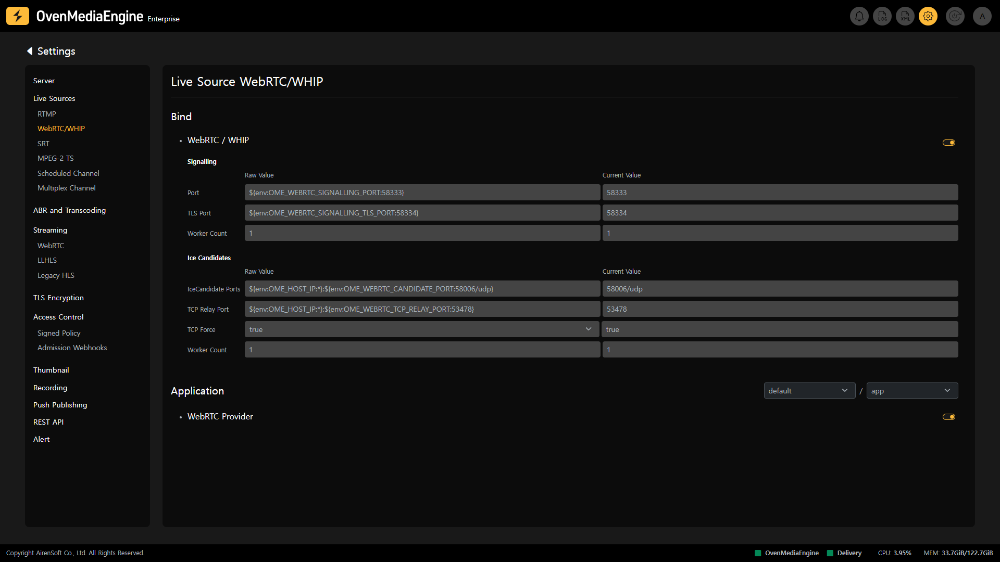
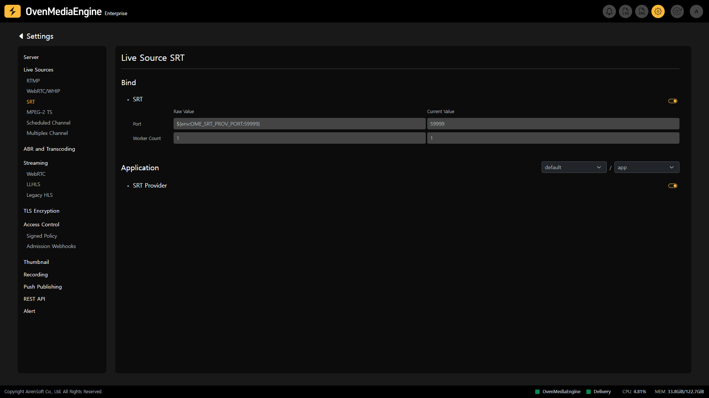
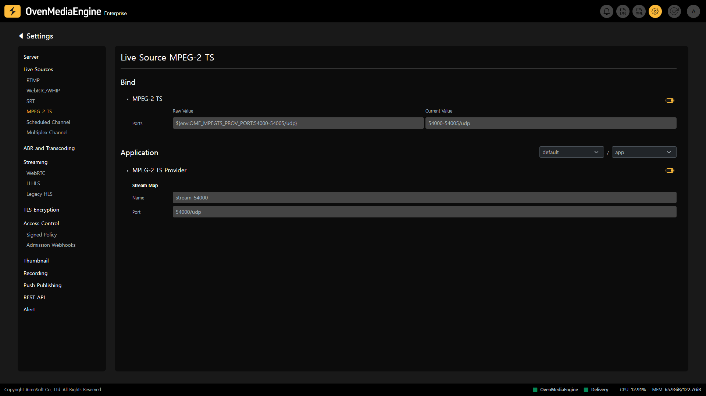
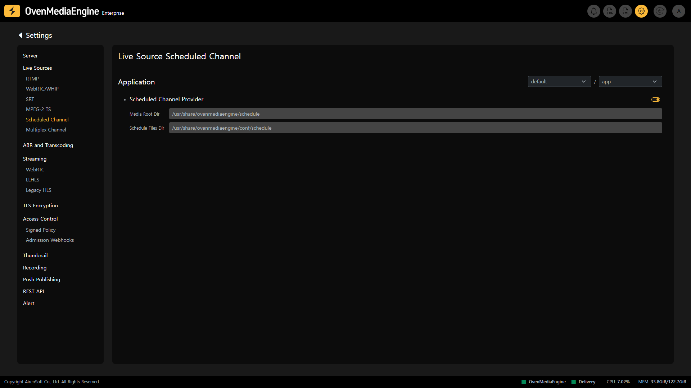
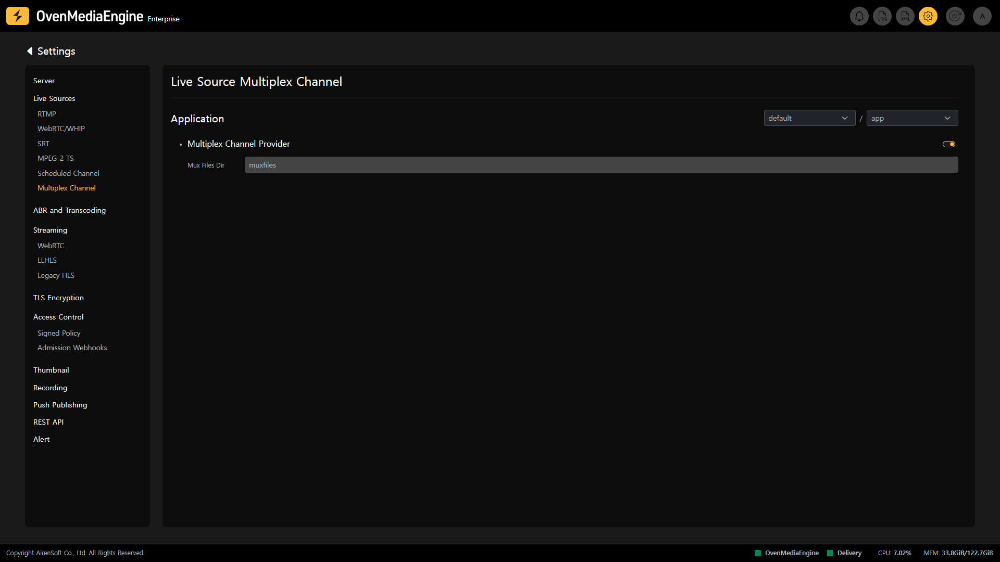

The Live Sources Settings page allows you to manage the various Ingress Protocols provided by OvenMediaEngine.

## RTMP Settings | 0.9.0.0+

On the RTMP in the Live Source Settings, you can view the RTMP Ingress Protocol information and set whether to enable RTMP per `Application`. And you can modify the `Port` and `Worker Count` on that page. The `Worker Count` is an option that allows you to set the number of threads used for sending and receiving over the Socket.

Additionally, you can select Virtual Host and Application in the Application section and check if RTMP Provider is enabled in the selected location.

:::info

Detailed Guide: [https://ovenmedialabs.com/docs/ome/live-source/rtmp](https://ovenmedialabs.com/docs/ome/live-source/rtmp)

:::

### Check RTMP Authentication Activation | 0.17.2.0+

If you need to receive only authenticated RTMP from OvenMediaEngine Enterprise, you can use `<AuthFile>` within `<VirtualHosts><VirtalHost><Applications><Application><Providers><RTMP>` in `Server.xml`. Please see the [rtmp-authentication.md](../../../features/access-control-and-security/rtmp-authentication.md "mention") guide for more details.

## WebRTC/WHIP Settings | 0.12.0.0+/0.15.1.0+

On the WebRTC/WHIP in the Live Source Settings, you can manage WebRTC and WHIP Ingress Protocol information and whether to enable WebRTC and WHIP per `Application`. You can also modify the `Signalling Port`, `ICE Candidate Port`, `TLC Port`, etc. on that page.

Additionally, you can select Virtual Host and Application in the Application section and check if WebRTC Provider is enabled in the selected location.

:::info

Detailed Guide: [https://ovenmedialabs.com/docs/ome/live-source/webrtc](https://ovenmedialabs.com/docs/ome/live-source/webrtc)

:::

## SRT Settings | 0.12.0.0+

On the SRT in the Live Source Settings, you can see the SRT Ingress Protocol information and whether to utilize SRT per `Application`, and you can edit the `Port` and `Worker Count` on that page. The `Worker Count` option allows you to set the number of threads used to send and receive over the Socket. In the Applications section, you can select Virtual Hosts and Applications and see that the SRT Provider is enabled in the selected location.

Additionally, SRT uses the MPEG-TS format when transmitting streams, which allows it to support many codecs, unlike RTMP.

:::info

Detailed Guide: [https://ovenmedialabs.com/docs/ome/live-source/srt](https://ovenmedialabs.com/docs/ome/live-source/srt)

:::

## MPEG-2 TS Settings | 0.10.4.0+

On the MPEG-2 TS in the Live Source Settings, you can see the MPEG-2 TS Ingress Protocol information and whether to use MPEG-2 TS per `Application`, and you can modify the `Port` and `Worker Count` on that page. The `Worker Count` is an option that allows you to set the number of threads used for transmission and reception through the Socket.

Additionally, you can select Virtual Host and Application in the Application section and check if MPEG-2 TS Provider is enabled in the selected location.

:::info

Detailed Guide: [https://ovenmedialabs.com/docs/ome/live-source/mpeg-2-ts-beta](https://ovenmedialabs.com/docs/ome/live-source/mpeg-2-ts-beta)

:::

## Check Scheduled Channels Activation | 0.16.4.0+

On the Scheduled Channel in the Live Source Settings, you can view whether Scheduled Channels are enabled for each `Application`. Also, you can see the path to the Media Source and Schedule File.

* `Media Root Dir`: Shows the path to the Media Source (Media File or Live) that OvenMediaEngine uses for the scheduled streaming.
* `Scheduled Files Dir`: Shows the path to the Schedule File (`.sch`) that OvenMediaEngine is referencing or the scheduled streaming.

:::info

Detailed Guide: [https://ovenmedialabs.com/docs/ome/live-source/scheduled-channel](https://ovenmedialabs.com/docs/ome/live-source/scheduled-channel)

:::

## Check Multiplex Channels Activation | 0.16.5.0+

On the Multiplex Channel in the Live Source Settings, you can check whether Multiplex Channels are enabled for each `Application` and the path to the Mux File.

* `Mux Files Dir`: Shows the path to the Mux File (`.mux)` that is set to combine multiple streams referenced by the OvenMediaEngine into a single stream.

:::info

Detailed Guide: [https://ovenmedialabs.com/docs/ome/live-source/multiplex-channel](https://ovenmedialabs.com/docs/ome/live-source/multiplex-channel)

:::

