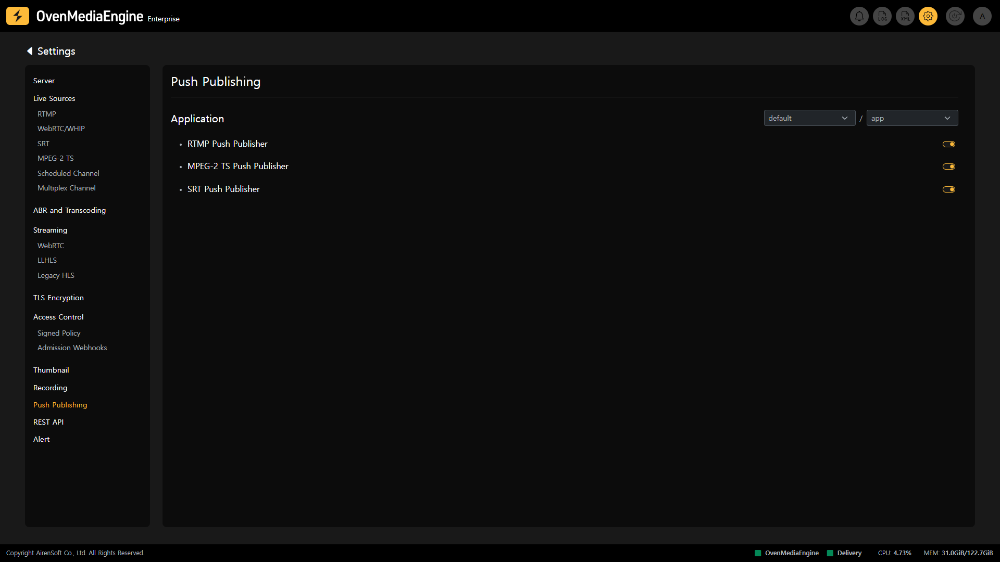

Push Publishing is a feature that allows you to re-stream a specific stream that has been ingressed from OvenMediaEngine Enterprise to another system.

## Check Push Publishing Activation

You can check if the Push Publishing feature is enabled for each `Application` on the Push Publishing Settings. As you can see in the image above, Push Publishing is available for `RTMP`, `MPEG-2 TS`, and `SRT` as Ingress Protocols, and you can check if the Push Publishing feature is enabled for each Protocol on that page.

When the Push Publishing feature is enabled, you can use the `StreamMap` option to automatically re-stream based on predefined conditions or control and monitor using the REST API.

:::info

Detailed Guide: [https://ovenmedialabs.com/docs/ome/push-publishing](https://ovenmedialabs.com/docs/ome/push-publishing)

:::

