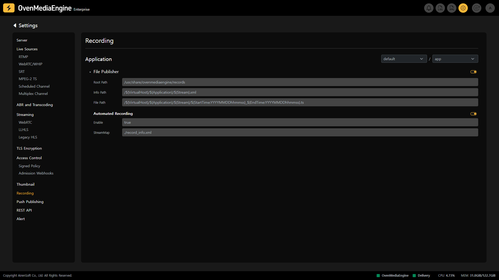

OvenMediaEngine's Recording feature allows you to record all or selected tracks in Live, and you can utilize the `StreamMap` option to automatically record based on predefined conditions or split the recording into files based on scheduled options based on system time.

## Check Recording Activation

Recording Settings 페이지에서 각 Application에서 Stream 녹화를 위한 File Publisher의 활성화 상태와 구성 세부 정보를 확인할 수 있습니다.

On the Recording Settings, you can check the activation status and configuration details of the `File Publisher` for stream recording in each `Application`.

### View File Publisher Information

* `Root Path`: Optional parameter used when requesting a recording via the API if a relative path is required.
* `Info Path`: Path to an `XML` file containing recording options and information about the recording file.
* `File Path`: Shows the path where recorded files will be saved and how recorded file names will be structured.

### View Automated Recording Information

* `StreamMap`: OvenMediaEngine Enterprise can automatically start and stop recording if there is an ingress stream that matches the predefined conditions configured in `StreamMap`. The tab displays information related to the path and file name of the `StreamMap`.

:::info

Detailed Guide: [https://docs.ovenmediaengine.com/recording](https://docs.ovenmediaengine.com/recording)

:::

