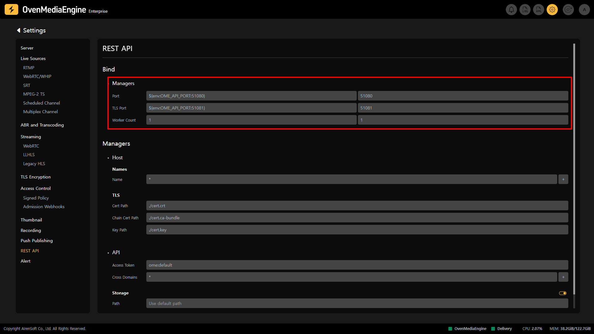
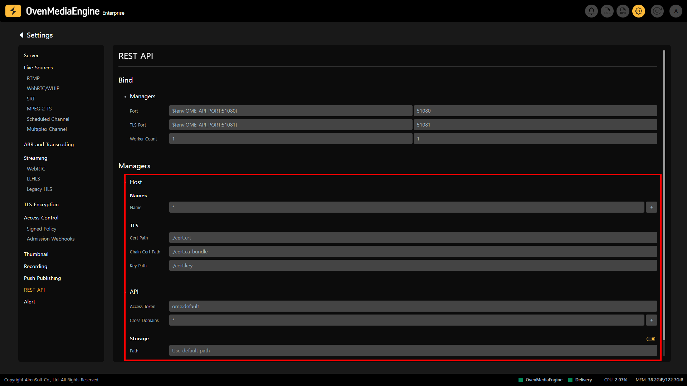

The REST APIs provided by OvenMediaEngine allow you to query or change settings such as `<VirtualHost>` and `<Application>/<Stream>`.

## API Server Port Settings

By default, the OvenMediaEngine API Server is disabled, so to use the API, you need to enable the feature by clicking the toggle button on the right side of the REST API Settings page. You can also review and modify the `Port` and Configuration for the REST APIs used by each `Application` on that page.

* `Port`: The Port that the server will use to receive HTTP requests
* `TLS Port`: Data is encrypted using the Transport Layer Security (TLS) Protocol between the web browser and the server. The encrypted data is transmitted over the Port.
* `Worker Count`: Sets the number of threads to use for data processing.

## Managers Settings

* `Name`: Enter the `Domain` or `IP` that can access the API Server.
  * _You can add multiple Domains or IPs by clicking the `+` button on the right._

### TLS Settings | 0.14.0.0+

* `Cert Path`: Shows the name and path of the `.crt` file that composes the TLS certificate.
* `Chain Cert Path`: Shows the name and path of the `.ca-bundle` file that constitutes the TLS certificate.
* `Key Path`: Shows the name and path of the `.key` file that composes the TLS certificate.

### API Settings

* `Access Token`:  Access Token is used to authenticate a client using the basic HTTP authentication scheme.
  * _Although RFC7617 format is not required, you can easily pass the authentication in a standard browser by setting the Access Token in the `user-id:password` format._
* `Cross Domains`: Most browsers and players prohibit accessing other domain resources in the currently running domain. You can control this situation via this option.

:::info

Detailed Guide: [https://ovenmedia.com/docs/ome/rest-api](https://ovenmedia.com/docs/ome/rest-api)

:::

### [API Storage](../../../features/operations-and-monitoring/api-storage.md) Settings | 0.17.0.0+

* `Enabled`: Sets can enable or disable `Storage`.
* `Path`: Specifies the path where API information will be stored.
