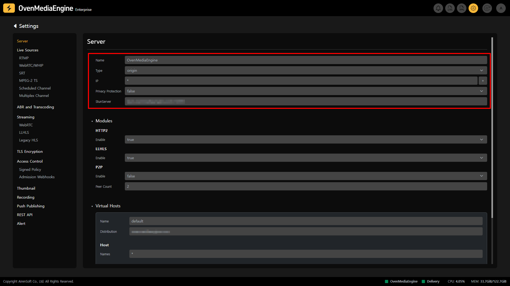
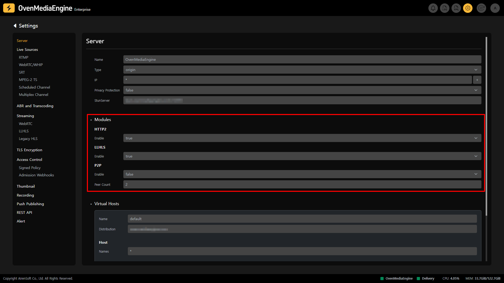
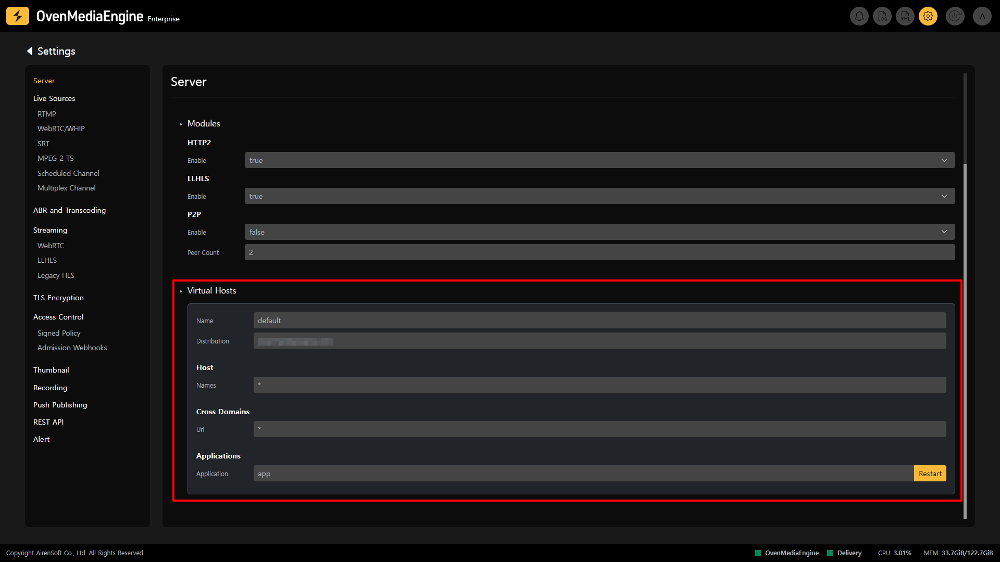

In the Server section of the Settings, you can check the Server Settings Information of OvenMediaEngine Enterprise referenced by OvenMediaEngine, Each Module Settings Information, Virtual Host Settings Information, etc., and you can modify the current Server Name, Server Type, Server IP, Privacy Protection, Stun Server, and more. The modified items will be reflected in `Server.xml`.

:::tip

Please wait a moment as it will be updated in the future so that users can directly modify more information in the Web Console.

:::

## Server Settings

This is the screen that appears when you access the Server section in Settings, and it is a function that allows you to check and modify the currently set server information.

* `Name`: You can specify the name of your OvenMediaEngine.
* `Type`: You can select the Host Type of the OvenMediaEngine to distinguish whether it will be used as an `Origin Server` or an `Edge Server`.
* `IP`: You can enter the IP address to which OvenMediaEngine will bind. If you enter a specific IP address, the Host can only use that IP address, and if you enter `*`, the system can use all IP addresses.
* `Privacy Protection`: This option removes personal information such as IP and Port from all records to comply with GDPR, PIPEDA, CCPA, LGPD, etc. If you set this option to `True`, the Client's IP and Port will be converted to `xxx.xxx.xxx.xxx:xxx` and output in all logs and REST API.
* `Stun Server`: OvenMediaEngine needs a Public IP to connect to the Player via WebRTC, but if it cannot get a Public IP via the local interface, OvenMediaEngine can obtain a Public IP by communicating with a Stun Server. You can set up the Stun Server by entering items.

:::info

Detailed Guide: [/docs/ome/configuration#server](/docs/ome/configuration#server)

:::

## Modules Settings

This feature allows you to view and modify the Module information currently set on the server.

* `HTTP2`: OvenMediaEngine also supports HTTP/2 so that you can smoothly use the stream that OvenMediaEngine ingresses or egresses through the web browser. This option only works on the TLS port.
* `LLHLS`: This option enables or disables Low Latency HLS (LLHLS), which provides HLS streaming with low latency.
* `P2P`: P2P Streaming is an experimental feature. When you stream with WebRTC, you can distribute network traffic by designating viewers watching your stream as Hosts. This option is set to `False` by default, but you can enable it at any time by setting it to `True`. You can also adjust the number of `Peer Count` to set the number of `Client Peer` that connect to one `Host Peer`.

:::info

P2P Guide: [/docs/ome/p2p-delivery](/docs/ome/p2p-delivery)

:::

## View Virtual Hosts Information

Virtual Host is a way to run two or more streaming servers on one system. OvenMediaEngine supports IP-based Virtual Host and Domain-based Virtual Host.

As you can see in the image above, you can go to the Server in Settings to view the Virtual Host information currently set up on your server.

:::info

Detailed Guide: [/docs/ome/configuration#virtual-host](/docs/ome/configuration#virtual-host)

:::

