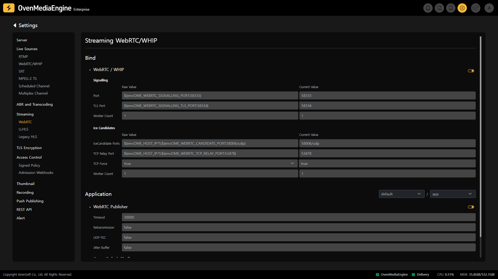
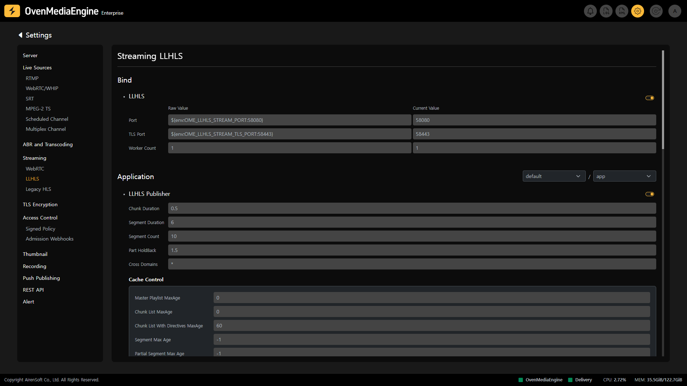
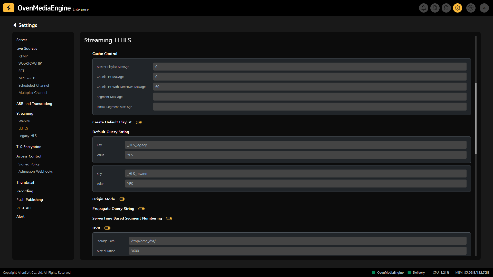
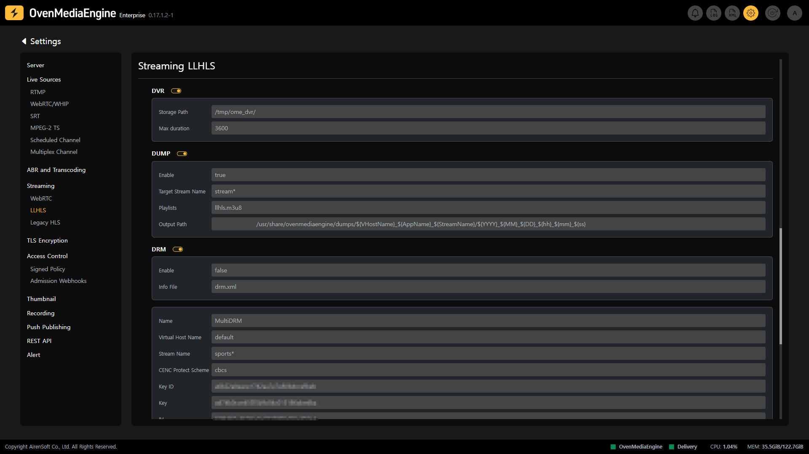
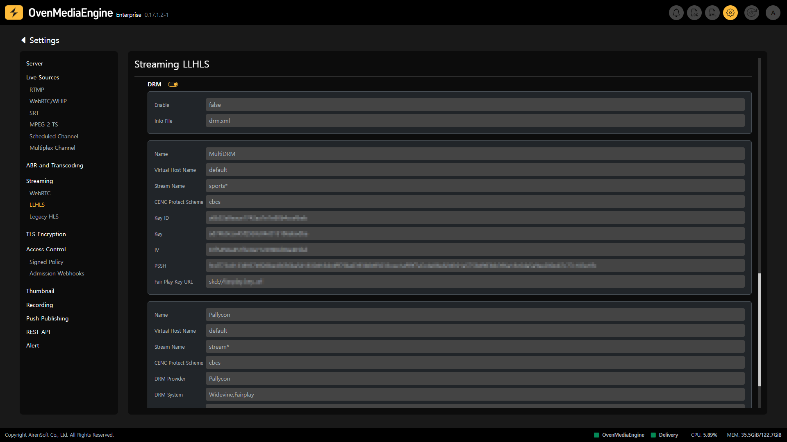
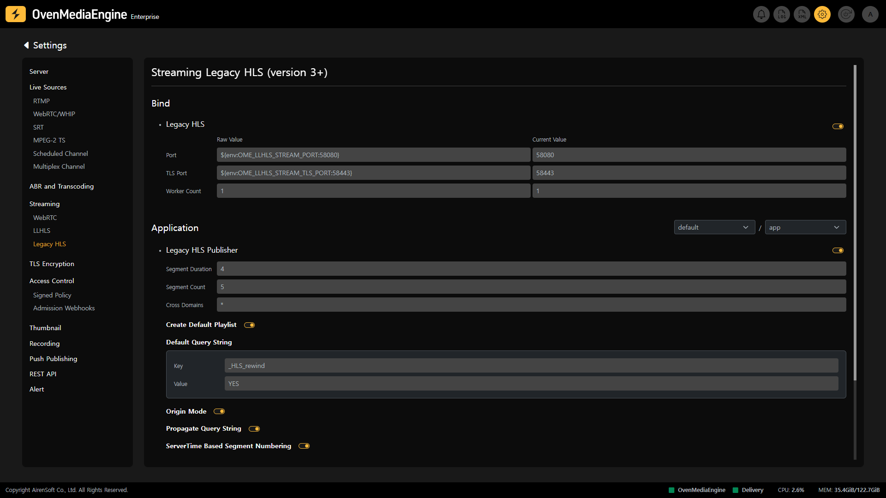
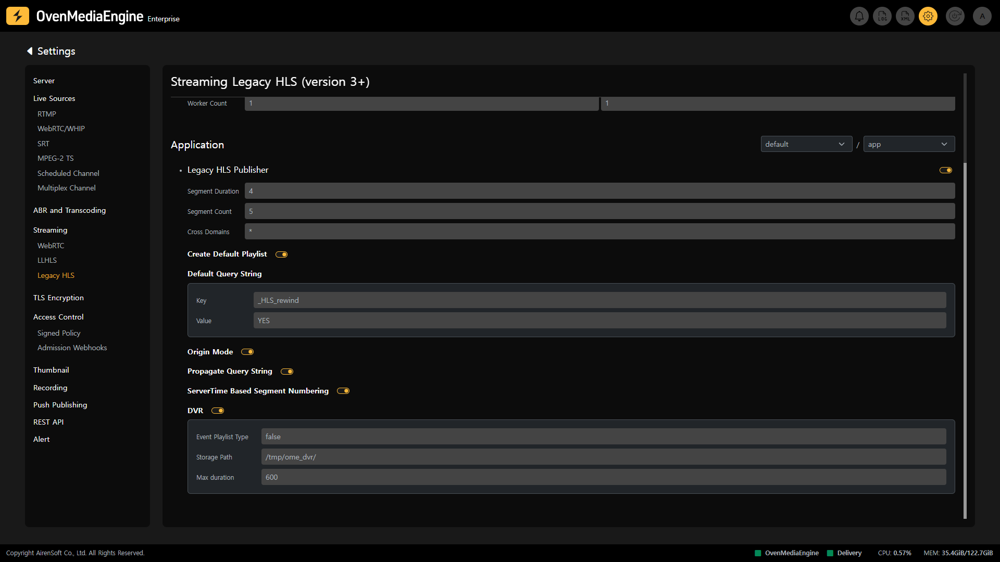

The Streaming Settings page allows you to manage the various Engress Protocols provided by OvenMediaEngine.

## WebRTC/WHIP Streaming Settings | 0.9.0.0+/0.15.1.0+

OvenMediaEngine Enterprise provides sub-second latency streaming using WebRTC.

The WebRTC Streaming Settings allows you to see and modify the WebRTC/WHIP Protocol information and activation status to be used for each application.

### Signalling Settings

Since `Signalling` is required to exchange `SDP` in WebRTC, OvenMediaEngine has an embedded WebSocket-based Signalling Server and provides its own defined Signaling Protocol. In the WebRTC/WHIP Settings, you can set the `Port` to be used for `Signaling`.

* `Port`: The Port that the server will use to receive HTTP requests
* `TLS Port`: Data is encrypted using the Transport Layer Security (TLS) Protocol between the web browser and the server. The encrypted data is transmitted over the Port.
* `Worker Count`: Sets the number of threads to use for data processing.

:::info

Signalling Guide: [https://ovenmedia.com/docs/ome/streaming/webrtc-publishing#signalling](https://ovenmedia.com/docs/ome/streaming/webrtc-publishing#signalling)

:::

### ICE Candidates Settings

WebRTC uses ICE for connections and specifically NAT traversal. The web browser or player exchanges the `Ice Candidate` with each other in the Signalling phase. Therefore, OvenMediaEngine provides an ICE for WebRTC connectivity.

* `IceCandidate Ports`: This function transfers the Candidate information set in `IceCandidate` to the WebRTC Peer and sets the `IP:Port` that the WebRTC Peer uses to request communication with the Candidate.
* `TCP Relay Port`: WebRTC basically works on UDP, but OvenMediaEngine has an embedded TURN Server for WebRTC/TCP so that WebRTC can work on TCP. The TURN Client of the Player can receive or transmit streams using the TCP Session that connects to the TURN Server, and this is a function to set the `IP:Port` used for communication.
* `TCP Force`: When transporting WebRTC over TCP, a URL pattern like `ws[s]://<host>[:port]/<app name>/<stream name>`**`?direction=send&transport=tcp`** is used. When the TCP Force option is set to `True`, this option allows TCP operations even when the `transport=tcp` query string is omitted from the URL pattern.
* `Worker Count`: Sets the number of threads to use for data processing.

:::info

ICE Guide: [https://ovenmedia.com/docs/ome/streaming/webrtc-publishing#ice](https://ovenmedia.com/docs/ome/streaming/webrtc-publishing#ice)

:::

### Check WebRTC Publisher Activation

* `Timeout`: ICE (STUN request/response) timeout as milliseconds, if there is no request or response during this time, the session is terminated. The default is 30000.
* `Retransmission`:  WebRTC uses UDP to transmit Media Data. When transmitting data in UDP, it is designed to skip the `Handshake` procedure and discard the Over Packet and Damaged Packet in order to ensure high speed and high efficiency. If you enable the `Retransmission` option, you can detect packet loss by utilizing `RTCP` (Real-time Transport Control Protocol) within WebRTC and retransmit packets that were dropped due to loss, etc.
  * _`Retransmission` reduces overall communication delay by retransmitting only necessary packets, enabling effective communication even in unstable network environments. However, packet retransmission generates additional network traffic, so it needs to be managed appropriately considering network conditions and traffic load._

:::warning

The `Retransmission` option is useful for WebRTC/UDP, but not for WebRTC/TCP.

:::

* `UDP FEC`: As explained in `Retransmission` above, there may be loss when transmitting data using UDP. Enabling the `UDP FEC` option enables the Forward Error Correction (FEC) feature, which adds error correction codes before transmitting data. FEC allows the receiver to restore the original data even if some data is lost or corrupted.
  * _`FEC` slightly increases the amount of data size that must be transmitted because it adds error correction codes, but it uses network bandwidth more efficiently because errors can be corrected immediately without retransmitting packets and delay._

:::warning

The `UDP FEC` option is useful for WebRTC/UDP, but not for WebRTC/TCP.

:::

* `Jitter Buffer`: This is an option to use `Jitter Buffer` to synchronize the stream when Audio and Video are transmitted at different speeds and conditions. For example, if the video packet arrives later than the audio packet, the audio packet can be delayed for a while to adjust the A/V stream to be played simultaneously.

:::info

WebRTC Publisher Guide: [https://ovenmedia.com/docs/ome/streaming/webrtc-publishing#publisher](https://ovenmedia.com/docs/ome/streaming/webrtc-publishing#publisher)

:::

* `Create Default Playlist`: You can control whether each playback protocol (LL-HLS, Legacy HLS, WebRTC) creates a Playlist (llhls, playlist, webrtc) by default. See the detailed guide [#default-playlist-creation-settings](../../../features/workflow-integration-and-external-system-connectivity/delay-buffer.md "mention") for more information.

:::info

Detailed Guide: [https://ovenmedia.com/docs/ome/streaming/webrtc-publishing](https://ovenmedia.com/docs/ome/streaming/webrtc-publishing)

:::

## Low-Latency HLS (LLHLS) Settings | 0.14.0.0+

Apple announced Low-Latency HLS (LLHLS), which enables streaming with a latency of about 2 to 6 seconds while maintaining scalability, and OvenMediaEngine provides low-latency streaming using LLHLS starting from version 0.14.0.

The LLHLS Streaming Settings page allows you to check and modify the LLHLS Protocol information and activation status to be used for each `Application`.&#x20;

* `Port`: The Port that the server will use to receive HTTP requests
* `TLS Port`: Data is encrypted using the Transport Layer Security (TLS) Protocol between the web browser and the server. The encrypted data is transmitted over the Port.
* `Worker Count`: Sets the number of threads to use for data processing.

#### See the LLHLS Publisher Options:

* `Chunk Duration`: Sets the partial segment length to fractional seconds. This value affects low-latency HLS Players. We recommend 0.2 seconds for this value.
* `Segment Duration`: Sets the length of the segment in seconds. Therefore, a shorter value allows the stream to start faster. However, a value that is too short will make legacy HLS players unstable. Apple recommends 6 seconds for this value.
* `Segment Count`: The number of segments listed in the playlist. This value has little effect on LLHLS players, so use 10 as Apple recommends. 5 is recommended for legacy HLS Players.
  * _Do not set below 3. It can only be used for experimentation._
* `Part HoldBack`: Sets the segment length to be sent in advance in fractional seconds.
* `Cross Domain`: Controls the domain in which the player works through `<CorssDomain>`. For more information, please refer to the [LLHLS CrossDomain](https://ovenmedia.com/docs/ome/streaming/low-latency-hls#crossdomain).

* `Cache Control`: You can specify how long content is cached on the Edge Server or CDN Cache Server by adding a Cache-Control header to the HTTP response. For more information, see the [#control-origin-cache](../../../features/workflow-integration-and-external-system-connectivity/delay-buffer.md "mention") guide.
* `Create Default Playlist`: You can control whether each playback protocol (LL-HLS, Legacy HLS, WebRTC) creates a default playlist (llhls, playlist, webrtc). For more information, see the [#default-playlist-creation-settings](../../../features/workflow-integration-and-external-system-connectivity/delay-buffer.md "mention") guide.
* `Default Query String`: You can control the default behavior for Low-Latency HLS (or Legacy HLS) via `<DefaultQueryString>`. For more information, see the [#default-query-string-settings](../../../features/workflow-integration-and-external-system-connectivity/delay-buffer.md "mention") guide.
* `Origin Mode`: Specifies the stream as the origin.
* `Propagate Query String`: If you enable `<PropagateQueryString>`, the query string included in the initial master playlist request will be automatically included in all subrequests (media playlists, segments, and partial segments). For more information, see the [#using-propagatet-query-string](../../../features/workflow-integration-and-external-system-connectivity/delay-buffer.md "mention") guide.
* `ServerTime Based Segment Numbering:` Origin redundancy allows the Edge Server or CDN Cache Server to connect to the Secondary Origin Server instead of the Primary Origin Server to download the same content if the Primary Origin Server fails. For more information, see the [#origin-redundancy-settings](../../../features/workflow-integration-and-external-system-connectivity/delay-buffer.md "mention").

:::info

Detailed Guide: [https://ovenmedia.com/docs/ome/streaming/low-latency-hls](https://ovenmedia.com/docs/ome/streaming/low-latency-hls)

:::

### Check LLHLS DVR Activation | 0.14.18.0+

You can create as long playlists as you want by enabling the Digital Video Recorder (DVR) option in the LLHLS Publisher in `Server.xml`. This option allows the Player to rewind the stream while it is live _(Live Rewind)_.

You can check the option information and activation status through the DVR item on the LLHLS Streaming Settings.

* `Storage Path`: Set the path to store the segments to prevent memory overuse and over-occupancy by making a playlist that is too long.
* `Max Duration`: The playlist is stored for the time set in `Max Duration`, and the unit is seconds.

:::info

LLHLS DVR Guide: [https://ovenmedia.com/docs/ome/streaming/low-latency-hls#live-rewind](https://ovenmedia.com/docs/ome/streaming/low-latency-hls#live-rewind)

:::

### Check LLHLS DUMP Activation | 0.14.11.0+

LLHLS Dump is a feature that allows you to dump the `.m3u8` and all track segments when the stream is played back as LLHLS so that the file can be served to VoD immediately up to the dumped point even while it is live. You can use this feature by enabling the Dump option in LLHLS Publisher in `Server.xml`.

You can see the option information and activation status through the DUMP on the LLHLS Streaming Settings page.

* `Enable`: Sets enable or disable the LLHLS Dump feature.
* `Target Stream Name`: The name of the stream to dump to. You can use `*` and `?` to filter stream names.
* `Playlists`: The name of the master playlist file to be dumped together.
* `Output Path`: Specify the path and file name to save the dumped file. You must have written permission in the specified folder.

:::info

LLHLS Dump Guide: [https://ovenmedia.com/docs/ome/streaming/low-latency-hls#dump](https://ovenmedia.com/docs/ome/streaming/low-latency-hls#dump)

:::

### Check LLHLS DRM Activation | 0.16.0.0+

Digital Rights Management (DRM) is a technology used to prevent unauthorized use, copying, and distribution of digital content. Starting with OvenMediaEngine version 0.16.0 or later, you can apply DRM to an LLHLS Stream through simple settings.

You can check the option information and activation status through the DRM on the LLHLS Streaming Settings page.

:::info

LLHLS DRM Guide: [Digital Rights Management (DRM)](../../../features/access-control-and-security/digital-rights-management-drm/README.md)

:::

## Legacy HLS (HLSv3 - TS Container) Settings | 0.16.6.0+

Since HLS based on MPEG-2 TS containers still provides broad compatibility, including support for older devices, the OME Enterprise team decided to support HLS version 3+ based on MPEG-2 TS containers starting with [OvneMediaEngine Enterprise 16.6.0](../../../about/release-notes/0.16.6.md#01660-1-july-5-2024) (updated on July 5, 2024).

The Legacy HLS Streaming Settings page allows you to check and modify the HLS Protocol information and activation status to be used for each `Application`.

* `Port`: The Port that the server will use to receive HTTP requests
* `TLS Port`: Data is encrypted using the Transport Layer Security (TLS) Protocol between the web browser and the server. The encrypted data is transmitted over the Port.
* `Worker Count`: Sets the number of threads to use for data processing.

:::info

Detailed Guide: [https://ovenmedia.com/docs/ome/streaming/hls](https://ovenmedia.com/docs/ome/streaming/hls)

:::

#### See the Legacy HLS Publisher Options:

* `Segment Duration`: Sets the length of the segment in seconds. Therefore, a shorter value allows the stream to start faster. However, a value that is too short will make legacy HLS players unstable. Apple recommends 6 seconds for this value.
* `Segment Count`: The number of segments listed in the playlist. 5 is recommended for HLS players.
  * _Do not set below 3. It can only be used for experimentation._
* `Cross Domain`: Controls the domain in which the player works through `<CorssDomain>`. For more information, please refer to the [HLS CrossDomain](https://ovenmedia.com/docs/ome/streaming/hls#crossdomain).

:::info

HLS Cross Domain Guide: [https://ovenmedia.com/docs/ome/streaming/hls#crossdomain](https://ovenmedia.com/docs/ome/streaming/hls#crossdomain)

:::

* `Create Default Playlist`: You can control whether each playback protocol (LL-HLS, Legacy HLS, WebRTC) creates a default playlist (llhls, playlist, webrtc). For more information, see the [#default-playlist-creation-settings](../../../features/workflow-integration-and-external-system-connectivity/delay-buffer.md "mention") guide.
* `Default Query String`: You can control the default behavior for Low-Latency HLS (or Legacy HLS) via `<DefaultQueryString>`. For more information, see the [#default-query-string-settings](../../../features/workflow-integration-and-external-system-connectivity/delay-buffer.md "mention") guide.
* `Origin Mode`: Specifies the stream as the origin.
* `Propagate Query String`: If you enable `<PropagateQueryString>`, the query string included in the initial master playlist request will be automatically included in all subrequests (media playlists, segments, and partial segments). For more information, see the [#using-propagatet-query-string](../../../features/workflow-integration-and-external-system-connectivity/delay-buffer.md "mention") guide.
* `ServerTime Based Segment Numbering:` Origin redundancy allows the Edge Server or CDN Cache Server to connect to the Secondary Origin Server instead of the Primary Origin Server to download the same content if the Primary Origin Server fails. For more information, see the [#origin-redundancy-settings](../../../features/workflow-integration-and-external-system-connectivity/delay-buffer.md "mention").

### Check HLS DVR Activation | 0.16.0.0+

You can view the option information and activation status through the DVR item on the Legacy HLS Streaming Settings page.

* `Storage Path`: Set the path to store the segments to prevent memory overuse and over-occupancy by making a playlist that is too long.
* `Max Duration`: The playlist is stored for the time set in `Max Duration`, and the unit is seconds.

:::info

HLS DVR Guide: [https://ovenmedia.com/docs/ome/streaming/hls#live-rewind](https://ovenmedia.com/docs/ome/streaming/hls#live-rewind)

:::

