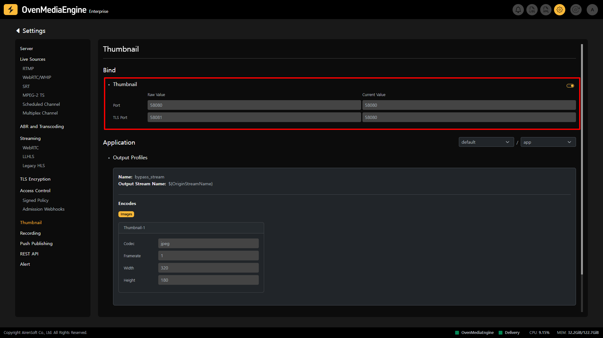
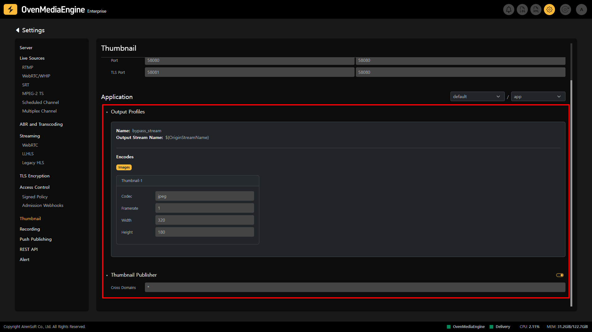

OvenMediaEngine can extract thumbnails in `.jpeg` or `.png` format from Live. This feature allows for more intuitive tasks such as organizing broadcast lists on a website or checking multiple streams simultaneously in a monitoring system.

## Thumbnail Port Settings

On the Thumbnail Settings, you can check and modify the Port Binding information and activation status of the Thumbnail for each `Application`.&#x20;

* `Port`: The Port that the server will use to receive HTTP requests
* `TLS Port`: Data is encrypted using the Transport Layer Security (TLS) Protocol between the web browser and the server. The encrypted data is transmitted over the Port.

:::info

The Port of the `Thumbnail Publisher` can use the same Port as HLS and DASH.

:::

## View Output Profiles Information

Explain the Output Profiles in the image above, you can see that the Encode content is defined to extract the Thumbnail Image from the Stream called `${OriginStreamName}` (all streams included in the Application) and generate a `jpeg` image with the size of 320\*180 per second.

* `Cross Domain`: Most browsers and players prohibit accessing other domain resources in the currently running domain. You can control this situation via this option.

:::info

Detailed Guide: [https://ovenmedialabs.com/docs/ome/thumbnail](https://ovenmedialabs.com/docs/ome/thumbnail)

:::

