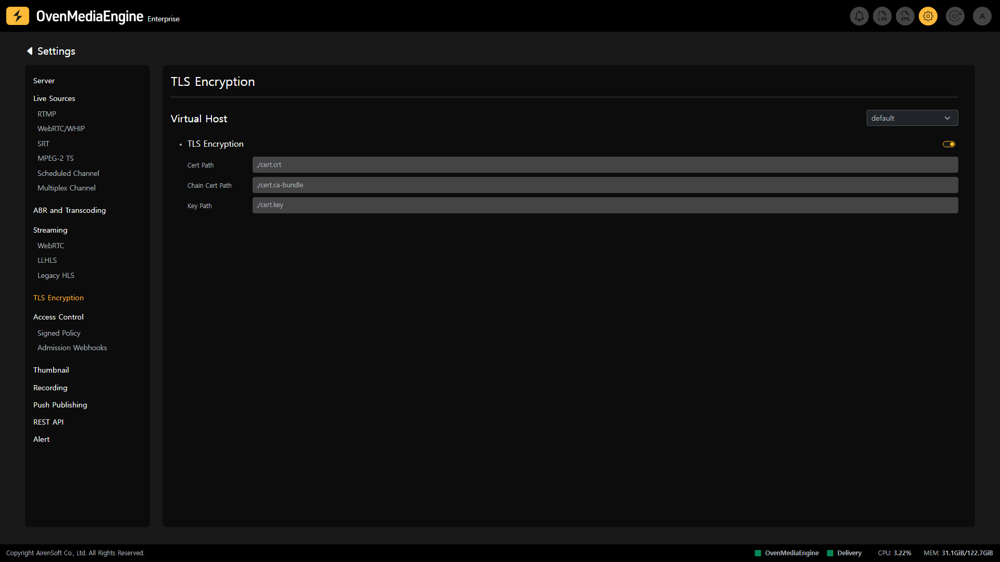

Transport Layer Security (TLS) is a protocol for securing Internet communications and encrypting and protecting personal information while data is being transmitted. If the stream is ingressed and egressed through a web browser, TLS may be required depending on the web browser policy. TLS is required especially when WebRTC Ingress is required.다.

## Check TLS Encryption Activation

On the TLS Encryption Settings, you can check whether TLS is enabled and the TLS path configured for each Virtual Host. This feature allows you to verify that each Virtual Host is properly configured with the necessary security certificates, enhancing the overall security and trustworthiness of your streaming environment.

* `Cert Path`: Shows the name and path of the `.crt` file that composes the TLS certificate.
* `Chain Cert Path`: Shows the name and path of the `.ca-bundle` file that constitutes the TLS certificate.
* `Key Path`: Shows the name and path of the `.key` file that composes the TLS certificate.
