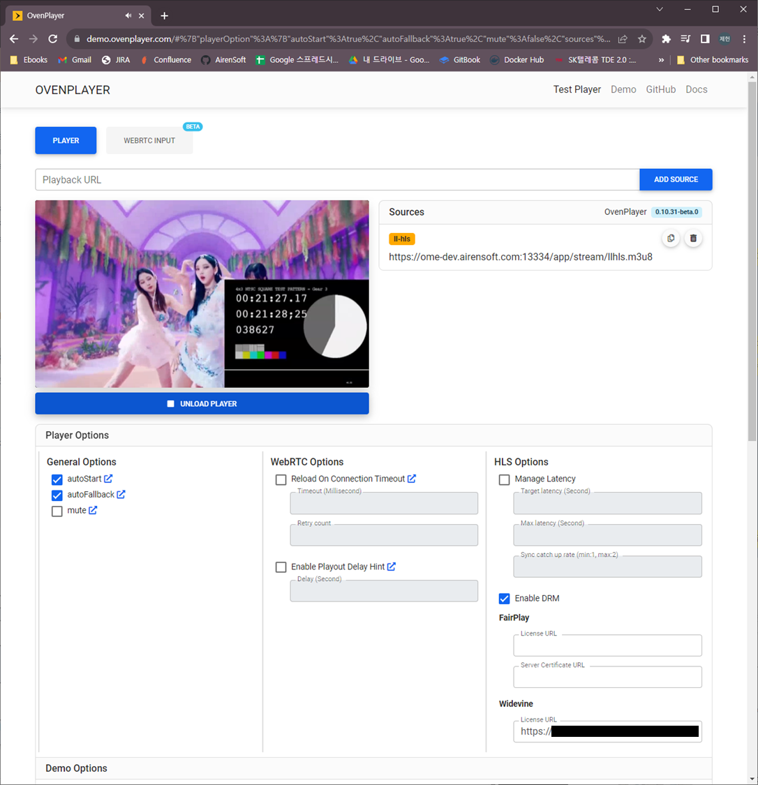

## PallyCon DRM Settings

### Configuration in DRM Info File

OvenMediaEngine Enterprise supports integration with [PallyCon](https://pallycon.com/), allowing easy DRM application to LLHLS streams. Configure the DRM Info File (`.xml`) as follows:

```xml
<?xml version="1.0" encoding="UTF-8"?>

<DRMInfo>
    <DRM>
        <Name>Pallycon</Name>
        <VirtualHostName>default</VirtualHostName>
        <ApplicationName>app</ApplicationName>
        <StreamName>stream*</StreamName> <!-- Can be wildcard regular expression -->

        <DRMProvider>Pallycon</DRMProvider> <!-- Manual(default), Pallycon -->
        <DRMSystem>Widevine,Fairplay</DRMSystem> <!-- Widevine, Fairplay -->
        <CencProtectScheme>cbcs</CencProtectScheme> <!-- cbcs -->
        <ContentId>${VHostName}_${AppName}_${StreamName}</ContentId>
        <KMSUrl>https://kms.pallycon.com/v2/cpix/pallycon/getKey/</KMSUrl>
        <KMSToken>xxxx</KMSToken>
    </DRM>
</DRMInfo>
```

Set `<DRMProvider>` to `Pallycon` and configure the necessary information as shown in the example. The `<KMSUrl>` and `<KMSToken>` values are provided by the PallyCon console. The `<ContentId>` can be created using `VHostName`, `AppName`, and `StreamName` macros.

## Checking Applied DRM

### Checking applied DRM in Settings

To verify the DRM settings, click the Settings icon at the top right of the Web Console. In the displayed screen, select the [Streaming](../../../exclusive/web-console/web-console-settings/streaming-egress-settings.md) tab and click on the [LLHLS sub-item to view the DRM configurations](../../../exclusive/web-console/web-console-settings/streaming-egress-settings.md#check-llhls-drm-activation--01600).

### Checking applied DRM in OvenPlayer



[OvenPlayer Demo](https://demo.ovenplayer.com/) now includes the Enable DRM option. You can test the applied DRM using the Egress URL provided by OvenMediaEngine Enterprise.

To find the Egress URL, go to the [Stream List](../../../exclusive/web-console/web-console-overview/stream-list/README.md) in the Web Console and click on the generated Stream Box to enter the Monitoring screen. Then, click the [URLs tab to view the Egress URL](../../../exclusive/web-console/web-console-overview/stream-list/managed-and-instant-streams.md#playback-url).\
You can test DRM functionality by entering the Egress URL along with the License URL, Key, Value, and other required fields in the [OvenPlayer Demo](https://demo.ovenplayer.com/).
