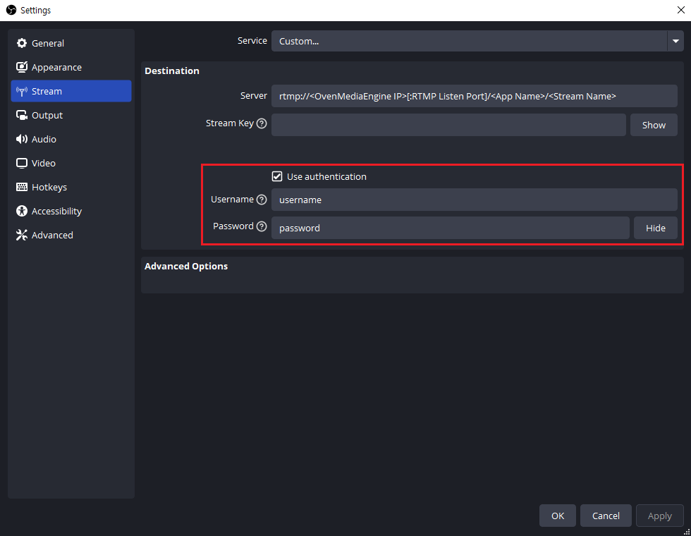

OvenMediaEngine Enterprise supports Username/Password Authentication when ingesting media sources through the RTMP Provider. This feature helps limit unauthorized users from accessing the stream.

## RTMP Authentication Settings

You can use it by specifying `<AuthFile>` in `<VirtualHosts><VirtalHost><Applications><Application><Providers><RTMP>` of `Server.xml`. You can use it by setting it as follows:

```xml
<?xml version="1.0" encoding="UTF-8"?>
<Server version="8">
  ...
  <VirtualHosts>
    <VirtualHost>
      <Applications>
        <Application>
          <Providers>
            ...
            <RTMP>
              <AuthFile>AuthInfo.xml</AuthFile>
            </LLHLS>
          </Publishers>
        </Application>
      </Applications>
    </VirtualHost>
  </VirtualHosts>
</Server>
```

Since `AuthFile` is set in `<Application><Provider><RTMP>`, you can manage the list of accounts required for authentication for each `Application`, making it convenient to use.


:::tip

If `<AuthFile>` is not specified or `<Auth><Enabled>` is set to `false` in the `.xml` file referenced by `AuthFile` (AuthInfo.xml), OvenMediaEngine Enterprise will receive RTMP streams without performing authentication as before.

:::


### Configure the Auth Info File

The content of the `<AuthInfo.xml>` file is in the form of `<AuthInfo><Auth>` with `<ID>`, `<Password>`, and `<Enabled>`. You can use it by configuring it as follows:

```xml
<AuthInfo>
    <Auth>
        <ID>username</ID>
        <Password>password</Password>
        <Enabled>true</Enabled>
    </Auth>
</AuthInfo>
```

* **`ID`**: Specifies the user ID to authenticate. This corresponds to the `Username` in OBS Settings.&#x20;
* **`Password`**: Specifies the user password required for authentication. This corresponds to the `Password` in OBS Settings.
* **`Enabled`**: If `<Enabled>` is `false`, OvenMediaEngine Enterprise will receive RTMP streams without authentication.

## Using RTMP Authentication in OBS

When streaming RTMP using OBS, you can use the RTMP Authentication feature by enabling the `Use autentication` item in OBS Settings:



If you made an `AuthInfo.xml` file following the guide above and specified `<AuthFile>` in OvenMediaEngine Enterprise, enter the `<ID>` recorded in the `AuthInfo.xml` file for the OBS's Username and `<Password>` for the OBS's Password, then proceed to Start Streaming. If the authentication information matches, OvenMediaEngine Enterprise will receive the RTMP media source from OBS.
