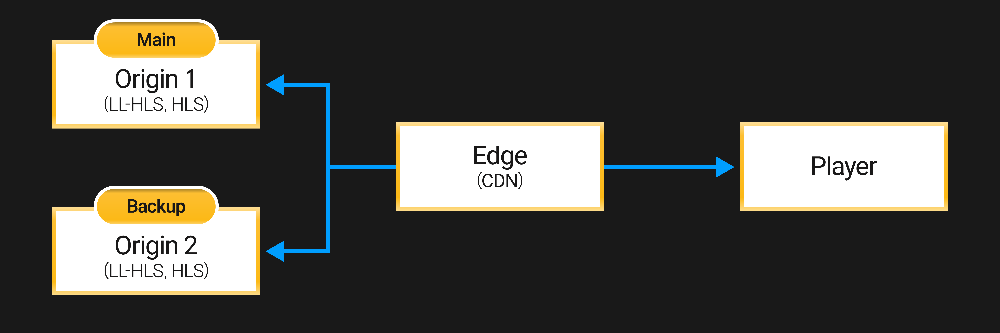

When an HTTP-based CDN or cache system supports origin failover for high availability (HA), OvenMediaEngine Enterprise, acting as an origin server, provides redundancy features that enable both the Main and Backup Servers to deliver identical content.



When a CDN supports origin failover, it automatically switches to the backup server if a failure occurs on the Main Server. To support this, the Main and Backup Servers must provide identical content in the same manner. This guide explains how OvenMediaEngine Enterprise, installed on different servers, can be configured to provide the same Low-Latency HLS (LL-HLS) and HLS content.

## TimestampMode Settings | 0.18.3.0+

`TimestampMode` is a feature for aligning stream timestamps. OvenMediaEngine Enterprise provides three timestamp modes to ensure that the Main and Backup Servers can generate identical content:

<table><thead><tr><th width="151">Value</th><th>Description</th></tr></thead><tbody><tr><td><p>ZeroBased</p><p>* Default</p></td><td>Starts stream timestamps from 0.</td></tr><tr><td>SystemClock</td><td>Sets timestamps based on the server's system clock.</td></tr><tr><td>Original</td><td>Uses the original timestamps generated by the external encoder without modification.</td></tr></tbody></table>

This feature addresses the issue that occurs when an external encoder sends a stream to OvenMediaEngine Enterprise with timestamps that are not based on the wall clock (typically starting from zero). In such cases, the Main and Backup Servers may generate LL-HLS or HLS content with different timestamps depending on when the stream starts.

Even if the Main and Backup Servers start at the same time initially, restarting one of them typically resets its timestamps to zero. This leads to a mismatch between the servers’ timestamps. As a consequence, when the CDN switches between the Main and Backup Servers, the player may encounter discontinuous timestamp jumps, which can cause playback issues for LL-HLS or HLS streams.

To prevent this, it is important to configure the appropriate `TimestampMode` so that the Main and Backup Servers generate matching timestamps:

* **If the encoder uses wall clock–based timestamps** (e.g., AWS Elemental Live, FFmpeg):\
  `<TimestampMode>``Original``</TimestampMode>`
* **If the encoder generates timestamps independently of the wall clock** (e.g., OBS starts from zero):\
  `<TimestampMode>``SystemClock``</TimestampMode>`


:::tip

When using the `SystemClock` mode, OvenMediaEngine Enterprise sets timestamps based on the server's system clock. Therefore, the system time on Main and Backup Servers must be precisely synchronized.

If you are unsure of how the encoder generates timestamps, it is recommended to use the `SystemClock` mode to ensure timestamp consistency between servers.

:::


### TimestampMode Example

To use this feature, configure `<TimestampMode>` under `<Providers><[Protocol Name]>` in `Server.xml` as shown below:

```xml
<?xml version="1.0" encoding="UTF-8"?>
<Server version="8">
  ...
  <VirtualHosts>
    <VirtualHost>
      <Applications>
        <Application>
          <Providers>
            <OVT>
              <TimestampMode>SystemClock</TimestampMode> <!-- Original, ZeroBased -->
            </OVT>
            <RTMP>
              <TimestampMode>SystemClock</TimestampMode> 
            </RTMP>
            <WebRTC>
              <TimestampMode>SystemClock</TimestampMode>
            </WebRTC>
            <RTSPPull>
              <TimestampMode>SystemClock</TimestampMode>
            </RTSPPull>
            <SRT>
              <TimestampMode>SystemClock</TimestampMode>
            </SRT>
            <Schedule>
              <TimestampMode>SystemClock</TimestampMode>
              <MediaRootDir>schedule</MediaRootDir>
              <ScheduleFilesDir>schedule</ScheduleFilesDir>
            </Schedule>
          </Providerrs>
        </Application>
      </Applications>
    </VirtualHost>
  </VirtualHosts>
  ...
</Server>
```

## ServerTimeBasedSegmentNumbering Settings

`ServerTimeBasedSegmentNumbering`  is a feature for matching segment numbers.

OvenMediaEngine Enterprise provides the `ServerTimeBasedSegmentNumbering` option, which allows HLS or LL-HLS segment numbers (sequence numbers) to be generated based on the server’s system clock. This ensures that segments from the Main and Backup Servers are assigned the same sequence numbers, regardless of when the streams are started.

When using the `ServerTimeBasedSegmentNumbering` feature, the following settings for LL-HLS or HLS must be identical on both servers:

* `ChunkDuration`
* `SegmentDuration`
* `SegmentCount`

In addition, the stream's FPS and Keyframe Interval must also be configured identically.

### ServerTimeBasedSegmentNumbering Example

To enable this feature, configure `<ServerTimeBasedSegmentNumbering>` under `<Publishers><LLHLS>` (or `<Publishers><HLS>`) in `Server.xml` as shown below:

```xml
<?xml version="1.0" encoding="UTF-8"?>
<Server version="8">
  ...
  <VirtualHosts>
    <VirtualHost>
      <Applications>
        <Application>
          <Publishers>
            ...
            <LLHLS>
              <OriginMode>true</OriginMode>
              <ServerTimeBasedSegmentNumbering>true</ServerTimeBasedSegmentNumbering>
              <ChunkDuration>1</ChunkDuration>
              <PartHoldBack>3</PartHoldBack>
              <SegmentDuration>6</SegmentDuration>
              <SegmentCount>10</SegmentCount>
              <CrossDomains>
                <Url>*</Url>
              </CrossDomains>
            </LLHLS>
            <HLS>
              <SegmentCount>10</SegmentCount>
              <SegmentDuration>4</SegmentDuration>
              <ServerTimeBasedSegmentNumbering>true</ServerTimeBasedSegmentNumbering>
              <CrossDomains>
                <Url>*</Url>
              </CrossDomains>
            </HLS>
            ...
          </Publishers>
        </Application>
      </Applications>
    </VirtualHost>
  </VirtualHosts>
  ...
</Server>
```

### What is OriginMode?

When `OriginMode` is enabled, OvenMediaEngine Enterprise does not issue a unique session key for each player session and disables session-based access control features. As a result, all users receive content using the same URL and structure, allowing cache servers to properly cache LL-HLS or HLS content.

By default, OvenMediaEngine Enterprise issues a session key for each player session and performs access control based on it. However, from the perspective of a cache server, this causes the content to be segmented by session, making caching impossible. Therefore, when using OvenMediaEngine Enterprise as the origin server behind a cache server, `OriginMode` should be enabled to allow the cache server to properly cache the content.


:::warning

When `OriginMode` is enabled, the responsibility for access control shifts from the origin server to the cache server. This means that the cache server must implement its own authentication and authorization logic to restrict access to content.

:::


## PacketSilenceTimeoutMs Settings | 0.18.3.0+

`PacketSilenceTimeoutMs` is a feature that detects and terminates unresponsive streams.

To identify and remove streams that stop receiving packets for a certain period of time, OvenMediaEngine Enterprise provides the `PacketSilenceTimeoutMs` setting. When this setting is enabled, if no packets are received within the specified timeout, the stream is automatically terminated and an appropriate HTTP error status (such as 404) is returned. This allows the CDN to detect a failure on the Main Server and initiate failover to the Backup Server.

Some encoders may maintain the connection but stop sending packets for a period of time. This can happen in normal scenarios, such as when a variable-FPS encoder sends a still frame, or due to abnormal conditions like TCP connection issues or encoder failures. Since OvenMediaEngine Enterprise continues to maintain the stream in such cases without returning an HTTP error, the CDN may be unable to detect the problem.

The `PacketSilenceTimeoutMs` setting is supported by the following `Providers`:

* RTMP
* SRT
* WebRTC
* Multiplex


:::info

`ScheduledChannel` is a persistent channel, so even if no packets are received, the stream is not deleted. Instead, it transitions to the configured `FallbackProgram`.

:::


:::danger

Because this `PacketSilenceTimeoutMs` feature overlaps with the [`PacketTimeout` in Anomaly Detection](../operations-and-monitoring/enhanced-alert.md#configuring-packettimeout), we recommend using this capability in [Anomaly Detection](../operations-and-monitoring/enhanced-alert.md#anomaly-detection--02010), which was introduced in version 0.20.1.0.

* If both settings are enabled, the module with the smaller timeout value will be triggered first.

:::


### PacketSilenceTimeoutMs Example

To use this feature, configure `<PacketSilenceTimeoutMs>` under `<Providers><[Protocol Name]>` in `Server.xml` as shown below:

```xml
<?xml version="1.0" encoding="UTF-8"?>
<Server version="8">
  ...
  <VirtualHosts>
    <VirtualHost>
      <Applications>
        <Application>
          <Providers>
            <RTMP>
            <TimestampMode>SystemClock</TimestampMode>
              <PacketSilenceTimeoutMs>1000</PacketSilenceTimeoutMs>
            </RTMP>
            <MPEGTS>
              <TimestampMode>SystemClock</TimestampMode>
              <PacketSilenceTimeoutMs>1000</PacketSilenceTimeoutMs>
            </MPEGTS>
            <SRT>
              <TimestampMode>SystemClock</TimestampMode>
              <PacketSilenceTimeoutMs>1000</PacketSilenceTimeoutMs>
            </SRT>
            <WebRTC>
              <TimestampMode>SystemClock</TimestampMode>
              <PacketSilenceTimeoutMs>1000</PacketSilenceTimeoutMs>
            </WebRTC>
            <Multiplex>
              <MuxFilesDir>mux_files</MuxFilesDir>
              <PacketSilenceTimeoutMs>1000</PacketSilenceTimeoutMs>
            </Multiplex>
          </Providerrs>
        </Application>
      </Applications>
    </VirtualHost>
  </VirtualHosts>
  ...
</Server>
```


:::tip

For **Pull-based Providers** such as RTSP and OVT, a similar functionality is already provided through the `noInputFailoverTimeoutMs` setting.

* Reference: [https://ovenmedialabs.com/docs/ome/rest-api/v1/virtualhost/application/stream#create-stream-pull](https://ovenmedialabs.com/docs/ome/rest-api/v1/virtualhost/application/stream#create-stream-pull)

:::

