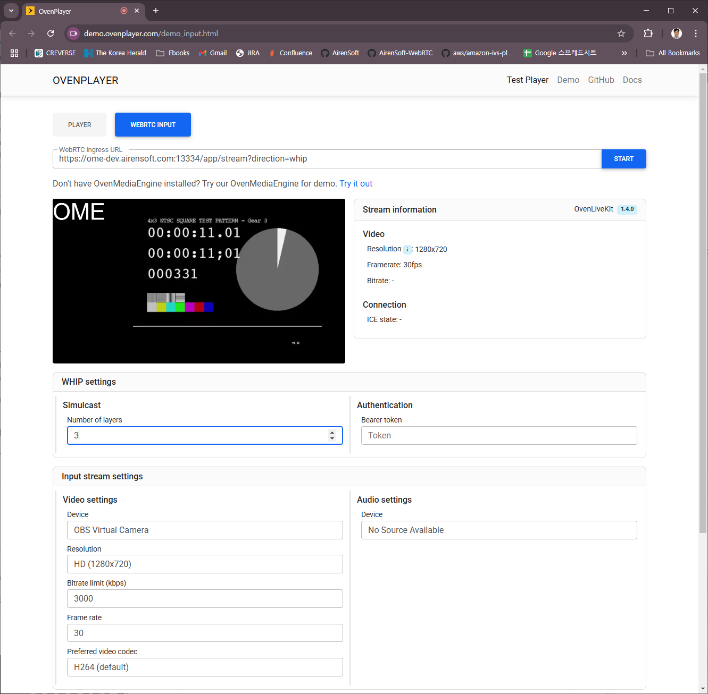
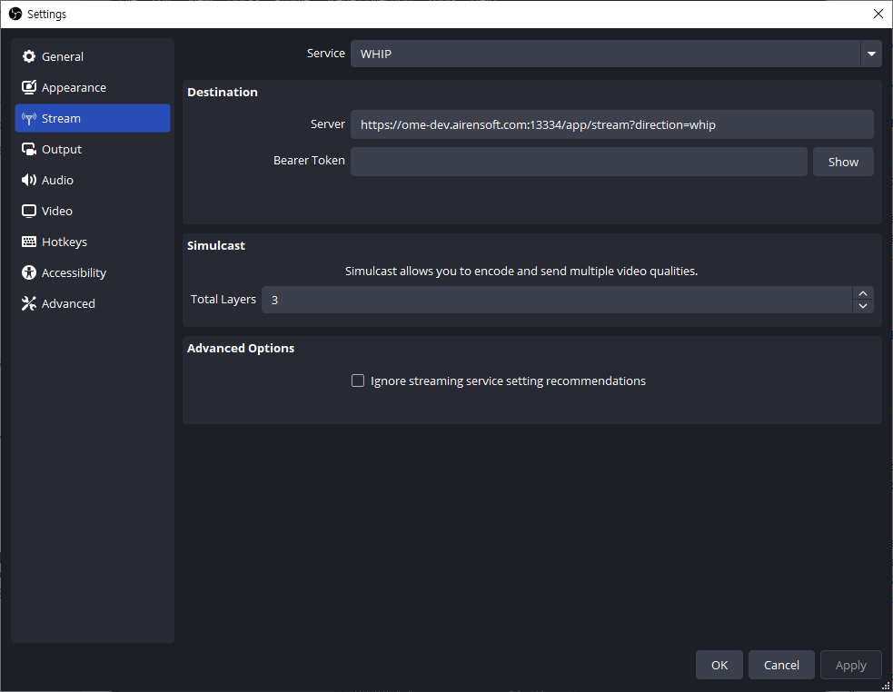
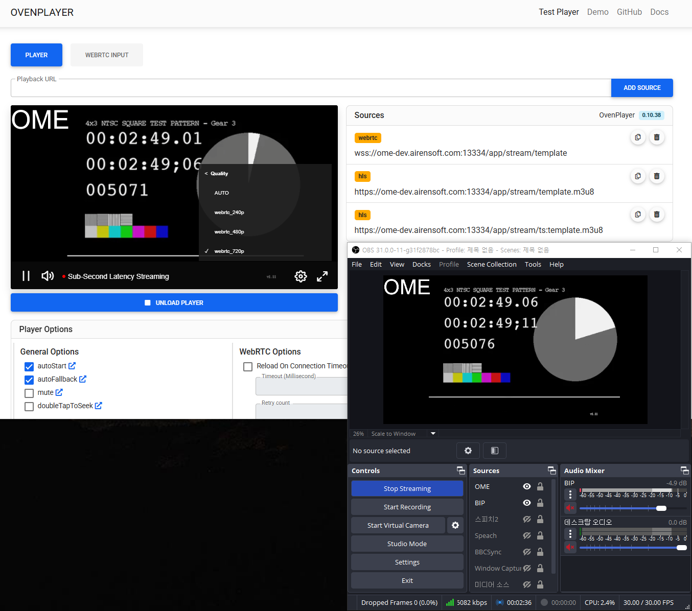
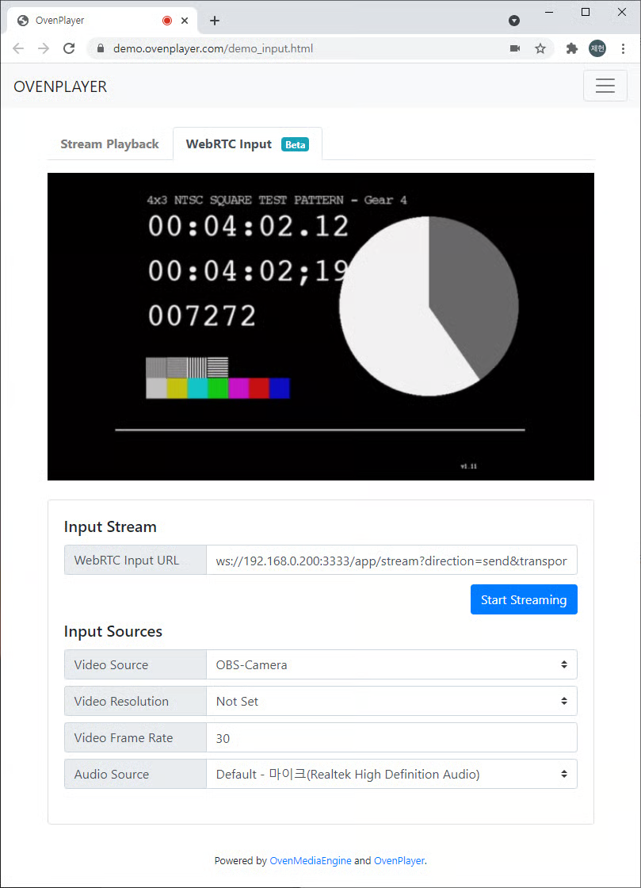
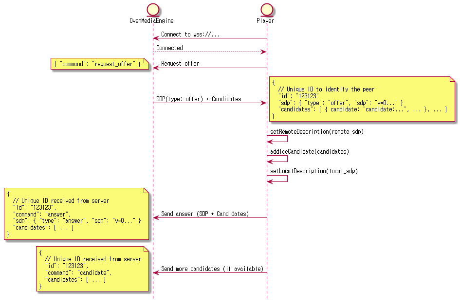

Users can send video and audio from a web browser to OvenMediaEngine via WebRTC without requiring any plug-ins. In addition to browsers, any encoder that supports WebRTC transmission can also be used as a media source.

<table><thead><tr><th width="216.6666259765625">Item</th><th>Description</th></tr></thead><tbody><tr><td>Container</td><td>RTP / RTCP</td></tr><tr><td>Security</td><td>DTLS, SRTP</td></tr><tr><td>Transport</td><td>ICE</td></tr><tr><td>Error Correction</td><td>ULPFEC (VP8, H.264), In-band FEC (Opus)</td></tr><tr><td>Codec</td><td>VP8, H.264, H.265, Opus</td></tr><tr><td>Signaling</td><td>Self-Defined Signaling Protocol, Embedded WebSocket-based Server / WHIP</td></tr><tr><td>Additional Features</td><td>Simulcast</td></tr></tbody></table>

## Configuration

### Bind

OvenMediaEngine supports self-defined signaling protocol and [WHIP ](https://datatracker.ietf.org/doc/draft-ietf-wish-whip/)for WebRTC ingest.

```xml
<!-- /Server/Bind -->
<Providers>
    ...
    <WebRTC>
        ...
        <Signalling>
            <Port>3333</Port>
            <TLSPort>3334</TLSPort>
        </Signalling>
        <IceCandidates>
            <TcpRelay>*:3478</TcpRelay>
            <TcpForce>false</TcpForce>
            <IceCandidate>*:10000-10005/udp</IceCandidate>
        </IceCandidates>
        ...
    </WebRTC>
    ...
</Providers>
```

You can set the port to use for signaling in `/<Server>/<Bind>/<Provider>/<WebRTC>/<Signalling>/<Port>` is for setting an unsecured HTTP port, and `<TLSPort>` is for setting a secured HTTP port that is encrypted with TLS.

For WebRTC ingest, you must set the ICE candidates of the OvenMediaEnigne server to `<IceCandidates>`. The candidates set in `<IceCandidate>` are delivered to the WebRTC peer, and the peer requests communication with this candidate. Therefore, you must set the IP that the peer can access. If the IP is specified as `*`, OvenMediaEngine gathers all IPs of the server and delivers them to the peer.

`<TcpRelay>` means OvenMediaEngine's built-in TURN Server. When this is enabled, the address of this turn server is passed to the peer via self-defined signaling protocol or WHIP, and the peer communicates with this turn server over TCP. This allows OvenMediaEngine to support WebRTC/TCP itself. For more information on URL settings, check out [WebRTC over TCP](webrtc-whip.md#webrtc-over-tcp).

### Application

WebRTC input can be turned on/off for each application. As follows Setting enables the WebRTC input function of the application. The `<CrossDomains>` setting is used in WebRTC signaling.

```xml
<!-- /Server/VirtualHosts/VirtualHost/Applications/Application -->
<Providers>
    ...
    <WebRTC>
        <Timeout>30000</Timeout>
        <FIRInterval>3000</FIRInterval>
        <RtcpBasedTimestamp>false</RtcpBasedTimestamp>
        <CrossDomains>
            <Url>*</Url>
        </CrossDomains>
    </WebRTC>
    ...
</Providers>
```

<table><thead><tr><th width="216.9998779296875">Property</th><th>Description</th></tr></thead><tbody><tr><td>`Timeout`</td><td>The maximum duration (ms) to wait for an ICE Binding request/response before terminating the session due to connection loss.</td></tr><tr><td>`FIRInterval`</td><td>The interval (ms) for sending a Full Intra Request (FIR) to the sender to force the generation of an IDR Frame (setting this to 0 disables the request).</td></tr><tr><td>`RtcpBasedTimestamp`</td><td>When set to `false` (default), each track's RTP timestamp is counted independently from zero, with no waiting for RTCP Sender Reports. When set to `true`, RTCP Sender Reports are used to synchronize A/V timestamps on a common clock. Use `true` only if the sender is known to reliably send RTCP SR; otherwise the stream start may be delayed up to 5 seconds while waiting for the first SR.</td></tr><tr><td>`CrossDomain`</td><td>Specifies the allowed domains for signaling requests in compliance with Cross-Origin Resource Sharing (CORS) policies.</td></tr></tbody></table>

## URL Pattern

OvenMediaEnigne supports self-defined signaling protocol and WHIP for WebRTC ingest.

### Self-defined Signaling URL

The signaling URL for WebRTC ingest uses the query string `?direction=send` as follows to distinguish it from the url for WebRTC playback. Since the self-defined WebRTC signaling protocol is based on WebSocket, you must specify `ws` or `wss` as the scheme.

> `ws[s]://<OME Host>[:Signaling Port]/<App Name>/<Stream Name>`**`?direction=send`**

### WHIP URL

For ingest from the WHIP client, put `?direction=whip` in the query string in the signaling URL as in the example below. Since WHIP is based on HTTP, you must specify `http` or `https` as the scheme.

> `http[s]://<OME Host>[:Signaling Port]/<App Name>/<Stream Name>`**`?direction=whip`**

### WebRTC over TCP

WebRTC transmission is sensitive to packet loss because it affects all players who access the stream. Therefore, it is recommended to provide WebRTC transmission over TCP. OvenMediaEngine has a built-in TURN server for WebRTC/TCP, and receives or transmits streams using the TCP session that the player's TURN client connects to the TURN server as it is. To use WebRTC/TCP, use transport=tcp query string as in WebRTC playback. See [WebRTC/tcp playback](../streaming-and-distribution/webrtc-streaming.md) for more information.

> `ws[s]://{OME Host}[:{Signaling Port}]/{App Name}/{Stream Name}`**`?direction=send&transport=tcp`**
>
> `http[s]://{OME Host}[:{Signaling Port}]/{App Name}/{Stream Name}`**`?direction=whip&transport=tcp`**


:::warning

To use WebRTC/tcp, `<TcpRelay>` must be turned on in `<Bind>` setting.

If `<TcpForce>` is set to `true`, it works over TCP even if you omit the `?transport=tcp` query string from the URL.

:::


## Simulcast

Simulcast is a feature that allows the sender to deliver multiple layers of quality to the end viewer without relying on a server encoder. This is a useful feature that allows for high-quality streaming to be delivered to viewers while significantly reducing costs in environments with limited server resources.

OvenMediaEngine supports WebRTC simulcast since 0.18.0. OvenMediaEngine only supports simulcast with WHIP signaling, and not with OvenMediaEngine's own signaling. Simulcast is only supported with WHIP signaling, and is not supported with OvenMediaEngine's own defined signaling.

You can test this using an encoder that supports WHIP and simulcast, such as OvenLiveKit or OBS. You can usually set the number of layers as below, and if you use the OvenLiveKit API directly, you can also configure the resolution and bitrate per layer.







### Playlist Template for Simulcast

When multiple input video Tracks exist, it means that several Tracks with the same Variant Name are present. For example, consider the following basic `<OutputProfile>` and assume there are three input video Tracks. In this case, three Tracks with the Variant Name `video_bypass` will be created:

```xml
<!-- /Server/VirtualHosts/VirtualHost/Applications/Application -->
<OutputProfiles>
    ...
    <OutputProfile>
        <Name>stream</Name>
        <OutputStreamName>${OriginStreamName}</OutputStreamName>
        <Encodes>
            <Video>
                <Name>video_bypass</Name>
                <Bypass>true</Bypass>
            </Video>
        </Encodes>
    </OutputProfile>
    ...
</OutputProfiles>
```

How can we structure Playlists with multiple Tracks? A simple method introduces an `Index` concept in Playlists:


```xml
<!-- /Server/VirtualHosts/VirtualHost/Applications/Application/OutputProfiles -->
<strong><OutputProfile>
</strong><strong>    ...
</strong>    <Playlist>
        <Name>simulcast</Name>
        <FileName>template</FileName>
        <Options>
            <WebRtcAutoAbr>true</WebRtcAutoAbr>
            <HLSChunklistPathDepth>0</HLSChunklistPathDepth>
            <EnableTsPackaging>true</EnableTsPackaging>
        </Options>
        <Rendition>
            <Name>first</Name>
            <Video>video_bypass</Video>
            <VideoIndexHint>0</VideoIndexHint> <!-- Optional, default : 0 -->
            <Audio>aac_audio</Audio>
        </Rendition>
        <Rendition>
            <Name>second</Name>
            <Video>video_bypass</Video>
            <VideoIndexHint>1</VideoIndexHint> <!-- Optional, default : 0 -->
            <Audio>aac_audio</Audio>
            <AudioIndexHint>0</AudioIndexHint> <!-- Optional, default : 0 -->
        </Rendition>
    </Playlist>
    ...
</OutputProfile>
```


`<VideoIndexHint>` and `<AudioIndexHint>` specify the Index of input video and audio Tracks, respectively.

However, when using the above configuration, if the encoder broadcasts 3 video tracks with Simulcast, it is inconvenient to change the configuration and restart the server to provide HLS/WebRTC streaming with 3 ABR layers. So I implemented a dynamic Rendition tool called RenditionTemplate.

### RenditionTemplate

The `<RenditionTemplate>` feature automatically generates Renditions based on specified conditions, eliminating the need to define each one manually. Here’s an example:

```xml
<!-- /Server/VirtualHosts/VirtualHost/Applications/Application/OutputProfiles -->
<OutputProfile>
    ...
    <Playlist>
        <Name>template</Name>
        <FileName>template</FileName>
        <Options>
            <WebRtcAutoAbr>true</WebRtcAutoAbr>
            <HLSChunklistPathDepth>0</HLSChunklistPathDepth>
            <EnableTsPackaging>true</EnableTsPackaging>
        </Options>
        <RenditionTemplate>
            <Name>hls_${Height}p</Name>
            <VideoTemplate>
                <EncodingType>bypassed</EncodingType>
            </VideoTemplate>
            <AudioTemplate>
                <VariantName>aac_audio</VariantName>
            </AudioTemplate>
        </RenditionTemplate>
    </Playlist>
    ...
</OutputProfile>
```

This configuration creates Renditions for all bypassed videos and uses audio Tracks with the `aac_audio` Variant Name.\
The following macros can be used in the Name of a `RenditionTemplate`:\
`${Width}` | `${Height}` | `${Bitrate}` | `${Framerate}` | `${Samplerate}` | `${Channel}`

You can specify conditions to control Rendition creation. For example, to include only videos with a minimum resolution of 280p and bitrate above 500kbps, or to exclude videos exceeding 1080p or 2Mbps:

```xml
<!-- /Server/VirtualHosts/VirtualHost/Applications/Application/OutputProfiles/OutputProfile/Playlist -->
<RenditionTemplate>
    <VideoTemplate>
        <EncodingType>bypassed</EncodingType> <!-- all, bypassed, encoded -->
        <VariantName>bypass_video</VariantName>
        <VideoIndexHint>0</VideoIndexHint>
        <MaxWidth>1080</MaxWidth>
        <MinWidth>240</MinWidth>
        <MaxHeight>720</MaxHeight>
        <MinHeight>240</MinHeight>
        <MaxFPS>30</MaxFPS>
        <MinFPS>30</MinFPS>
        <MaxBitrate>2000000</MaxBitrate>
        <MinBitrate>500000</MinBitrate>
    </VideoTemplate>
    <AudioTemplate>
        <EncodingType>encoded</EncodingType> <!-- all, bypassed, encoded -->
        <VariantName>aac_audio</VariantName>
        <MaxBitrate>128000</MaxBitrate>
        <MinBitrate>128000</MinBitrate>
        <MaxSamplerate>48000</MaxSamplerate>
        <MinSamplerate>48000</MinSamplerate>
        <MaxChannel>2</MaxChannel>
        <MinChannel>2</MinChannel>
        <AudioIndexHint>0</AudioIndexHint>
    </AudioTemplate>
    ...
</RenditionTemplate>
```

## WebRTC Producer

We provide a demo page so you can easily test your WebRTC input. You can access the demo page at the URL below.

[https://demo.ovenplayer.com/demo_input.html](https://demo.ovenplayer.com/demo_input.html)




:::warning

The getUserMedia API to access the local device only works in a [secure context](https://developer.mozilla.org/en-US/docs/Web/API/MediaDevices/getUserMedia#privacy_and_security). So, the WebRTC Input demo page can only work on the https site \*\*\*\* [**https**://demo.ovenplayer.com/demo\_input.html](https://demo.ovenplayer.com/demo_input.html). This means that due to [mixed content](https://developer.mozilla.org/en-US/docs/Web/Security/Mixed_content) you have to install the certificate in OvenMediaEngine and use the signaling URL as wss to test this. If you can't install the certificate in OvenMediaEngine, you can temporarily test it by allowing the insecure content of the demo.ovenplayer.com URL in your browser.

:::


### Self-defined WebRTC Ingest Signaling Protocol

To create a custom WebRTC Producer, you need to implement OvenMediaEngine's Self-defined Signaling Protocol or WHIP. Self-defined protocol is structured in a simple format and uses the[ same method as WebRTC Streaming](../streaming-and-distribution/webrtc-streaming.md#signalling-protocol).



When the player connects to ws\[s]://host:port/app/stream?**direction=send** through a WebSocket and sends a request offer command, the server responds to the offer SDP. If `transport=tcp` exists in the query string of the URL, [iceServers ](https://developer.mozilla.org/en-US/docs/Web/API/RTCIceServer)information is included in offer SDP, which contains the information of OvenMediaEngine's built-in TURN server, so you need to set this in `RTCPeerConnection` to use WebRTC/TCP. The player then `setsRemoteDescription` and `addIceCandidate` offer SDP, generates an answer SDP, and responds to the server.
