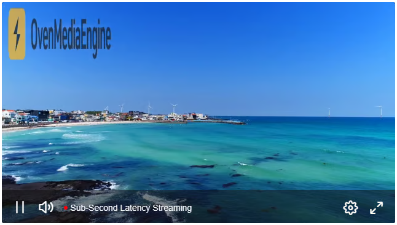
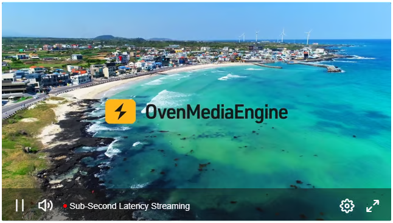
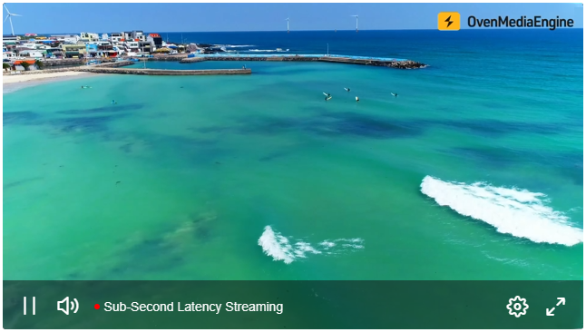

The Image Overlay feature lets you superimpose visual elements such as logos, watermarks, and banners on top of a stream in real-time. You can add, modify, or clear overlays through the REST API or XML configuration, and **precisely control each element’s position**, **size**, and **opacity**. It provides a simple way to handle scenarios like campaign swaps, emergency notices, brand reinforcement, on-screen information, and more.

* **Supported formats:** `PNG` (with alpha), `JPEG`
* **Image source URI schemes:** `http`, `https`, `file`&#x20;

## Image Overlay Configuration (XML)

When the Image Overlay feature is enabled in `Server.xml`, changes are applied automatically to new streams without restarting OvenMediaEngine Enterprise. Configure the XML as follows.

### Configuring Image Overlays in `Server.xml`

In `Server.xml`, configure `<Application><OutputProfiles><MediaOptions><Overlays>` as below:

```xml
<?xml version="1.0" encoding="UTF-8"?>
<Server version="8">
  ...
  <VirtualHosts>
    <VirtualHost>
      <Applications>
        <Application>
          <OutputProfiles>
            <MediaOptions>
              <Overlays>
                <Enable>true</Enable>
                <Path>overlay/OverlayInfo.xml</Path>
              </Overlays>
            </MediaOptions>
            ...
          </OutputProfiles>
          ...
        </Application>
      </Applications>
    </VirtualHost>
  </VirtualHosts>
</Server>
```

<table><thead><tr><th width="156">Element</th><th width="135">Value</th><th>Description</th></tr></thead><tbody><tr><td>Enable</td><td>true | false</td><td>Enables or disables the overlay feature.</td></tr><tr><td>Path</td><td>-</td><td>Specifies the path to the XML file that contains the overlay settings.<br />* Please see the `OverlayInfo.xml` example below.</td></tr></tbody></table>

#### `OverlayInfo.xml` Configuration Example:

```xml
<?xml version="1.0" encoding="UTF-8"?>
<OverlayMap>
  <OverlayInfo>
    <Enable>true</Enable>
    <OutputStreamName>stream1*</OutputStreamName>                 <!-- Must -->
    <VariantNames>*_1080p,*_720p</VariantNames>                   <!-- Optional -->
    <Overlay>
      <Url>http://ovenmediaengine.com/overlay/image001.png</Url>  <!-- Must -->
      <Left>10</Left>                                             <!-- Optional -->
      <Top>10</Top>                                               <!-- Optional -->
      <Width>64</Width>                                           <!-- Optional -->
      <Height>64</Height>                                         <!-- Optional -->
      <Opacity>50</Opacity>                                       <!-- Optional -->
    </Overlay>
    <Overlay>
      <Url>http://ovenmediaengine.com/overlay/image002.png</Url>  
      <Left>(MAIN_W - OVER_W)/2</Left> 
      <Top>(MAIN_H - OVER_H)/2</Top>                              
      <Width>OVER_W/10</Width>                                    
      <Height>OVER_H/10</Height>                                  
      <Opacity>50</Opacity>                                       
    </Overlay>
  </OverlayInfo>

  <OverlayInfo>
    <Enable>true</Enable>
    <OutputStreamName>stream2*</OutputStreamName>               
    <VariantNames>h264_1080p</VariantNames>                       
    <Overlay>
      <Url>overlay/image003.png</Url> 
      <Left>10</Left>                              
      <Top>10</Top>                                
      <Width>64</Width>                            
      <Height>64</Height>                          
      <Opacity>50</Opacity>                        
    </Overlay>
  </OverlayInfo>  
  ...
  <OverlayInfo>
  </OverlayInfo>
  ...
</OverlayMap>
```

<table><thead><tr><th width="156">Element</th><th width="135">Value</th><th>Description</th></tr></thead><tbody><tr><td>Enable</td><td>true | false</td><td>Enables or disables the image overlay feature.</td></tr><tr><td>OutputStreamName</td><td>-</td><td>Specifies the output stream that will use the image overlay.<br />* Select streams using the wildcard character (`*`).</td></tr><tr><td>VariantNames</td><td>-</td><td>Option to select one or more tracks within the output stream for the image overlay. If omitted, the overlay applies to all video tracks in the output stream.<br />* Select tracks using the wildcard character (`*`).<br />* Separate multiple tracks with commas (`,`).</td></tr><tr><td>Url</td><td>-</td><td><p>URL (path) of the image file to render as the overlay. <br />* Supported URI schemes: `http`, `https`, `file`</p><p>* Relative paths are supported and are resolved relative to the configuration file’s location.</p></td></tr><tr><td>Left, Top, Width, Height</td><td>-</td><td><p>Sets the position and size of the overlay image.<br />* Original frame size macros: `MAIN_W`, `MAIN_H`</p><p>* Overlay image size macros: `OVER_W`, `OVER_H`</p><p>* Values accept arithmetic expressions: `+`, `-`, `*`, `/`, `()`</p><p>* If omitted: `Left` and `Top` default to `0`. `Width` and `Height` follow the image - omit both to draw it at its original size, or omit one to keep its aspect ratio.</p></td></tr><tr><td>Opacity</td><td>0-100</td><td>Sets the opacity of the overlay image.<br />* Closer to `0` means more transparent; closer to `100` means more opaque.</td></tr></tbody></table>

## Using Image Overlay in Real-Time (REST API)

You can use the REST API to add, update, or clear overlays on a specific stream or on a track(s) within the stream in real-time. The available options and parameters are identical to those in the [XML configuration](image-overlay.md#image-overlay-configuration-xml) above.

### Add Image Overlay

> **Request**

<details>

<summary><span class="http-method http-method-post">POST</span> /v1/vhosts&#x7B;vhost&#x7D;/apps/&#x7B;app&#x7D;/streams/&#x7B;stream&#x7D;:startOverlay</summary>

```json
// Insert & Update Image
{
  "outputStreamName": "stream",
  "variantNames": ["video_1080","video_720"],
  "overlays" : [
       {
          "url": "http://ovenmediaengine.com/overlay/image001.png",
          "left": "10",
          "top": "10",
          "width": "180",
          "height": "64",  
          "opacity": 50
      },
      {
          "url": "overlay/image003.png",
          "left": "(MAIN_W - OVER_W)/2",
          "top": "(MAIN_H - OVER_H)/2",
          "width": "OVER_W/2",
          "height": "OVER_H/2",  
          "opacity": 50
      } 
  ]
}
```

#### Configuration Parameters (same as in the XML configuration)

<table><thead><tr><th width="156">Element</th><th width="135">Value</th><th>Description</th></tr></thead><tbody><tr><td>Enable</td><td>true | false</td><td>Enables or disables the image overlay feature.</td></tr><tr><td>OutputStreamName</td><td>-</td><td>Specifies the output stream that will use the image overlay.<br />* Select streams using the wildcard character (`*`).</td></tr><tr><td>VariantNames</td><td>array</td><td>Option to select one or more tracks within the output stream for the image overlay. If omitted, the overlay applies to all video tracks in the output stream.<br />* Select tracks using the wildcard character (`*`).<br />* Separate multiple tracks with commas (`,`).</td></tr><tr><td>Url</td><td>-</td><td><p>URL (path) of the image file to render as the overlay. <br />* Supported URI schemes: `http`, `https`, `file`</p><p>* Relative paths are supported and are resolved relative to the configuration file’s location.</p></td></tr><tr><td>Left, Top, Width, Height</td><td>-</td><td><p>Sets the position and size of the overlay image.<br />* Original frame size macros: `MAIN_W`, `MAIN_H`</p><p>* Overlay image size macros: `OVER_W`, `OVER_H`</p><p>* Values accept arithmetic expressions: `+`, `-`, `*`, `/`, `()`</p><p>* If omitted: `Left` and `Top` default to `0`. `Width` and `Height` follow the image - omit both to draw it at its original size, or omit one to keep its aspect ratio.</p></td></tr><tr><td>Opacity</td><td>0-100</td><td>Sets the opacity of the overlay image.<br />* Closer to `0` means more transparent; closer to `100` means more opaque.</td></tr></tbody></table>

</details>

> **Responses**

<details>

<summary><span class="http-method http-method-200">200</span> OK</summary>

**Header**

```http
Content-Type: application/json
```

**Body**


```json
<strong>{
</strong>    "message": "OK",
    "statusCode": 200
}
```


</details>

<details>

<summary><span class="http-method http-method-400">400</span> Bad Request</summary>

**Header**

```http
Content-Type: application/json
```

**Body**


```json
<strong>{
</strong>    "message": "Could not parse json context",
    "statusCode": 400
}
```


```json
<strong>{
</strong>    "message": "No required parameters",
    "statusCode": 400
}
```


</details>

<details>

<summary><span class="http-method http-method-404">404</span> Not Found</summary>

**Header**

```http
Content-Type: application/json
```

**Body**


```json
<strong>{
</strong>    "message": "Could not found output stream",
    "statusCode": 404
}
```


```json
<strong>{
</strong>    "message": "Could not found track by variant",
    "statusCode": 404
}
```


</details>

### Clear Image Overlay

You can clear all overlays applied to a specific stream or to a track(s) within that stream using the REST API.

> **Request**

<details>

<summary><span class="http-method http-method-post">POST</span> /v1/vhosts&#x7B;vhost&#x7D;/apps/&#x7B;app&#x7D;/streams/&#x7B;stream&#x7D;:stopOverlay</summary>

```json
// Clear Overlays
{
  "outputStreamName": "stream",
  "variantNames": ["video_1080","video_720"],
}
```

#### Configuration Parameters (same as in the XML configuration)

<table><thead><tr><th width="156">Element</th><th width="135">Value</th><th>Description</th></tr></thead><tbody><tr><td>OutputStreamName</td><td>-</td><td>Specifies the output stream for which to disable the image overlay.<br />* Select streams using the wildcard character (`*`).</td></tr><tr><td>VariantNames</td><td>array</td><td>Option to select one or more tracks within the specified output stream for which to disable the image overlay. If omitted, the overlay applies to all video tracks in the output stream.<br />* Select tracks using the wildcard character (`*`).<br />* Separate multiple tracks with commas (`,`).</td></tr></tbody></table>

</details>

> **Responses**

<details>

<summary><span class="http-method http-method-200">200</span> OK</summary>

**Header**

```http
Content-Type: application/json
```

**Body**


```json
<strong>{
</strong>    "message": "OK",
    "statusCode": 200
}
```


</details>

<details>

<summary><span class="http-method http-method-400">400</span> Bad Request</summary>

**Header**

```http
Content-Type: application/json
```

**Body**


```json
<strong>{
</strong>    "message": "Could not parse json context",
    "statusCode": 400
}
```


```json
<strong>{
</strong>    "message": "No required parameters",
    "statusCode": 400
}
```


</details>

<details>

<summary><span class="http-method http-method-404">404</span> Not Found</summary>

**Header**

```http
Content-Type: application/json
```

**Body**


```json
<strong>{
</strong>    "message": "Could not found output stream",
    "statusCode": 404
}
```


```json
<strong>{
</strong>    "message": "Could not found track by variant",
    "statusCode": 404
}
```


</details>

## Image Overlay Usage Examples

The examples below either use explicit values or leverage macros and expressions.

#### #01. Overlay an image with a fixed size at the top-left of the screen.

* Size: 500\*250
* Opacity: 70

```xml
...          
  <Overlay>
    <Url>http://ovenmediaengine.com/overlay/ome.png</Url>  
    <Left>32</Left> 
    <Top>32</Top>                              
    <Width>500</Width>                                    
    <Height>250</Height>                                  
    <Opacity>70</Opacity>                    
    </Overlay>
...
```



#### #02. Overlay the original image centered on the screen.

* Size: Original
* Opacity: 100

```xml
...          
  <Overlay>
    <Url>http://ovenmediaengine.com/overlay/ome.png</Url>  
    <Left>MAIN_W/2 - OVER_W/2</Left> 
    <Top>MAIN_H/2 - OVER_H/2</Top>                              
    <Width>OVER_W</Width>                                    
    <Height>OVER_H</Height>                                  
    <Opacity>100</Opacity>                    
    </Overlay>
...
```



#### #03. Overlay the image at 50% size at the top-right of the screen.

* Size: ½ (half of the original)
* Opacity: 100

```xml
...          
  <Overlay>
    <Url>http://ovenmediaengine.com/overlay/ome.png</Url>  
    <Left>MAIN_W - (OVER_W/2) - 32</Left> 
    <Top>32</Top>                              
    <Width>OVER_W/2</Width>                                    
    <Height>OVER_H/2</Height>                                  
    <Opacity>100</Opacity>                    
    </Overlay>
...
```


