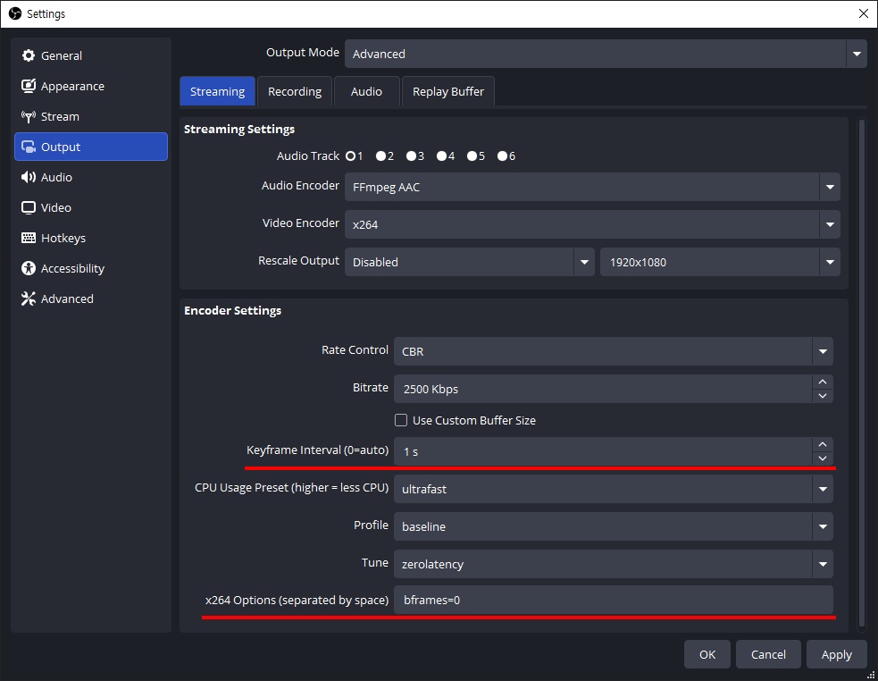
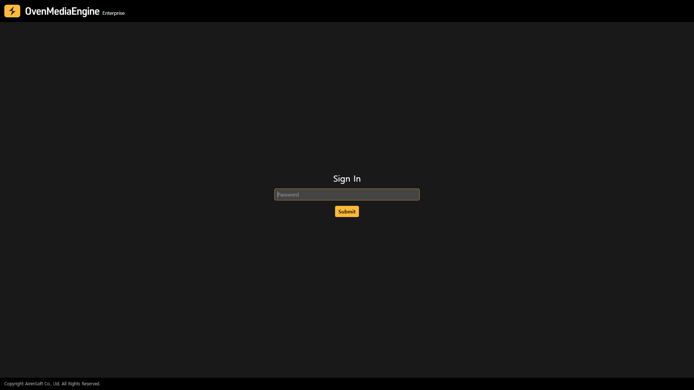
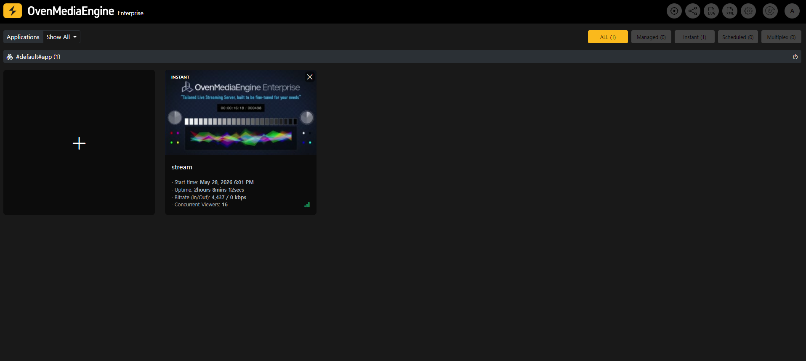
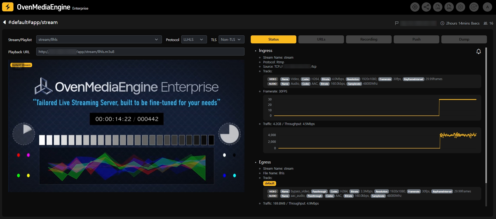
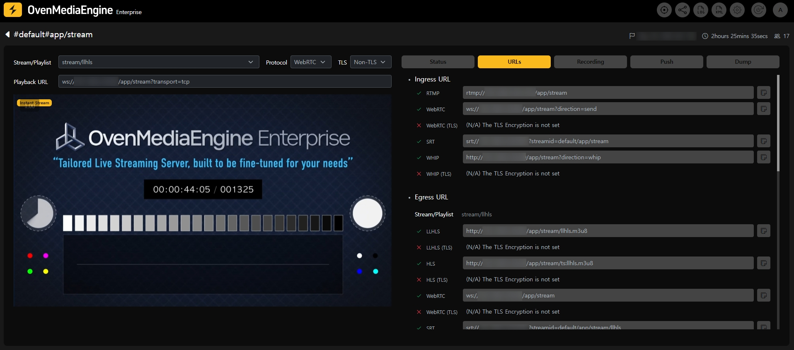

After completing the initial setup, follow this guide to publish a live stream and verify playback within minutes.

:::info

The URLs in this guide use the default virtual host (`default`) and application (`app`) configured after a fresh installation. The stream name (`stream`) can be any name you choose.

:::

## Publishing

Publish a live stream to OvenMediaEngine Enterprise using a live encoder such as [OBS](https://obsproject.com/).

**RTMP**: `rtmp://Your.Host.Address:1935/app/stream`

**SRT**: `srt://Your.Host.Address:9999?streamid=default/app/stream`

**WHIP**: `http://Your.Host.Address:80/app/stream?direction=whip`

To publish via RTMP with OBS, configure the stream settings as follows. Under **\[Service]**, select **\[Custom]**, then enter the RTMP ingest URL in the **Server** field:

**Server** `rtmp://Your.Host.Address:1935/app/stream`

The following output settings are recommended for ultra-low latency:

| Setting           | Value                               |
| ----------------- | ----------------------------------- |
| Keyframe Interval | 1s (DO NOT set it to **0**)         |
| CPU Usage Preset  | ultrafast                           |
| Profile           | baseline                            |
| Tune              | zerolatency                         |
| B-frames          | 0                                   |

Setting **B-frames** to `0` helps prevent WebRTC playback stuttering.

## Playback

To play back in an external player, use the egress URLs below.

**WebRTC** (supported by [OvenPlayer](https://demo.ovenplayer.com/)): `ws://Your.Host.Address:80/app/stream/master`

**LLHLS**: `http://Your.Host.Address:80/app/stream/master.m3u8`

**HLS**: `http://Your.Host.Address:80/app/stream/ts:master.m3u8`

**SRT**: `srt://Your.Host.Address:9998?streamid=default/app/stream/master`

### Playback via Web Console

OvenMediaEngine Enterprise includes a built-in Web Console that lets you monitor and play back streams directly from your browser without any additional tools.

Open the Web Console at `http://Your.Host.Address:8080` in your browser. Sign in using the default password `ovenstudio`.

Once the stream is being published, it will appear in the stream list.

Select the stream to open the **Stream Monitoring** tab. Select a protocol (**WebRTC** or **LLHLS**) and set TLS to **Non-TLS** if TLS has not yet been configured, then click **Watch** to play the stream in the embedded player.

The **URLs** tab in the Web Console lists all ingress and egress URLs for the stream.

## Next Steps

- [Going Secure with TLS](./getting-started-tls-configuration.md): Enable HTTPS for secure WebRTC and HLS playback in browsers.
- [Adaptive Bitrate Streaming](./getting-started-abr.md): Configure adaptive bitrate streaming for multiple quality renditions.
